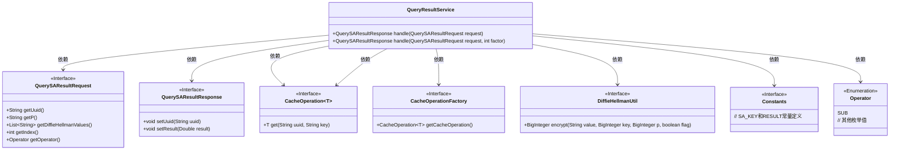
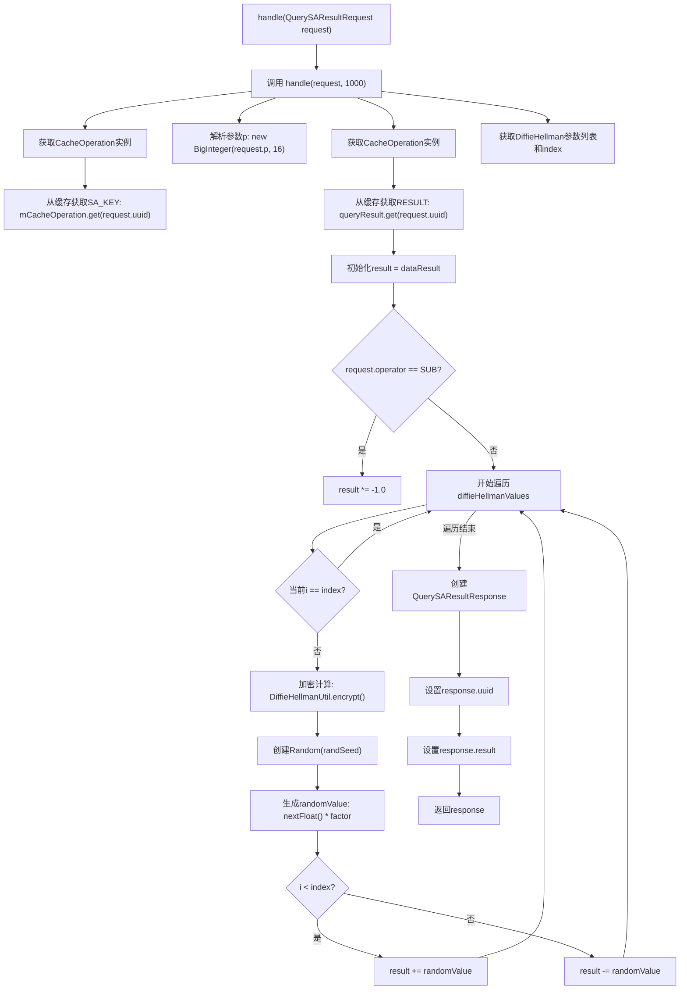

# 基础信息

|      |      |
|------|------|
| 名称 | QueryResultService |
| 编码语言 | .java |
| 代码路径 | WeFe/mpc/mpc-sa/mpc-sa-server/src/main/java/com/welab/wefe/mpc/sa/server/service/QueryResultService.java |
| 包名 | com.welab.wefe.mpc.sa.server.service |
| 依赖项 | ['com.welab.wefe.mpc.cache.intermediate.CacheOperation', 'com.welab.wefe.mpc.cache.intermediate.CacheOperationFactory', 'com.welab.wefe.mpc.commom.Constants', 'com.welab.wefe.mpc.commom.Operator', 'com.welab.wefe.mpc.sa.request.QuerySAResultRequest', 'com.welab.wefe.mpc.sa.request.QuerySAResultResponse', 'com.welab.wefe.mpc.util.DiffieHellmanUtil', 'java.math.BigInteger', 'java.util.List', 'java.util.Random'] |
| 概述说明 | QueryResultService处理查询请求，通过缓存获取数据，使用DiffieHellman加密和随机数调整结果，最后返回响应。支持乘法和减法操作。 |

# 说明

QueryResultService类处理查询结果请求，提供两种handle方法。默认方法使用固定因子1000，另一方法接受自定义因子。流程包括：从缓存获取密钥和结果数据，根据操作类型调整结果符号，遍历DiffieHellman值列表，跳过当前索引项，使用密钥和参数p加密生成随机种子，计算随机值并累加或减去结果。最后构建并返回包含UUID和处理结果的响应对象。

# 类列表 Class Summary

| 名称   | 类型  | 说明 |
|-------|------|-------------|
| QueryResultService | class | QueryResultService处理查询请求，通过缓存获取密钥和数据结果，根据操作符和DiffieHellman值调整结果，最终返回响应。 |

## 类 QueryResultService

|      |      |
|------|------|
| 访问范围 | public |
| 类型 | class |
| 名称 | QueryResultService |
| 说明 | QueryResultService处理查询请求，通过缓存获取密钥和数据结果，根据操作符和DiffieHellman值调整结果，最终返回响应。 |

### UML类图

这段代码展示了一个查询结果服务类`QueryResultService`，它通过处理`QuerySAResultRequest`请求来生成`QuerySAResultResponse`响应。服务类依赖多个接口和工具类，包括缓存操作工厂`CacheOperationFactory`、Diffie-Hellman加密工具`DiffieHellmanUtil`以及常量定义类`Constants`。主要逻辑涉及从缓存获取数据、执行加密操作、进行数学计算，最终构建并返回响应对象。整个设计体现了分层架构思想，各模块职责明确。

### 内部方法调用关系图

流程图描述：该流程图展示了QueryResultService处理查询结果的核心逻辑。流程从入口方法开始，通过缓存操作获取加密密钥和原始结果数据，然后根据操作符类型调整结果值。接着遍历DiffieHellman参数列表，跳过指定索引项，对每个参数进行加密并生成随机值，根据位置关系对结果进行加减运算。最后构造响应对象并返回。整个过程涉及条件判断、循环处理和加密计算等关键步骤。

### 字段列表 Field List

| 名称  | 类型  | 说明 |
|-------|-------|------|

### 方法列表

| 名称  | 类型  | 说明 |
|-------|-------|------|
| handle | QuerySAResultResponse | 该方法处理查询SA结果请求，通过缓存获取密钥和数据结果，根据操作符调整结果值，利用DiffieHellman加密生成随机数并更新结果，最后返回响应。 |
| handle | QuerySAResultResponse | Java方法处理查询请求，默认超时1000毫秒。 |

