# 基础信息

|      |      |
|------|------|
| 名称 | com |
| 编码语言 | .java |
| 代码路径 | WeFe/serving/serving-sdk-java/src/main/java/com |
| 包名 | docs.serving.serving-sdk-java.src.main.java.com |
| 概述说明 | 该模块提供联邦学习预测框架，支持逻辑回归和XGBoost算法，涵盖单条/批量处理、参数校验、结果合并。通过抽象类和模板方法定义标准化流程，依赖注解和反射实现动态加载。关键组件包括模型处理器、算法管理器和线程池，适用于实时和离线预测场景。 |

# 说明

## 概述  
该模块是联邦学习环境下的标准化预测框架，核心职责是统一管理模型预测全流程（单条/批量处理、参数校验、结果转换）和多方结果合并。通过抽象基类（如AbstractAlgorithm/AbstractBatchModelProcessor）定义模板方法模式，关键数据结构包括BaseModel、PredictParams、特征映射和预测结果模型（如LrPredictResultModel）。外部依赖涉及XGBoost框架、JObject、多线程工具（如CountDownLatch）和联邦学习组件（如WeFe）。例如EmptyModelProcessor提供占位实现，AlgorithmManager通过反射动态加载算法实例。

## 主要业务场景  
模块支持横向/纵向联邦预测，典型流程为：参数初始化→本地计算→多方结果合并→脱敏输出，类似MapReduce与分布式决策引擎混合。交互模式采用Promoter-Provider架构，通过注解（如@ModelProcessor）和工厂模式（如AlgorithmManager）动态装配组件。功能完整性体现在支持逻辑回归（评分卡分箱）、XGBoost（树结构合并）及异常处理（StateCode状态码）。例如金融风控中XgboostVertPromoterAlgorithm合并远程树结构，或通过PredictBehavior接口规范特征查询。API覆盖单条/批量预测、加密配置管理及线程池任务调度。

### 包内部结构视图

```mermaid
graph TD
    serving --> sdk
    sdk --> processor
    sdk --> algorithm
    sdk --> predicter
    sdk --> utils
    sdk --> enums
    sdk --> manager
    sdk --> dto
    sdk --> model
    sdk --> config
    processor --> EmptyModelProcessor.java
    processor --> EmptyBatchModelProcessor.java
    processor --> BatchModelProcessor.java
    processor --> AbstractBatchModelProcessor.java
    processor --> ModelProcessor.java
    processor --> AbstractModelProcessor.java
    algorithm --> lr
    algorithm --> xgboost
    algorithm --> AbstractAlgorithm.java
    algorithm --> AbstractBatchAlgorithm.java
    lr --> single
    lr --> batch
    lr --> LrAlgorithmHelper.java
    single --> AbstractLrAlgorithm.java
    single --> LrHorzPromoterAlgorithm.java
    single --> LrVertProviderAlgorithm.java
    single --> LrVertPromoterAlgorithm.java
    batch --> LrVertPromoterBatchAlgorithm.java
    batch --> LrVertProviderBatchAlgorithm.java
    batch --> LrHorzPromoterBatchAlgorithm.java
    batch --> AbstractLrBatchAlgorithm.java
    xgboost --> single
    xgboost --> batch
    xgboost --> XgboostAlgorithmHelper.java
    single --> XgboostVertPromoterAlgorithm.java
    single --> XgboostVertProviderAlgorithm.java
    single --> AbstractXgboostAlgorithm.java
    single --> XgboostHorzPromoterAlgorithm.java
    batch --> XgboostVertProviderBatchAlgorithm.java
    batch --> XgboostVertPromoterBatchAlgorithm.java
    batch --> XgboostHorzPromoterBatchAlgorithm.java
    batch --> AbstractXgBoostBatchAlgorithm.java
    predicter --> single
    predicter --> batch
    predicter --> PredictBehavior.java
    predicter --> AbstractBasePredictor.java
    single --> AbstractSinglePredictor.java
    single --> AbstractSingleProviderPredictor.java
    batch --> AbstractBatchPredictor.java
    batch --> AbstractBatchProviderPredictor.java
    utils --> AlgorithmThreadPool.java
    enums --> XgboostWorkMode.java
    enums --> StateCode.java
    manager --> AlgorithmManager.java
    manager --> ModelProcessorManager.java
    dto --> PredictParams.java
    dto --> ProviderParams.java
    dto --> BatchPredictParams.java
    dto --> PredictResult.java
    model --> lr
    model --> xgboost
    model --> BaseFeatureResultModel.java
    model --> ModelMeta.java
    model --> BaseAlgorithmModel.java
    model --> FeatureDataModel.java
    model --> BaseModel.java
    model --> ScoreCardInfoModel.java
    model --> PredictModel.java
    lr --> LrPredictResultModel.java
    lr --> LrScoreCardModel.java
    lr --> LrModel.java
    lr --> BaseLrModel.java
    xgboost --> XgboostPredictResultModel.java
    xgboost --> XgboostDecisionTreeModel.java
    xgboost --> XgboostModel.java
    xgboost --> BaseXgboostModel.java
    xgboost --> XgboostNodeModel.java
    xgboost --> XgbProviderPredictResultModel.java
    config --> Config.java
    config --> Launcher.java
```

该流程图展示了WeFe服务SDK的完整目录结构，从顶层serving节点开始，逐级展开sdk下的10个主要模块。每个模块内部又包含具体的子模块和实现类，特别是algorithm模块详细展示了lr和xgboost两种算法的单机和批量处理实现，model模块则展示了不同算法对应的模型结构。整个结构层次清晰，完整呈现了机器学习服务SDK的功能模块划分。

# 文件列表

| 名称   | 类型  | 说明 |
|-------|------|-------------|
| [welab](welab/_module.md) | package | 该模块提供联邦学习预测框架，支持逻辑回归和XGBoost算法，涵盖单条/批量处理、参数校验、结果合并。通过抽象类和模板方法定义标准化流程，依赖注解和反射实现动态加载。关键组件包括模型处理器、算法管理器和线程池，适用于实时和离线预测场景。 |

