# 基础信息

|      |      |
|------|------|
| 名称 | sdk |
| 编码语言 | .java |
| 代码路径 | WeFe/serving/serving-sdk-java/src/main/java/com/welab/wefe/serving/sdk |
| 包名 | docs.serving.serving-sdk-java.src.main.java.com.welab.wefe.serving.sdk |
| 概述说明 | 该模块提供联邦学习预测框架，支持逻辑回归和XGBoost算法，涵盖单条/批量处理、参数校验、结果合并。通过抽象类和模板方法定义标准化流程，依赖注解和反射实现动态加载。关键组件包括模型处理器、算法管理器和线程池，适用于实时和离线预测场景。 |

# 说明

## 概述  
该模块是联邦学习环境下的标准化预测框架，核心职责是统一管理模型预测全流程（单条/批量处理、参数校验、结果转换）和多方结果合并。通过抽象基类（如AbstractAlgorithm/AbstractBatchModelProcessor）定义模板方法模式，关键数据结构包括BaseModel、PredictParams、特征映射和预测结果模型（如LrPredictResultModel）。外部依赖涉及XGBoost框架、JObject、多线程工具（如CountDownLatch）和联邦学习组件（如WeFe）。例如EmptyModelProcessor提供占位实现，AlgorithmManager通过反射动态加载算法实例。

## 主要业务场景  
模块支持横向/纵向联邦预测，典型流程为：参数初始化→本地计算→多方结果合并→脱敏输出，类似MapReduce与分布式决策引擎混合。交互模式采用Promoter-Provider架构，通过注解（如@ModelProcessor）和工厂模式（如AlgorithmManager）动态装配组件。功能完整性体现在支持逻辑回归（评分卡分箱）、XGBoost（树结构合并）及异常处理（StateCode状态码）。例如金融风控中XgboostVertPromoterAlgorithm合并远程树结构，或通过PredictBehavior接口规范特征查询。API覆盖单条/批量预测、加密配置管理及线程池任务调度。

### 包内部结构视图

```mermaid
graph TD
    sdk --> processor
    sdk --> algorithm
    sdk --> predicter
    sdk --> utils
    sdk --> enums
    sdk --> manager
    sdk --> dto
    sdk --> model
    sdk --> config
    processor --> EmptyModelProcessor.java
    processor --> EmptyBatchModelProcessor.java
    processor --> BatchModelProcessor.java
    processor --> AbstractBatchModelProcessor.java
    processor --> ModelProcessor.java
    processor --> AbstractModelProcessor.java
    algorithm --> lr
    algorithm --> xgboost
    algorithm --> AbstractAlgorithm.java
    algorithm --> AbstractBatchAlgorithm.java
    lr --> single
    lr --> batch
    lr --> LrAlgorithmHelper.java
    single --> AbstractLrAlgorithm.java
    single --> LrHorzPromoterAlgorithm.java
    single --> LrVertProviderAlgorithm.java
    single --> LrVertPromoterAlgorithm.java
    batch --> LrVertPromoterBatchAlgorithm.java
    batch --> LrVertProviderBatchAlgorithm.java
    batch --> LrHorzPromoterBatchAlgorithm.java
    batch --> AbstractLrBatchAlgorithm.java
    xgboost --> single
    xgboost --> batch
    xgboost --> XgboostAlgorithmHelper.java
    single --> XgboostVertPromoterAlgorithm.java
    single --> XgboostVertProviderAlgorithm.java
    single --> AbstractXgboostAlgorithm.java
    single --> XgboostHorzPromoterAlgorithm.java
    batch --> XgboostVertProviderBatchAlgorithm.java
    batch --> XgboostVertPromoterBatchAlgorithm.java
    batch --> XgboostHorzPromoterBatchAlgorithm.java
    batch --> AbstractXgBoostBatchAlgorithm.java
    predicter --> single
    predicter --> batch
    predicter --> PredictBehavior.java
    predicter --> AbstractBasePredictor.java
    single --> AbstractSinglePredictor.java
    single --> AbstractSingleProviderPredictor.java
    batch --> AbstractBatchPredictor.java
    batch --> AbstractBatchProviderPredictor.java
    utils --> AlgorithmThreadPool.java
    enums --> XgboostWorkMode.java
    enums --> StateCode.java
    manager --> AlgorithmManager.java
    manager --> ModelProcessorManager.java
    dto --> PredictParams.java
    dto --> ProviderParams.java
    dto --> BatchPredictParams.java
    dto --> PredictResult.java
    model --> lr
    model --> xgboost
    model --> BaseFeatureResultModel.java
    model --> ModelMeta.java
    model --> BaseAlgorithmModel.java
    model --> FeatureDataModel.java
    model --> BaseModel.java
    model --> ScoreCardInfoModel.java
    model --> PredictModel.java
    lr --> LrPredictResultModel.java
    lr --> LrScoreCardModel.java
    lr --> LrModel.java
    lr --> BaseLrModel.java
    xgboost --> XgboostPredictResultModel.java
    xgboost --> XgboostDecisionTreeModel.java
    xgboost --> XgboostModel.java
    xgboost --> BaseXgboostModel.java
    xgboost --> XgboostNodeModel.java
    xgboost --> XgbProviderPredictResultModel.java
    config --> Config.java
    config --> Launcher.java
```

该流程图展示了WeFe服务SDK的完整目录结构，从根目录sdk开始向下展开，包含processor、algorithm、predicter等主要模块。algorithm模块下细分为lr和xgboost两种算法实现，每种算法又包含single和batch两种处理模式。predicter模块同样区分单例和批量预测。model模块包含各类数据模型定义，config模块提供配置相关功能。整个结构层次清晰，体现了模块化设计思想。

# 文件列表

| 名称   | 类型  | 说明 |
|-------|------|-------------|
| [enums](enums/_module.md) | package | XgboostWorkMode枚举定义skip、dp、layered三种工作模式。StateCode枚举包含SUCCESS(0)、系统错误(10000-10001)和数据错误(20001)状态码，提供code和description属性及获取方法。 |
| [algorithm](algorithm/_module.md) | package | 逻辑回归模块实现预测流程，支持单条和批量处理，含本地计算、分数调整、结果合并及脱敏。XGBoost模块整合多方决策树，执行联合预测，支持垂直和水平联邦。抽象类提供预测框架，子类实现具体逻辑。 |
| [config](config/_module.md) | package | Config类存储配置信息，含成员ID、RSA公私钥和密钥类型变量。Launcher类通过init方法初始化Config变量，确保仅执行一次。 |
| [model](model/_module.md) | package | 该模块实现逻辑回归和XGBoost模型预测功能，包括参数存储、结果封装和错误处理。关键类有LrModel、XgboostModel等，支持信用评分和风险预测等场景，采用工厂方法和分层封装设计。 |
| [dto](dto/_module.md) | package | PredictParams类封装预测参数，含userId和featureDataModel属性，提供多种创建方式。ProviderParams类存储提供者参数，含memberId和api字段，支持工厂方法创建。BatchPredictParams管理批量预测参数，含用户ID列表和预测参数列表，支持查询。PredictResult类封装预测结果，含算法类型、联邦学习类型、角色和结果属性。 |
| [manager](manager/_module.md) | package | AlgorithmManager类通过MAP和BATCH_MAP管理算法类，支持逻辑回归和XGBoost，覆盖三种联邦学习模式和两种角色。ModelProcessorManager类管理模型处理器，通过反射扫描注解类填充映射表，提供获取处理器实例的方法。 |
| [utils](utils/_module.md) | package | AlgorithmThreadPool类实现了一个静态线程池，核心线程数为CPU核心数，最大线程数为两倍核心数，提供执行Runnable和Callable任务的方法，支持CountDownLatch计数，并能获取活跃线程数。 |
| [predicter](predicter/_module.md) | package | 单次预测模块封装预测流程，支持模型加载和特征处理。批量预测框架提供常规和联邦计算场景支持。PredictBehavior接口定义获取模型和特征数据方法。AbstractBasePredictor为预测行为提供基础框架。 |
| [processor](processor/_module.md) | package | EmptyModelProcessor和EmptyBatchModelProcessor是空实现的模型处理器类，分别用于单例和批量处理。BatchModelProcessor和ModelProcessor是运行时注解，含id属性。AbstractModelProcessor和AbstractBatchModelProcessor是抽象类，定义了预处理和后处理的框架方法。 |

