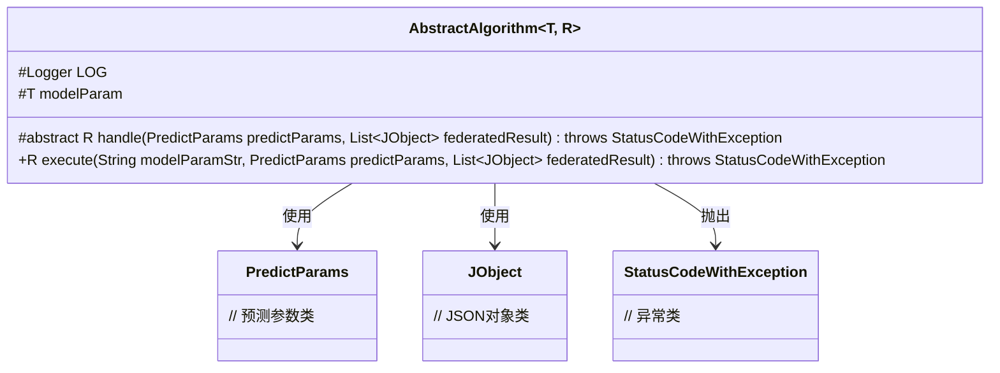
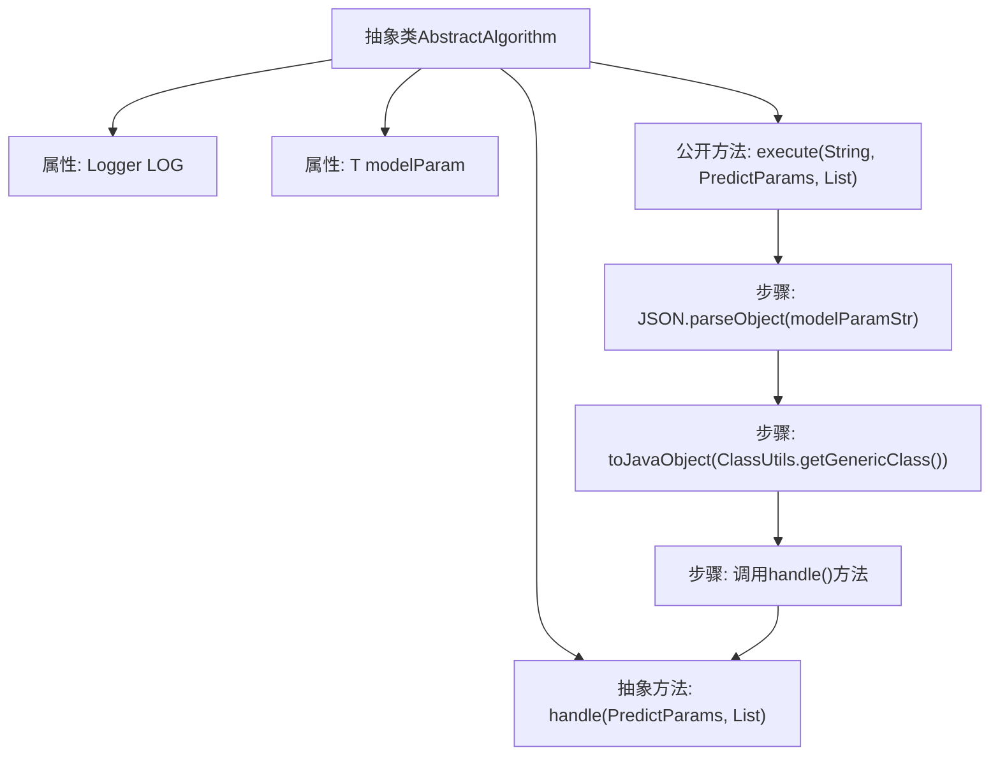

# 基础信息

|      |      |
|------|------|
| 名称 | AbstractAlgorithm |
| 编码语言 | .java |
| 代码路径 | WeFe/serving/serving-sdk-java/src/main/java/com/welab/wefe/serving/sdk/algorithm/AbstractAlgorithm.java |
| 包名 | com.welab.wefe.serving.sdk.algorithm |
| 依赖项 | ['com.alibaba.fastjson.JSON', 'com.welab.wefe.common.exception.StatusCodeWithException', 'com.welab.wefe.common.util.ClassUtils', 'com.welab.wefe.common.util.JObject', 'com.welab.wefe.serving.sdk.dto.PredictParams', 'org.slf4j.Logger', 'org.slf4j.LoggerFactory', 'java.util.List'] |
| 概述说明 | 抽象类AbstractAlgorithm定义算法框架，含日志和模型参数，提供执行入口execute和需子类实现的抽象方法handle，用于处理预测参数并返回结果。 |

# 说明

这是一个名为AbstractAlgorithm的抽象类，使用泛型T和R定义模型参数类型和返回结果类型。类中包含一个受保护的Logger实例和模型参数变量modelParam。核心方法是抽象的handle方法，用于处理预测逻辑，接收PredictParams参数和联合结果列表，可能抛出StatusCodeWithException异常。execute方法负责将字符串形式的模型参数转换为实体对象，并调用handle方法执行预测。该类为算法实现提供了基础框架，要求子类实现具体的预测处理逻辑。

# 类列表 Class Summary

| 名称   | 类型  | 说明 |
|-------|------|-------------|
| AbstractAlgorithm | class | 抽象类AbstractAlgorithm定义算法框架，含日志和模型参数，提供execute方法转换参数并调用抽象方法handle处理预测，返回结果R。 |

## 类 AbstractAlgorithm

|      |      |
|------|------|
| 访问范围 | public abstract |
| 类型 | class |
| 名称 | AbstractAlgorithm |
| 说明 | 抽象类AbstractAlgorithm定义算法框架，含日志和模型参数，提供execute方法转换参数并调用抽象方法handle处理预测，返回结果R。 |

### UML类图

该代码展示了一个泛型抽象类AbstractAlgorithm，它定义了算法框架的核心结构。类中包含受保护的日志对象和模型参数，以及一个抽象方法handle用于具体算法实现。execute方法负责参数转换并调用handle方法。类通过泛型T和R支持灵活的参数和返回类型，与PredictParams、JObject和StatusCodeWithException类存在依赖关系，体现了模板方法设计模式的特点。

### 内部方法调用关系图

这段代码描述了一个抽象算法框架类，包含参数转换和执行流程。流程图展示了从execute方法开始，先通过JSON解析将字符串参数转换为Java对象，然后调用抽象handle方法进行处理的过程。该类采用模板方法模式，强制子类实现具体的handle逻辑，同时提供了通用的参数转换功能。Logger属性用于记录日志，modelParam存储转换后的模型参数。整个流程体现了参数预处理和业务逻辑分离的设计思想。

### 字段列表 Field List

| 名称  | 类型  | 说明 |
|-------|-------|------|
| modelParam | T | 声明一个受保护的泛型变量modelParam，类型为T。 |
| LOG = LoggerFactory.getLogger(getClass()) | Logger | 定义当前类的日志记录器实例，使用protected final修饰确保子类可访问且不可修改。 |

### 方法列表

| 名称  | 类型  | 说明 |
|-------|-------|------|
| handle | R | 抽象方法，处理预测参数和联合结果，可能抛出异常。 |
| execute | R | 方法execute接收模型参数字符串、预测参数和联合结果列表，将字符串参数转为实体对象后调用handle处理。可能抛出StatusCodeWithException异常。 |

