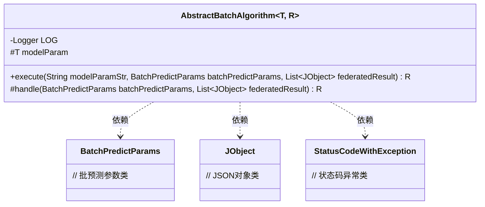
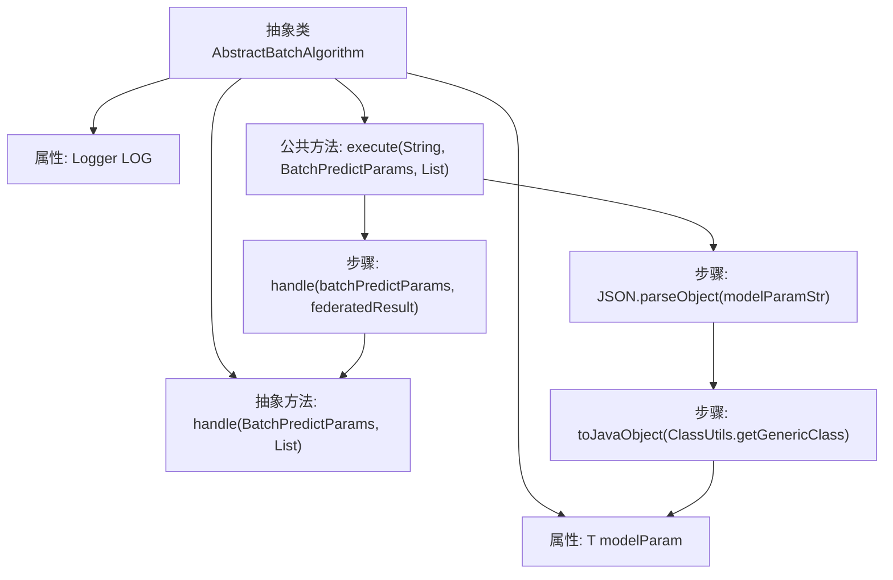

# 基础信息

|      |      |
|------|------|
| 名称 | AbstractBatchAlgorithm |
| 编码语言 | .java |
| 代码路径 | WeFe/serving/serving-sdk-java/src/main/java/com/welab/wefe/serving/sdk/algorithm/AbstractBatchAlgorithm.java |
| 包名 | com.welab.wefe.serving.sdk.algorithm |
| 依赖项 | ['com.alibaba.fastjson.JSON', 'com.welab.wefe.common.exception.StatusCodeWithException', 'com.welab.wefe.common.util.ClassUtils', 'com.welab.wefe.common.util.JObject', 'com.welab.wefe.serving.sdk.dto.BatchPredictParams', 'org.slf4j.Logger', 'org.slf4j.LoggerFactory', 'java.util.List'] |
| 概述说明 | 抽象类AbstractBatchAlgorithm定义批量预测算法框架，含模型参数和日志，通过execute方法解析参数并调用抽象方法handle执行预测，返回结果R。 |

# 说明

这是一个名为AbstractBatchAlgorithm的抽象类，用于实现批量预测算法。该类使用泛型T和R分别表示模型参数类型和预测结果类型。它包含一个受保护的日志记录器和模型参数变量。核心功能是通过execute方法执行批量预测，该方法接收模型参数字符串、批量预测参数和联合结果列表，将字符串参数转换为实体对象后调用抽象的handle方法完成实际预测。handle方法需要子类实现，可能抛出StatusCodeWithException异常。整个类提供了批量预测的框架结构，具体算法由子类实现。

# 类列表 Class Summary

| 名称   | 类型  | 说明 |
|-------|------|-------------|
| AbstractBatchAlgorithm | class | 抽象批处理算法基类，定义模板方法execute和抽象方法handle，支持泛型参数T和R，包含日志和模型参数处理功能。 |

## 类 AbstractBatchAlgorithm

|      |      |
|------|------|
| 访问范围 | public abstract |
| 类型 | class |
| 名称 | AbstractBatchAlgorithm |
| 说明 | 抽象批处理算法基类，定义模板方法execute和抽象方法handle，支持泛型参数T和R，包含日志和模型参数处理功能。 |

### UML类图

这段代码展示了一个抽象类`AbstractBatchAlgorithm`，它使用了泛型类型`T`和`R`，主要用于批处理算法的执行框架。该类包含一个受保护的日志记录器、模型参数字段，以及两个关键方法：`execute`用于执行批处理流程（包括参数转换和核心处理），`handle`作为抽象方法需要子类实现具体逻辑。类图中清晰地展示了它与`BatchPredictParams`、`JObject`和`StatusCodeWithException`三个辅助类的依赖关系，体现了参数传递和异常处理机制。该设计为批处理算法提供了可扩展的模板方法模式。

### 内部方法调用关系图

这段代码定义了一个抽象类AbstractBatchAlgorithm，包含泛型类型T和R，主要用于批处理预测任务。类中包含一个受保护的Logger属性、一个模型参数属性modelParam，以及一个抽象的handle方法用于处理批预测逻辑。公共方法execute负责将数据库中的参数字符串转换为实体对象，并调用handle方法执行实际预测。流程图展示了从execute方法开始，经过参数转换后调用handle方法的完整流程。

### 字段列表 Field List

| 名称  | 类型  | 说明 |
|-------|-------|------|
| modelParam | T | 声明一个受保护的泛型变量modelParam，类型为T。 |
| LOG = LoggerFactory.getLogger(getClass()) | Logger | 声明一个受保护的final日志对象LOG，使用当前类名初始化。 |

### 方法列表

| 名称  | 类型  | 说明 |
|-------|-------|------|
| handle | R | 抽象方法，处理批量预测参数和联合结果，可能抛出状态码异常。 |
| execute | R | 方法execute接收模型参数字符串、批量预测参数和联合结果列表，将参数字符串转为实体对象后调用handle处理。可能抛出StatusCodeWithException异常。 |

