# 基础信息

|      |      |
|------|------|
| 名称 | algorithm |
| 编码语言 | .java |
| 代码路径 | WeFe/serving/serving-sdk-java/src/main/java/com/welab/wefe/serving/sdk/algorithm |
| 包名 | docs.serving.serving-sdk-java.src.main.java.com.welab.wefe.serving.sdk.algorithm |
| 概述说明 | 逻辑回归模块实现预测流程，支持单条和批量处理，含本地计算、分数调整、结果合并及脱敏。XGBoost模块整合多方决策树，执行联合预测，支持垂直和水平联邦。抽象类提供预测框架，子类实现具体逻辑。 |

# 说明

## 概述  
该模块核心职责是实现联邦学习环境下的预测功能，支持逻辑回归和XGBoost算法，涵盖单条/批量预测、分数调整及多方结果合并。通过抽象基类（AbstractAlgorithm/AbstractBatchAlgorithm）定义标准化流程，类似模板方法模式。关键数据结构包括预测结果模型（LrPredictResultModel/XgboostPredictResultModel）、参数对象（PredictParams）和特征映射（fidValueMapping）。外部依赖涉及JObject、XGBoost框架、多线程工具（如CountDownLatch）及联邦学习框架（如WeFe）。例如逻辑回归支持评分卡分箱转换，XGBoost处理垂直联邦的树结构合并。

## 主要业务场景  
模块支持横向/纵向联邦预测，典型流程为：初始化参数→本地计算→多方结果合并→脱敏输出。交互模式采用Promoter-Provider架构，类似MapReduce与分布式决策引擎混合。逻辑回归场景包含Sigmoid转换和用户ID匹配，XGBoost场景需处理特征映射和多线程同步。功能完整性体现在支持分类/回归任务、缺失值处理及skip模式。例如金融风控中调整baseScore，或通过XgboostVertPromoterAlgorithm合并远程树结构。API覆盖单条预测、批量接口及联邦结果解析。

### 包内部结构视图

```mermaid
graph TD
    algorithm --> lr
    algorithm --> xgboost
    algorithm --> AbstractAlgorithm.java
    algorithm --> AbstractBatchAlgorithm.java
    lr --> single
    lr --> batch
    lr --> LrAlgorithmHelper.java
    single --> AbstractLrAlgorithm.java
    single --> LrHorzPromoterAlgorithm.java
    single --> LrVertProviderAlgorithm.java
    single --> LrVertPromoterAlgorithm.java
    batch --> AbstractLrBatchAlgorithm.java
    batch --> LrVertPromoterBatchAlgorithm.java
    batch --> LrVertProviderBatchAlgorithm.java
    batch --> LrHorzPromoterBatchAlgorithm.java
    xgboost --> single
    xgboost --> batch
    xgboost --> XgboostAlgorithmHelper.java
    single --> AbstractXgboostAlgorithm.java
    single --> XgboostVertPromoterAlgorithm.java
    single --> XgboostVertProviderAlgorithm.java
    single --> XgboostHorzPromoterAlgorithm.java
    batch --> AbstractXgBoostBatchAlgorithm.java
    batch --> XgboostVertProviderBatchAlgorithm.java
    batch --> XgboostVertPromoterBatchAlgorithm.java
    batch --> XgboostHorzPromoterBatchAlgorithm.java
```

该流程图展示了WeFe服务SDK中算法模块的层级结构，包含lr和xgboost两个主要算法分类，每个分类下又细分为single和batch两种处理模式。顶层抽象类定义基础算法结构，具体算法实现分布在各自子目录中，形成清晰的树形继承体系，便于维护和扩展机器学习算法功能。

# 文件列表

| 名称   | 类型  | 说明 |
|-------|------|-------------|
| [AbstractAlgorithm.java](AbstractAlgorithm.md) | file | 抽象类AbstractAlgorithm定义算法框架，含日志和模型参数，提供执行入口execute和需子类实现的抽象方法handle，用于处理预测参数并返回结果。 |
| [AbstractBatchAlgorithm.java](AbstractBatchAlgorithm.md) | file | 抽象类AbstractBatchAlgorithm定义批量预测算法框架，含模型参数和日志，通过execute方法解析参数并调用抽象方法handle执行预测，返回结果R。 |
| [xgboost](xgboost/_module.md) | package | 该模块实现XGBoost联邦预测，支持垂直/水平联邦模式，整合多方决策树结构并执行联合预测。核心功能包括特征映射、多线程并行计算和结果聚合，依赖XGBoost框架和联邦学习工具。 |
| [lr](lr/_module.md) | package | 该模块实现逻辑回归预测流程，包括本地计算、分数调整和结果合并。支持横向和纵向联邦场景，涉及数据脱敏和分布式结果聚合。工具类提供Sigmoid转换、评分卡计算等方法。适用于金融风控等批量预测需求。 |

