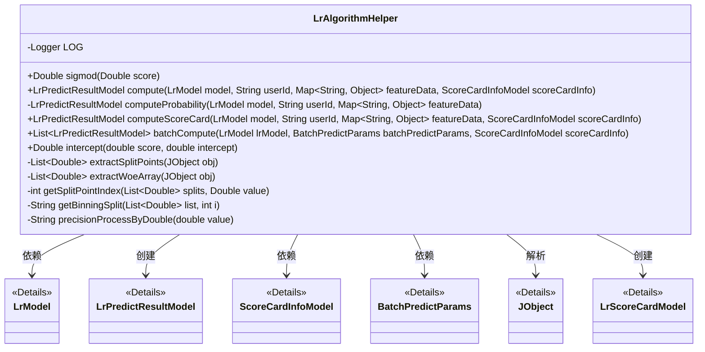
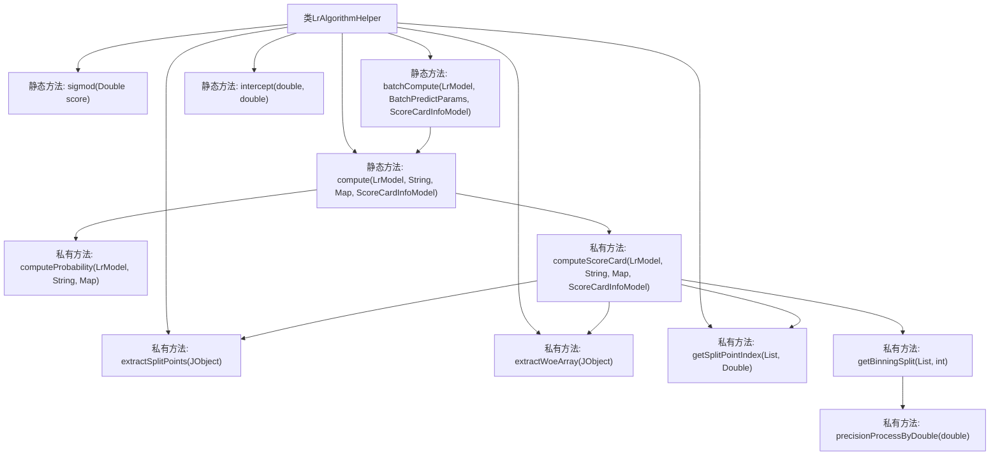

# 基础信息

|      |      |
|------|------|
| 名称 | LrAlgorithmHelper |
| 编码语言 | .java |
| 代码路径 | WeFe/serving/serving-sdk-java/src/main/java/com/welab/wefe/serving/sdk/algorithm/lr/LrAlgorithmHelper.java |
| 包名 | com.welab.wefe.serving.sdk.algorithm.lr |
| 依赖项 | ['com.alibaba.fastjson.JSON', 'com.alibaba.fastjson.util.TypeUtils', 'com.welab.wefe.common.util.JObject', 'com.welab.wefe.serving.sdk.dto.BatchPredictParams', 'com.welab.wefe.serving.sdk.enums.StateCode', 'com.welab.wefe.serving.sdk.model.ScoreCardInfoModel', 'com.welab.wefe.serving.sdk.model.lr.LrModel', 'com.welab.wefe.serving.sdk.model.lr.LrPredictResultModel', 'com.welab.wefe.serving.sdk.model.lr.LrScoreCardModel', 'com.welab.wefe.serving.sdk.utils.AlgorithmThreadPool', 'org.apache.commons.compress.utils.Lists', 'org.slf4j.Logger', 'org.slf4j.LoggerFactory', 'java.math.BigDecimal', 'java.util.List', 'java.util.Map', 'java.util.concurrent.CopyOnWriteArrayList', 'java.util.concurrent.CountDownLatch', 'java.lang.Math.exp'] |
| 概述说明 | LrAlgorithmHelper类提供逻辑回归算法支持，包含Sigmoid函数、特征概率计算、评分卡计算及批量预测功能，处理特征匹配错误并返回预测结果。 |

# 说明

LrAlgorithmHelper是一个逻辑回归算法工具类，提供多种计算方法。包含sigmod函数计算、基于特征的概率计算computeProbability和评分卡计算computeScoreCard。概率计算通过特征值与权重乘积求和得到分数；评分卡计算则额外处理分箱、WOE转换和评分转换。提供批量计算方法batchCompute，支持多线程处理用户预测请求。包含辅助方法如分箱索引获取、分箱区间格式化、数值精度处理等。当特征不匹配时会记录错误日志并返回失败结果。

# 类列表 Class Summary

| 名称   | 类型  | 说明 |
|-------|------|-------------|
| LrAlgorithmHelper | class | LrAlgorithmHelper类提供逻辑回归算法支持，包含sigmoid函数、特征概率计算、评分卡计算及批量预测功能，处理特征匹配错误并返回预测结果。 |

## 类 LrAlgorithmHelper

|      |      |
|------|------|
| 访问范围 | public |
| 类型 | class |
| 名称 | LrAlgorithmHelper |
| 说明 | LrAlgorithmHelper类提供逻辑回归算法支持，包含sigmoid函数、特征概率计算、评分卡计算及批量预测功能，处理特征匹配错误并返回预测结果。 |

### UML类图

该代码实现了一个逻辑回归算法工具类，主要提供特征得分计算、批量预测等功能。核心方法包括基于特征的概率计算(computeProbability)和评分卡计算(computeScoreCard)，支持单条和批量预测。类通过泛型集合处理特征数据，使用JObject解析评分卡配置，并通过线程池实现批量预测的并行处理。异常处理包括特征匹配检查和日志记录，数值处理采用BigDecimal保证精度。

### 内部方法调用关系图

该流程图展示了LrAlgorithmHelper类的核心结构，包含12个主要方法节点和15条调用关系。重点逻辑体现在compute方法的分支处理（根据scoreCardInfo选择computeProbability或computeScoreCard），以及computeScoreCard方法中通过特征值匹配、分箱计算和WOE转换的评分卡实现流程。私有工具方法如extractSplitPoints和getSplitPointIndex支撑了核心评分计算功能，batchCompute方法则通过线程池实现批量预测。

### 字段列表 Field List

| 名称  | 类型  | 说明 |
|-------|-------|------|
| LOG = LoggerFactory.getLogger(LrAlgorithmHelper.class) | Logger | 定义类LrAlgorithmHelper的私有静态日志常量LOG。 |

### 方法列表

| 名称  | 类型  | 说明 |
|-------|-------|------|
| extractSplitPoints | List<Double> | 提取JObject中的splitPoints字段，返回Double类型列表。 |
| intercept | Double | 这是一个静态方法，接收两个double参数score和intercept，返回它们的和。 |
| batchCompute | List<LrPredictResultModel> | 该方法使用多线程批量计算预测结果，通过线程池并行处理每个用户的特征数据，最终返回结果列表。异常时记录错误日志。 |
| computeScoreCard | LrPredictResultModel | 该方法计算用户评分卡分数，遍历特征数据，匹配模型权重，计算每个特征的得分并累加，若特征不匹配则返回错误，最终返回用户ID、总分和评分卡详情。 |
| extractWoeArray | List<Double> | 提取JSON对象中的woeArray字段并转为Double列表。 |
| computeProbability | LrPredictResultModel | 方法computeProbability根据模型权重和特征数据计算概率得分。遍历特征数据，匹配模型权重并累加得分。若无匹配特征，返回错误；否则返回用户ID和得分。 |
| sigmod | Double | 这是一个静态方法，实现Sigmoid函数，输入Double类型分数，输出1/(1+e^(-score))的结果。 |
| compute | LrPredictResultModel | 静态方法compute根据模型、用户ID、特征数据和评分卡信息计算预测结果。若特征数据为空返回0分，否则根据评分卡信息选择不同计算方法。 |
| getSplitPointIndex | int | 该方法遍历列表splits，返回第一个大于等于value的元素的索引，若无则返回最后一个索引。 |
| getBinningSplit | String | 方法getBinningSplit接收列表和索引，生成区间字符串。前界为-∞（首项）或列表前项，后界为当前项。结果格式"前界,后界"。 |
| precisionProcessByDouble | String | 该方法将双精度浮点数转换为保留两位小数的字符串，采用四舍五入规则处理。 |

