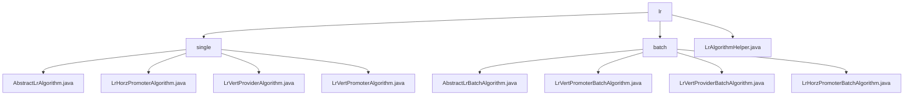

# 基础信息

|      |      |
|------|------|
| 名称 | lr |
| 编码语言 | .java |
| 代码路径 | WeFe/serving/serving-sdk-java/src/main/java/com/welab/wefe/serving/sdk/algorithm/lr |
| 包名 | docs.serving.serving-sdk-java.src.main.java.com.welab.wefe.serving.sdk.algorithm.lr |
| 概述说明 | 该模块实现逻辑回归预测流程，包括本地计算、分数调整和结果合并。支持横向和纵向联邦场景，涉及数据脱敏和分布式结果聚合。工具类提供Sigmoid转换、评分卡计算等方法。适用于金融风控等批量预测需求。 |

# 说明

## 概述  
该模块核心职责是实现逻辑回归算法的预测流程，支持单条和批量处理，涵盖本地计算、分数调整、结果合并及数据脱敏。通过统一接口规范（如handle/batchLocalCompute）和抽象基类（AbstractLrBatchAlgorithm）定义标准化流程，类似分布式计算框架。关键数据结构包括LrPredictResultModel（存储预测结果）、PredictParams（预测参数）和isScoreCard标志（区分评分卡模型）。外部依赖涉及JObject、AbstractAlgorithm及父类提供的批量计算框架。例如，分数调整包含Sigmoid转换、截距处理及分箱/WOE转换（评分卡场景）。

## 主要业务场景  
模块支持联邦学习中的横向（LrHorzPromoter）和纵向（LrVertPromoter）预测场景，典型流程为：1）本地计算生成预测值；2）根据isScoreCard决定归一化方式；3）纵向场景通过用户ID合并远程结果（类似MapReduce）。交互模式包含同步合并（mergeRemote）和异步计算，例如LrVertProvider会调用maskSensitiveData脱敏。典型应用包括金融风控评分（如baseScore调整）和非评分卡模型（如概率预测）。API类型覆盖单条预测、批量计算及跨节点聚合，工具类LrAlgorithmHelper提供分箱处理和多线程支持。

### 包内部结构视图

该流程图展示了逻辑回归算法模块的层级结构，顶层为lr目录，下分single（单机版）和batch（批量版）两个子目录。single目录包含4个具体算法实现类，batch目录包含3个批量算法实现类和1个抽象基类。根目录下还有1个工具类，整体呈现清晰的树状依赖关系。

# 文件列表

| 名称   | 类型  | 说明 |
|-------|------|-------------|
| [LrAlgorithmHelper.java](LrAlgorithmHelper.md) | file | LrAlgorithmHelper类提供逻辑回归算法支持，包含Sigmoid函数、特征概率计算、评分卡计算及批量预测功能，处理特征匹配错误并返回预测结果。 |
| [batch](batch/_module.md) | package | LrVertPromoterBatchAlgorithm类处理批量预测，含handle和mergeRemote方法。LrVertProviderBatchAlgorithm类实现批量预测与数据脱敏。LrHorzPromoterBatchAlgorithm类重写handle方法处理预测结果。AbstractLrBatchAlgorithm抽象类提供逻辑回归批量预测核心功能。 |
| [single](single/_module.md) | package | 抽象类AbstractLrAlgorithm扩展AbstractAlgorithm，实现逻辑回归核心逻辑，含预测计算、分数调整等方法。LrHorzPromoterAlgorithm处理本地计算与标准化。LrVertProviderAlgorithm执行本地计算并清除敏感数据。LrVertPromoterAlgorithm合并远程结果并归一化。 |

