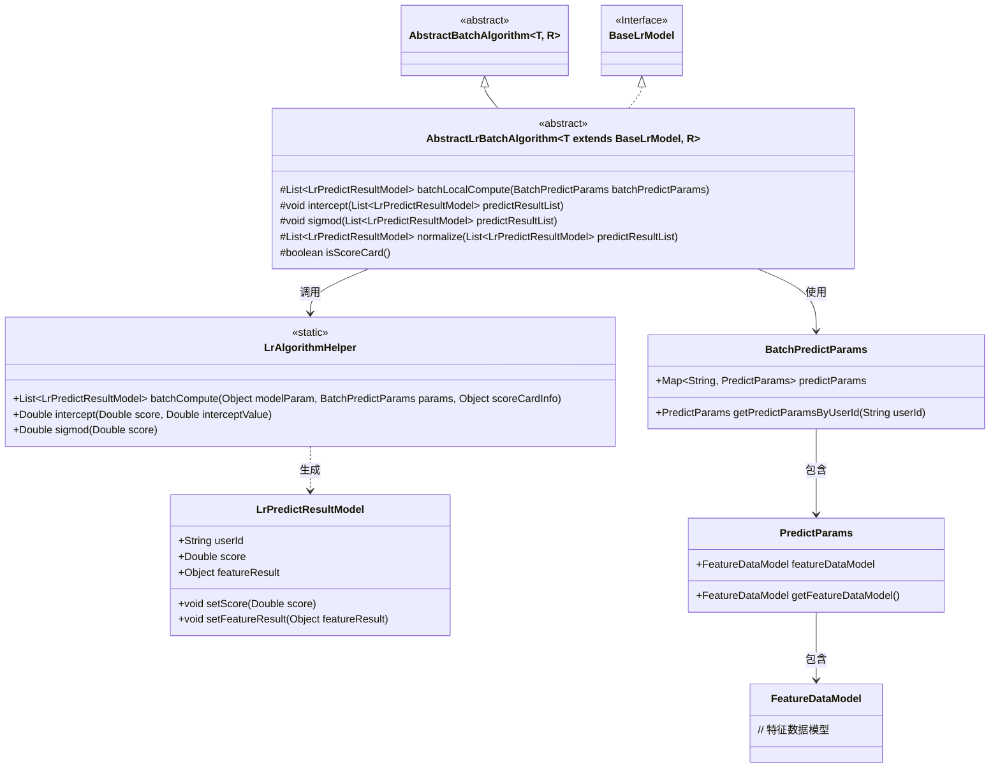
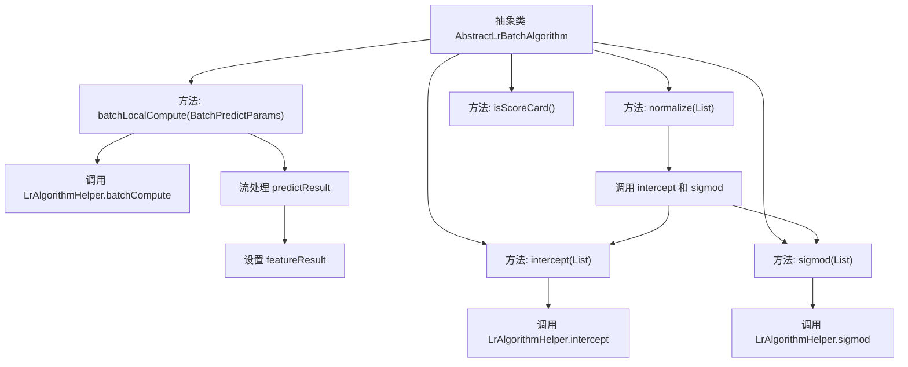

# 基础信息

|      |      |
|------|------|
| 名称 | AbstractLrBatchAlgorithm |
| 编码语言 | .java |
| 代码路径 | WeFe/serving/serving-sdk-java/src/main/java/com/welab/wefe/serving/sdk/algorithm/lr/batch/AbstractLrBatchAlgorithm.java |
| 包名 | com.welab.wefe.serving.sdk.algorithm.lr.batch |
| 依赖项 | ['com.welab.wefe.serving.sdk.algorithm.AbstractBatchAlgorithm', 'com.welab.wefe.serving.sdk.algorithm.lr.LrAlgorithmHelper', 'com.welab.wefe.serving.sdk.dto.BatchPredictParams', 'com.welab.wefe.serving.sdk.model.PredictModel', 'com.welab.wefe.serving.sdk.model.lr.BaseLrModel', 'com.welab.wefe.serving.sdk.model.lr.LrPredictResultModel', 'java.util.List'] |
| 概述说明 | 抽象类AbstractLrBatchAlgorithm提供批量预测功能，包含本地计算、截距处理、Sigmoid转换和归一化方法，支持评分卡判断。 |

# 说明

这是一个名为AbstractLrBatchAlgorithm的抽象类，继承自AbstractBatchAlgorithm，主要用于实现批量逻辑回归算法。该类包含多个关键方法：batchLocalCompute方法执行批量预测计算并提取特征结果；intercept方法对预测结果进行截距处理；sigmod方法应用sigmoid函数转换分数；normalize方法组合了截距处理和sigmoid转换。此外，isScoreCard方法用于检查是否存在评分卡信息。该类通过泛型支持不同类型的模型和结果，核心功能围绕逻辑回归预测结果的批量处理和标准化流程展开。

# 类列表 Class Summary

| 名称   | 类型  | 说明 |
|-------|------|-------------|
| AbstractLrBatchAlgorithm | class | 抽象类AbstractLrBatchAlgorithm实现批量预测逻辑，包含本地计算、截距处理、Sigmoid转换和结果标准化方法，支持评分卡判断。 |

## 类 AbstractLrBatchAlgorithm

|      |      |
|------|------|
| 访问范围 | public abstract |
| 类型 | class |
| 名称 | AbstractLrBatchAlgorithm |
| 说明 | 抽象类AbstractLrBatchAlgorithm实现批量预测逻辑，包含本地计算、截距处理、Sigmoid转换和结果标准化方法，支持评分卡判断。 |

### UML类图

该类图展示了一个逻辑回归批处理算法的抽象类结构。AbstractLrBatchAlgorithm继承自AbstractBatchAlgorithm，并实现了BaseLrModel接口，包含批处理计算、截距处理、Sigmoid函数转换和标准化等方法。通过LrAlgorithmHelper工具类进行核心计算，处理BatchPredictParams参数和LrPredictResultModel结果模型，涉及特征数据模型和预测参数的层级关系。

### 内部方法调用关系图

这段代码展示了一个抽象类`AbstractLrBatchAlgorithm`的核心方法流程。主要功能包括批量计算预测结果、拦截处理、Sigmoid函数转换、结果归一化以及分数卡检查。流程图清晰地展示了各方法间的调用关系，特别是`normalize`方法会依次调用`intercept`和`sigmod`方法，而`batchLocalCompute`方法则通过流处理为每个预测结果设置特征值。整体结构体现了对机器学习批处理算法的封装和扩展能力。

### 字段列表 Field List

| 名称  | 类型  | 说明 |
|-------|-------|------|

### 方法列表

| 名称  | 类型  | 说明 |
|-------|-------|------|
| isScoreCard | boolean | 检查modelParam中scoreCardInfo是否非空，返回布尔值。 |
| intercept | void | 该方法对预测结果列表中的每个模型分数进行截距调整，使用LrAlgorithmHelper.intercept方法结合模型参数中的截距值进行修正。 |
| batchLocalCompute | List<LrPredictResultModel> | 该方法批量计算预测结果，使用模型参数和输入数据生成预测结果列表，并为每个结果补充特征数据后返回。 |
| sigmod | void | 该方法对预测结果列表中的每个模型分数应用S型函数转换。 |
| normalize | List<LrPredictResultModel> | 该方法对预测结果列表进行标准化处理，先执行截距调整，再应用Sigmoid函数转换，最后返回处理后的列表。 |

