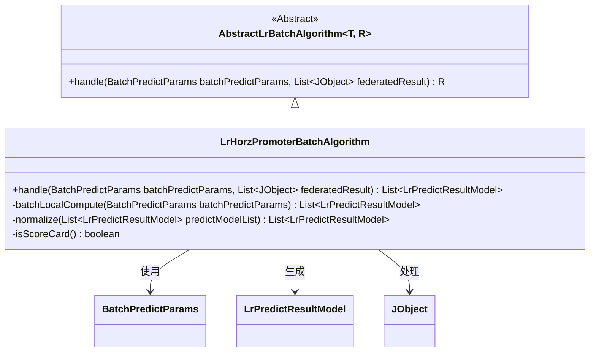
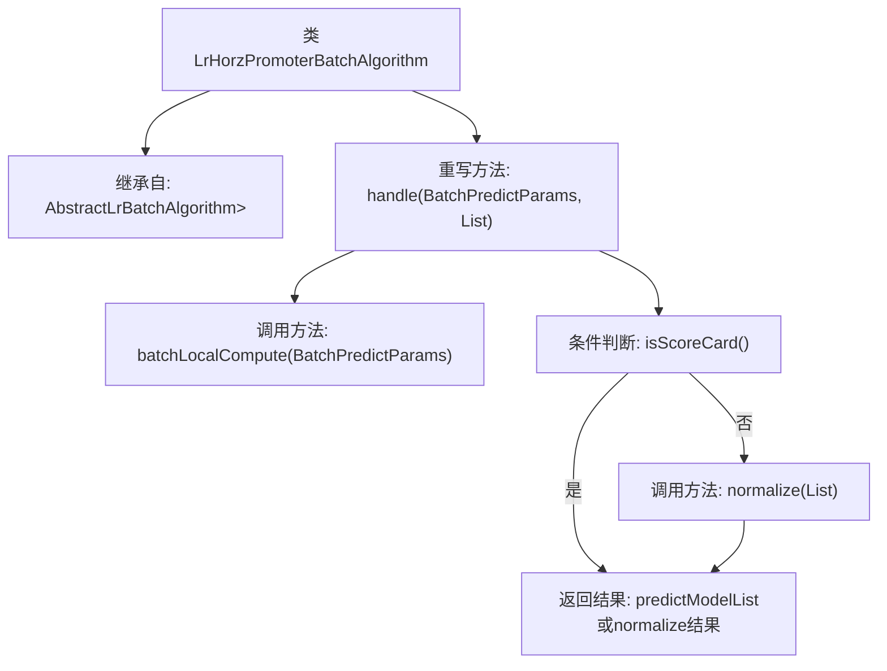

# 基础信息

|      |      |
|------|------|
| 名称 | LrHorzPromoterBatchAlgorithm |
| 编码语言 | .java |
| 代码路径 | WeFe/serving/serving-sdk-java/src/main/java/com/welab/wefe/serving/sdk/algorithm/lr/batch/LrHorzPromoterBatchAlgorithm.java |
| 包名 | com.welab.wefe.serving.sdk.algorithm.lr.batch |
| 依赖项 | ['com.welab.wefe.common.util.JObject', 'com.welab.wefe.serving.sdk.dto.BatchPredictParams', 'com.welab.wefe.serving.sdk.model.lr.BaseLrModel', 'com.welab.wefe.serving.sdk.model.lr.LrPredictResultModel', 'java.util.List'] |
| 概述说明 | LrHorzPromoterBatchAlgorithm类继承AbstractLrBatchAlgorithm，处理批量预测参数和联合结果，返回预测模型列表或归一化结果。 |

# 说明

该内容描述了一个名为LrHorzPromoterBatchAlgorithm的类，继承自AbstractLrBatchAlgorithm。该类重写了handle方法，用于处理批量预测参数和联合计算结果。方法首先调用batchLocalCompute进行本地计算，生成预测结果列表。然后根据isScoreCard方法的返回值决定直接返回预测结果列表，还是对结果进行归一化处理后返回。整个过程涉及批量预测和结果处理逻辑。

# 类列表 Class Summary

| 名称   | 类型  | 说明 |
|-------|------|-------------|
| LrHorzPromoterBatchAlgorithm | class | 这是一个Java类，继承自抽象批处理算法类，用于处理逻辑回归模型的批量预测。核心方法接收预测参数和联合结果，先进行本地计算，再根据是否评分卡决定是否归一化结果。 |

## 类 LrHorzPromoterBatchAlgorithm

|      |      |
|------|------|
| 访问范围 | public |
| 类型 | class |
| 名称 | LrHorzPromoterBatchAlgorithm |
| 说明 | 这是一个Java类，继承自抽象批处理算法类，用于处理逻辑回归模型的批量预测。核心方法接收预测参数和联合结果，先进行本地计算，再根据是否评分卡决定是否归一化结果。 |

### UML类图

这段代码展示了一个横向逻辑回归(LR)预测批处理算法的实现。LrHorzPromoterBatchAlgorithm继承自泛型抽象类AbstractLrBatchAlgorithm，实现了具体的handle方法。该算法首先通过batchLocalCompute进行本地计算，然后根据isScoreCard()判断是否需要对结果进行normalize标准化处理。类图中清晰地展示了继承关系、依赖关系以及关键方法的访问权限，体现了该批处理算法的核心逻辑结构。

### 内部方法调用关系图

该流程图描述了LrHorzPromoterBatchAlgorithm类的核心逻辑结构。该类继承自AbstractLrBatchAlgorithm基类，并重写了handle方法。handle方法首先调用batchLocalCompute进行本地计算，然后根据isScoreCard()的返回值决定直接返回计算结果还是先进行normalize标准化处理。整个流程展示了方法调用链和条件分支，清晰地呈现了数据处理路径和决策点。

### 字段列表 Field List

| 名称  | 类型  | 说明 |
|-------|-------|------|

### 方法列表

| 名称  | 类型  | 说明 |
|-------|-------|------|
| handle | List<LrPredictResultModel> | 该方法处理批量预测参数和联合结果，先进行本地计算生成预测列表，最后根据是否评分卡决定返回归一化结果或原始列表。 |

