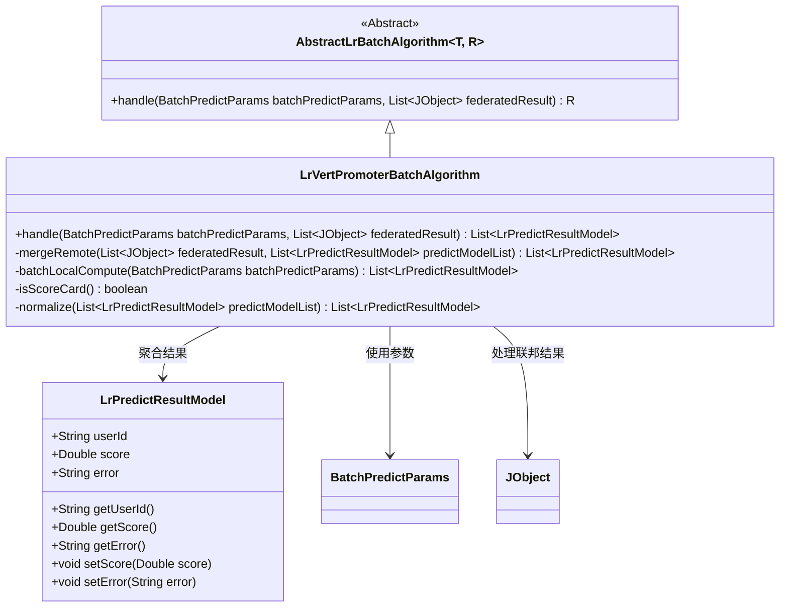
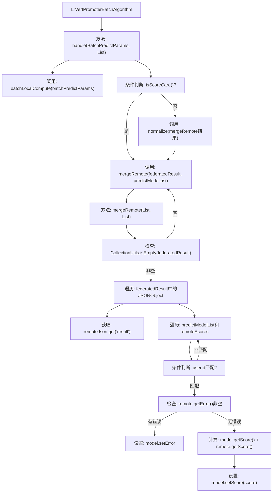
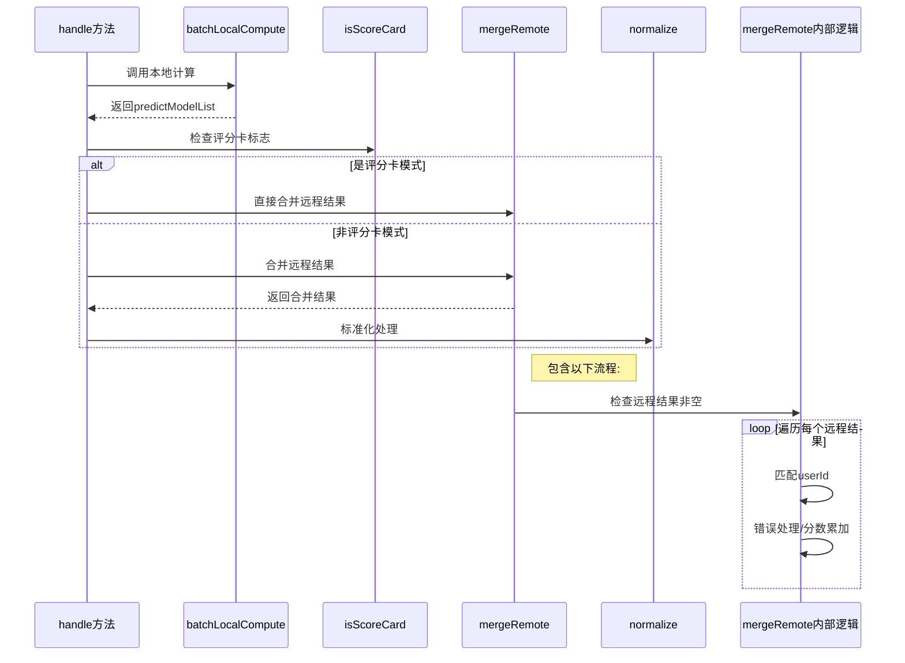

# 基础信息

|      |      |
|------|------|
| 名称 | LrVertPromoterBatchAlgorithm |
| 编码语言 | .java |
| 代码路径 | WeFe/serving/serving-sdk-java/src/main/java/com/welab/wefe/serving/sdk/algorithm/lr/batch/LrVertPromoterBatchAlgorithm.java |
| 包名 | com.welab.wefe.serving.sdk.algorithm.lr.batch |
| 依赖项 | ['com.alibaba.fastjson.JSONObject', 'com.welab.wefe.common.exception.StatusCodeWithException', 'com.welab.wefe.common.util.JObject', 'com.welab.wefe.serving.sdk.dto.BatchPredictParams', 'com.welab.wefe.serving.sdk.model.lr.BaseLrModel', 'com.welab.wefe.serving.sdk.model.lr.LrPredictResultModel', 'org.apache.commons.collections4.CollectionUtils', 'java.util.List'] |
| 概述说明 | LrVertPromoterBatchAlgorithm类处理批量预测，合并本地和远程结果。若为评分卡则直接合并，否则归一化。合并时匹配用户ID并累加分数，处理错误信息。 |

# 说明

该代码描述了一个名为LrVertPromoterBatchAlgorithm的类，继承自AbstractLrBatchAlgorithm。主要功能是处理批量预测任务，包含两个核心方法：handle和mergeRemote。handle方法执行本地计算后，根据isScoreCard标志决定是否对合并结果进行标准化处理。mergeRemote方法负责合并本地与远程预测结果，通过匹配用户ID进行分数累加，并处理远程调用错误情况。整个过程实现了分布式环境下的预测结果聚合。

# 类列表 Class Summary

| 名称   | 类型  | 说明 |
|-------|------|-------------|
| LrVertPromoterBatchAlgorithm | class | LrVertPromoterBatchAlgorithm类处理批量预测，合并本地与远程结果，根据是否为评分卡决定是否标准化。合并时匹配用户ID并累加分数或记录错误。 |

## 类 LrVertPromoterBatchAlgorithm

|      |      |
|------|------|
| 访问范围 | public |
| 类型 | class |
| 名称 | LrVertPromoterBatchAlgorithm |
| 说明 | LrVertPromoterBatchAlgorithm类处理批量预测，合并本地与远程结果，根据是否为评分卡决定是否标准化。合并时匹配用户ID并累加分数或记录错误。 |

### UML类图

这段代码展示了一个逻辑回归垂直联邦学习的预测算法实现。LrVertPromoterBatchAlgorithm继承自抽象类AbstractLrBatchAlgorithm，主要实现了handle方法用于处理批量预测，包含本地计算(batchLocalCompute)和远程结果合并(mergeRemote)两个核心步骤。mergeRemote方法通过比对用户ID将本地和远程的预测分数相加，同时处理可能的错误情况。类图中清晰地展示了算法类与参数类、结果类之间的依赖关系，以及继承自抽象基类的层级结构。

### 内部方法调用关系图

该流程图展示了纵向逻辑回归批量预测算法的核心处理流程。首先通过本地计算生成预测结果，然后根据是否启用评分卡模式决定是否进行标准化处理。合并远程结果时，会遍历所有协作方的计算结果，进行用户ID匹配和分数聚合，同时处理可能的错误情况。时序图则清晰呈现了方法间的调用顺序和条件分支逻辑。

### 字段列表 Field List

| 名称  | 类型  | 说明 |
|-------|-------|------|

### 方法列表

| 名称  | 类型  | 说明 |
|-------|-------|------|
| mergeRemote | List<LrPredictResultModel> | 合并远程预测结果到本地列表。若远程结果为空则返回本地列表。遍历远程结果，匹配用户ID后合并分数或记录错误。最终返回更新后的本地列表。 |
| handle | List<LrPredictResultModel> | 该方法处理批量预测参数和联合结果，先本地计算生成预测模型列表，再根据是否评分卡决定合并远程结果的方式。 |

