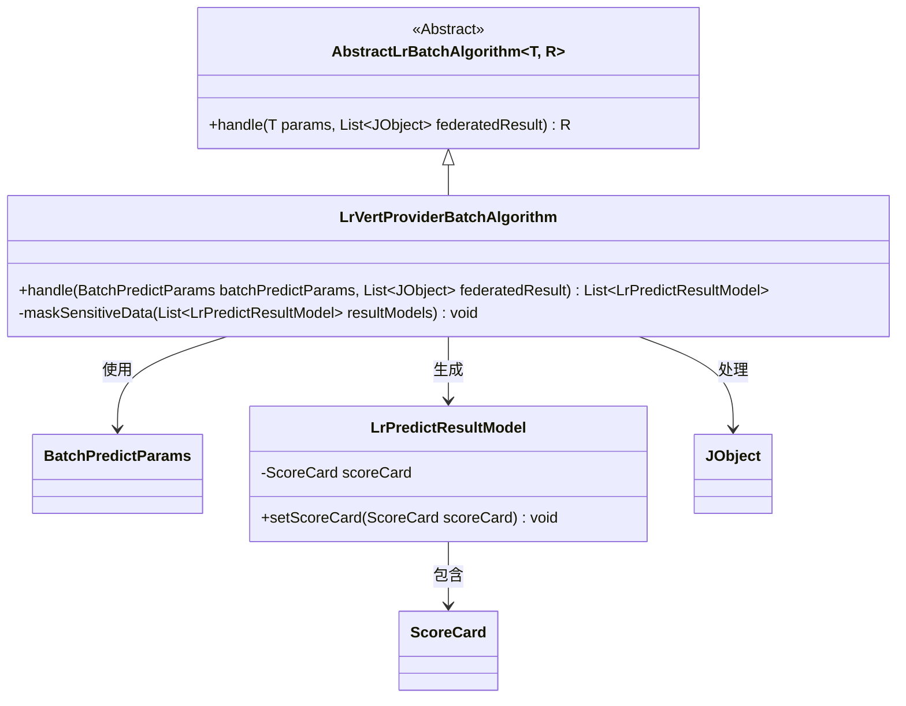
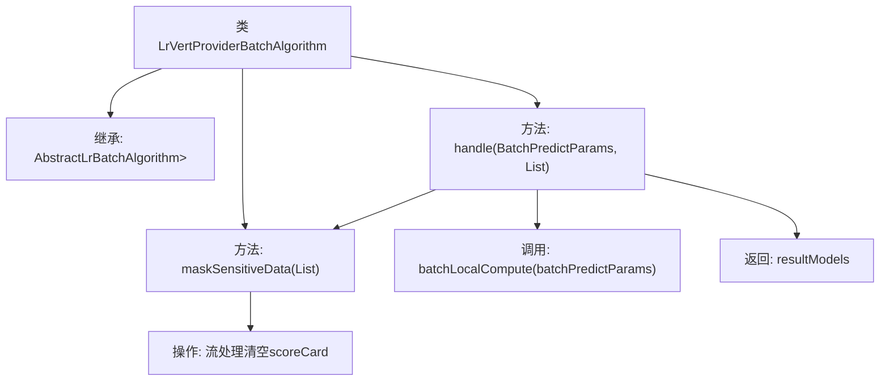

# 基础信息

|      |      |
|------|------|
| 名称 | LrVertProviderBatchAlgorithm |
| 编码语言 | .java |
| 代码路径 | WeFe/serving/serving-sdk-java/src/main/java/com/welab/wefe/serving/sdk/algorithm/lr/batch/LrVertProviderBatchAlgorithm.java |
| 包名 | com.welab.wefe.serving.sdk.algorithm.lr.batch |
| 依赖项 | ['com.welab.wefe.common.util.JObject', 'com.welab.wefe.serving.sdk.dto.BatchPredictParams', 'com.welab.wefe.serving.sdk.model.lr.BaseLrModel', 'com.welab.wefe.serving.sdk.model.lr.LrPredictResultModel', 'java.util.List'] |
| 概述说明 | LrVertProviderBatchAlgorithm类继承AbstractLrBatchAlgorithm，重写handle方法处理批量预测，调用本地计算并屏蔽敏感数据（清空scoreCard）。 |

# 说明

这是一个名为LrVertProviderBatchAlgorithm的Java类，继承自AbstractLrBatchAlgorithm抽象类。该类实现了批量预测逻辑，主要功能包括：处理批量预测参数和联合计算结果，执行本地批量计算，并对结果中的敏感数据进行脱敏处理。具体通过maskSensitiveData方法将结果模型中的scoreCard字段设为null来实现数据脱敏。最终返回处理后的预测结果列表。

# 类列表 Class Summary

| 名称   | 类型  | 说明 |
|-------|------|-------------|
| LrVertProviderBatchAlgorithm | class | LrVertProviderBatchAlgorithm类继承AbstractLrBatchAlgorithm，处理批量预测参数和联合结果，执行本地计算并屏蔽敏感数据。 |

## 类 LrVertProviderBatchAlgorithm

|      |      |
|------|------|
| 访问范围 | public |
| 类型 | class |
| 名称 | LrVertProviderBatchAlgorithm |
| 说明 | LrVertProviderBatchAlgorithm类继承AbstractLrBatchAlgorithm，处理批量预测参数和联合结果，执行本地计算并屏蔽敏感数据。 |

### UML类图

类图描述：该图展示了逻辑回归垂直提供方批量算法(LrVertProviderBatchAlgorithm)的类结构，它继承自泛型抽象类AbstractLrBatchAlgorithm。主要功能是通过handle方法处理批量预测参数和联邦结果，生成预测结果列表，并包含敏感数据掩码处理的私有方法。涉及的核心类包括批预测参数、预测结果模型（内含计分卡对象）和JSON对象，体现了数据处理流程中的关键组件关系。

### 内部方法调用关系图

该流程图展示了LrVertProviderBatchAlgorithm类的核心结构和工作流程。该类继承自AbstractLrBatchAlgorithm，主要包含handle和maskSensitiveData两个方法。handle方法首先调用batchLocalCompute进行本地计算，然后调用maskSensitiveData方法通过流处理清空所有结果模型的scoreCard敏感数据，最后返回处理后的结果列表。整个流程体现了数据处理和隐私保护的完整链路。

### 字段列表 Field List

| 名称  | 类型  | 说明 |
|-------|-------|------|

### 方法列表

| 名称  | 类型  | 说明 |
|-------|-------|------|
| handle | List<LrPredictResultModel> | 重写方法处理批量预测参数和联合结果，执行本地计算并屏蔽敏感数据后返回结果模型列表。 |
| maskSensitiveData | void | 该方法遍历结果模型列表，清空每个模型的敏感数据scoreCard字段。 |

