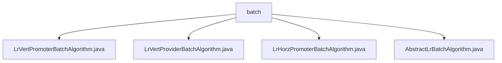

# 基础信息

|      |      |
|------|------|
| 名称 | batch |
| 编码语言 | .java |
| 代码路径 | WeFe/serving/serving-sdk-java/src/main/java/com/welab/wefe/serving/sdk/algorithm/lr/batch |
| 包名 | docs.serving.serving-sdk-java.src.main.java.com.welab.wefe.serving.sdk.algorithm.lr.batch |
| 概述说明 | LrVertPromoterBatchAlgorithm类处理批量预测，含handle和mergeRemote方法。LrVertProviderBatchAlgorithm类实现批量预测与数据脱敏。LrHorzPromoterBatchAlgorithm类重写handle方法处理预测结果。AbstractLrBatchAlgorithm抽象类提供逻辑回归批量预测核心功能。 |

# 说明

## 概述  
该模块实现分布式逻辑回归批量预测，核心职责包括本地计算、结果合并及数据脱敏。通过抽象基类AbstractLrBatchAlgorithm定义标准化流程（如sigmoid转换、截距处理），子类LrVertPromoter/LrHorzPromoter等分别处理纵向/横向联邦场景。例如LrVertPromoter通过mergeRemote合并跨节点预测分数，类似MapReduce的聚合模式。关键数据结构包含预测结果列表和评分卡标志isScoreCard，依赖父类AbstractBatchAlgorithm提供的批量计算框架。

## 主要业务场景  
模块支持联邦学习中批量预测任务，典型流程为：1）本地执行batchLocalCompute生成预测值；2）根据isScoreCard决定是否归一化；3）纵向场景下通过用户ID匹配合并远程结果。例如LrVertProvider会对敏感数据调用maskSensitiveData脱敏。交互模式包含同步合并（mergeRemote）和异步计算，适用于金融风控等需要分布式评分的场景。API类型涵盖本地计算、结果标准化和跨节点聚合三类操作。

### 包内部结构视图

该流程图展示了LR批量算法模块的文件结构，其中batch目录包含四个Java实现类：纵向合作方/提供方批量算法、横向合作方批量算法以及抽象的批量算法基类。所有文件均位于同一层级，直接隶属于batch目录下。

# 文件列表

| 名称   | 类型  | 说明 |
|-------|------|-------------|
| [LrVertPromoterBatchAlgorithm.java](LrVertPromoterBatchAlgorithm.md) | file | LrVertPromoterBatchAlgorithm类处理批量预测，合并本地和远程结果。若为评分卡则直接合并，否则归一化。合并时匹配用户ID并累加分数，处理错误信息。 |
| [LrVertProviderBatchAlgorithm.java](LrVertProviderBatchAlgorithm.md) | file | LrVertProviderBatchAlgorithm类继承AbstractLrBatchAlgorithm，重写handle方法处理批量预测，调用本地计算并屏蔽敏感数据（清空scoreCard）。 |
| [LrHorzPromoterBatchAlgorithm.java](LrHorzPromoterBatchAlgorithm.md) | file | LrHorzPromoterBatchAlgorithm类继承AbstractLrBatchAlgorithm，处理批量预测参数和联合结果，返回预测模型列表或归一化结果。 |
| [AbstractLrBatchAlgorithm.java](AbstractLrBatchAlgorithm.md) | file | 抽象类AbstractLrBatchAlgorithm提供批量预测功能，包含本地计算、截距处理、Sigmoid转换和归一化方法，支持评分卡判断。 |

