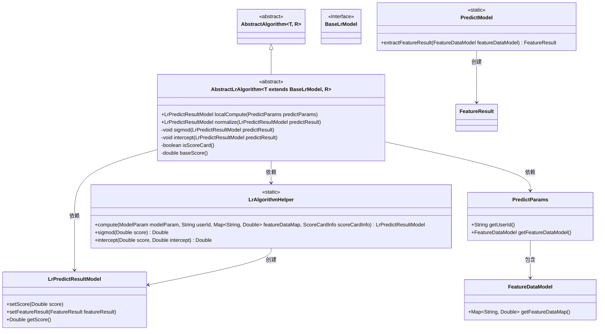
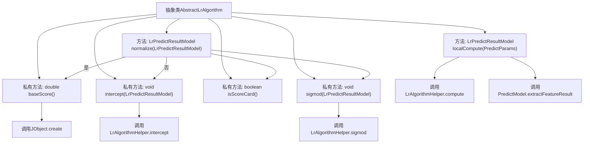

# 基础信息

|      |      |
|------|------|
| 名称 | AbstractLrAlgorithm |
| 编码语言 | .java |
| 代码路径 | WeFe/serving/serving-sdk-java/src/main/java/com/welab/wefe/serving/sdk/algorithm/lr/single/AbstractLrAlgorithm.java |
| 包名 | com.welab.wefe.serving.sdk.algorithm.lr.single |
| 依赖项 | ['com.welab.wefe.common.util.JObject', 'com.welab.wefe.serving.sdk.algorithm.AbstractAlgorithm', 'com.welab.wefe.serving.sdk.algorithm.lr.LrAlgorithmHelper', 'com.welab.wefe.serving.sdk.dto.PredictParams', 'com.welab.wefe.serving.sdk.model.PredictModel', 'com.welab.wefe.serving.sdk.model.lr.BaseLrModel', 'com.welab.wefe.serving.sdk.model.lr.LrPredictResultModel'] |
| 概述说明 | 抽象类AbstractLrAlgorithm实现逻辑回归预测，包含本地计算、归一化处理（计分卡判断、截距调整、Sigmoid转换）及基础分数计算功能。 |

# 说明

该抽象类扩展了AbstractAlgorithm，专用于逻辑回归算法。主要功能包括：localCompute方法通过LrAlgorithmHelper计算预测结果，并提取特征结果；normalize方法根据是否为评分卡模型进行分数调整，非评分卡则执行截距处理和Sigmoid转换。辅助方法包括sigmod函数转换分数、intercept处理截距、isScoreCard判断模型类型及baseScore获取评分卡基础分。整体实现了逻辑回归预测流程的核心逻辑。

# 类列表 Class Summary

| 名称   | 类型  | 说明 |
|-------|------|-------------|
| AbstractLrAlgorithm | class | 抽象类AbstractLrAlgorithm实现LR模型预测计算，包含本地计算、归一化、sigmoid函数和截距处理等方法，支持评分卡功能。 |

## 类 AbstractLrAlgorithm

|      |      |
|------|------|
| 访问范围 | public abstract |
| 类型 | class |
| 名称 | AbstractLrAlgorithm |
| 说明 | 抽象类AbstractLrAlgorithm实现LR模型预测计算，包含本地计算、归一化、sigmoid函数和截距处理等方法，支持评分卡功能。 |

### UML类图

该类图展示了一个逻辑回归算法抽象类`AbstractLrAlgorithm`的继承关系和协作对象。该类继承自`AbstractAlgorithm`，实现了本地计算和结果归一化功能，依赖`LrAlgorithmHelper`进行核心计算，使用`PredictParams`作为输入参数，生成`LrPredictResultModel`作为输出结果。图中清晰体现了泛型参数约束（T必须继承`BaseLrModel`）、静态工具类的使用以及模型参数的数据流动路径。

### 内部方法调用关系图

该流程图展示了抽象类AbstractLrAlgorithm的核心结构和方法调用关系。主要包含localCompute和normalize两个公开方法，其中localCompute通过LrAlgorithmHelper完成预测计算并提取特征结果，normalize方法根据是否计分卡模式分别处理：计分卡模式调用baseScore计算基准分，否则先进行截距处理再执行sigmod函数。私有方法包含sigmod计算、intercept截距处理、isScoreCard判断和baseScore基准分计算，形成完整的逻辑处理链条。

### 字段列表 Field List

| 名称  | 类型  | 说明 |
|-------|-------|------|

### 方法列表

| 名称  | 类型  | 说明 |
|-------|-------|------|
| sigmod | void | 该方法使用逻辑回归的Sigmoid函数对预测结果分数进行转换。 |
| isScoreCard | boolean | 检查modelParam的scoreCardInfo是否非空，返回布尔值。 |
| localCompute | LrPredictResultModel | 方法localCompute接收PredictParams参数，调用LrAlgorithmHelper.compute计算预测结果，设置特征结果后返回LrPredictResultModel对象。 |
| normalize | LrPredictResultModel | 该方法对预测结果进行标准化处理：若为评分卡模式，则累加基础分；否则执行截距和Sigmoid转换。最终返回处理后的结果。 |
| intercept | void | 该方法通过调用LrAlgorithmHelper.intercept调整预测分数，并将新分数设置回predictResult。 |
| baseScore | double | 该方法计算基础分数，从评分卡获取a_score和b_score，结合模型参数中的截距值进行加权求和。 |

