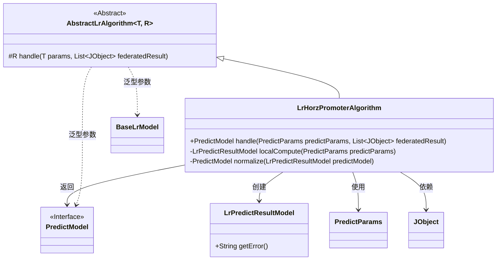
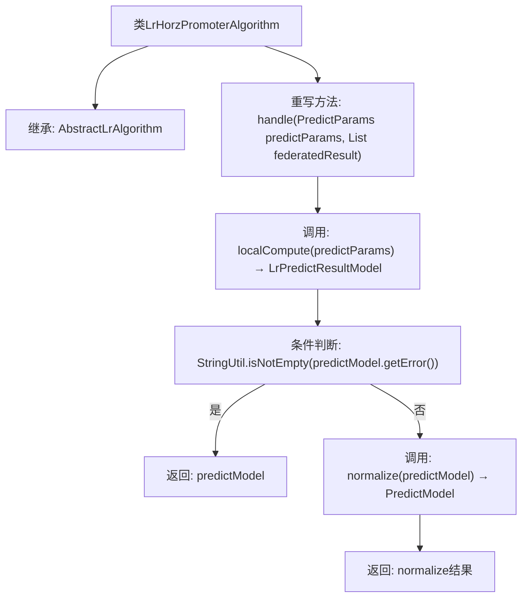

# 基础信息

|      |      |
|------|------|
| 名称 | LrHorzPromoterAlgorithm |
| 编码语言 | .java |
| 代码路径 | WeFe/serving/serving-sdk-java/src/main/java/com/welab/wefe/serving/sdk/algorithm/lr/single/LrHorzPromoterAlgorithm.java |
| 包名 | com.welab.wefe.serving.sdk.algorithm.lr.single |
| 依赖项 | ['com.welab.wefe.common.util.JObject', 'com.welab.wefe.common.util.StringUtil', 'com.welab.wefe.serving.sdk.dto.PredictParams', 'com.welab.wefe.serving.sdk.model.PredictModel', 'com.welab.wefe.serving.sdk.model.lr.BaseLrModel', 'com.welab.wefe.serving.sdk.model.lr.LrPredictResultModel', 'java.util.List'] |
| 概述说明 | LrHorzPromoterAlgorithm继承AbstractLrAlgorithm，重写handle方法，先本地计算预测结果，错误则返回，否则归一化后返回。 |

# 说明

该内容描述了一个名为LrHorzPromoterAlgorithm的类，继承自AbstractLrAlgorithm。该类重写了handle方法，用于处理预测参数和联合计算结果。首先调用localCompute进行本地计算，若结果包含错误则直接返回；否则对结果进行标准化处理后返回。整个过程涉及预测参数、联合计算结果及错误检查。

# 类列表 Class Summary

| 名称   | 类型  | 说明 |
|-------|------|-------------|
| LrHorzPromoterAlgorithm | class | LrHorzPromoterAlgorithm继承AbstractLrAlgorithm，重写handle方法，先本地计算，错误则返回，否则归一化结果。 |

## 类 LrHorzPromoterAlgorithm

|      |      |
|------|------|
| 访问范围 | public |
| 类型 | class |
| 名称 | LrHorzPromoterAlgorithm |
| 说明 | LrHorzPromoterAlgorithm继承AbstractLrAlgorithm，重写handle方法，先本地计算，错误则返回，否则归一化结果。 |

### UML类图

该图展示了LrHorzPromoterAlgorithm继承自泛型抽象类AbstractLrAlgorithm，实现了横向联邦学习的预测处理流程。类图中包含6个主要类/接口，清晰地呈现了算法核心结构：LrHorzPromoterAlgorithm通过localCompute进行本地计算，再通过normalize标准化结果，最终返回PredictModel。箭头关系准确表达了类之间的继承、依赖和泛型关联。

### 内部方法调用关系图

该流程图展示了LrHorzPromoterAlgorithm类的核心处理逻辑。首先通过localCompute方法进行本地计算，然后检查计算结果是否存在错误：若存在错误则直接返回错误信息，否则对结果进行标准化处理后返回。整个过程体现了错误优先处理和结果后处理的典型模式，箭头清晰标注了条件分支和返回路径。

### 字段列表 Field List

| 名称  | 类型  | 说明 |
|-------|-------|------|

### 方法列表

| 名称  | 类型  | 说明 |
|-------|-------|------|
| handle | PredictModel | 该方法处理预测参数和联合结果，先进行本地计算生成预测模型。若模型包含错误则直接返回，否则返回归一化后的模型。 |

