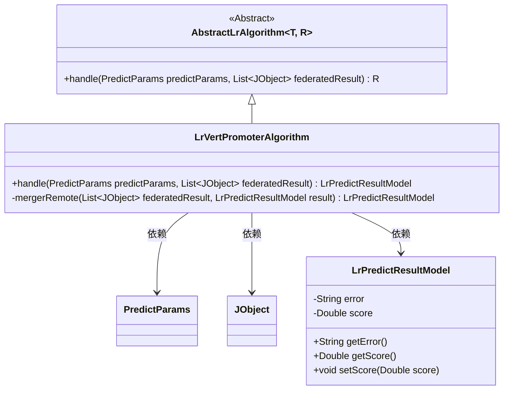
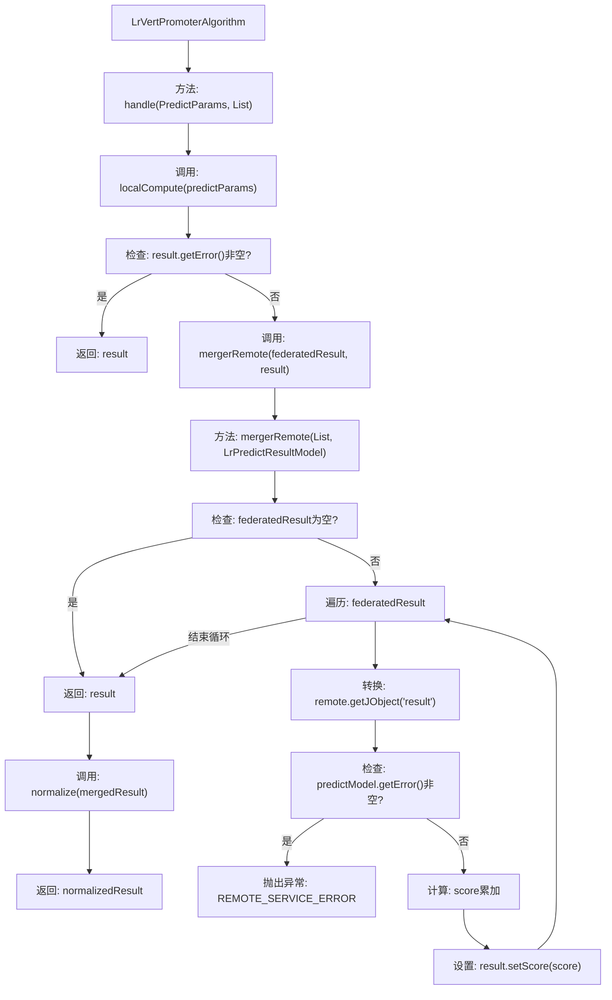

# 基础信息

|      |      |
|------|------|
| 名称 | LrVertPromoterAlgorithm |
| 编码语言 | .java |
| 代码路径 | WeFe/serving/serving-sdk-java/src/main/java/com/welab/wefe/serving/sdk/algorithm/lr/single/LrVertPromoterAlgorithm.java |
| 包名 | com.welab.wefe.serving.sdk.algorithm.lr.single |
| 依赖项 | ['com.alibaba.fastjson.util.TypeUtils', 'com.welab.wefe.common.StatusCode', 'com.welab.wefe.common.exception.StatusCodeWithException', 'com.welab.wefe.common.util.JObject', 'com.welab.wefe.common.util.StringUtil', 'com.welab.wefe.serving.sdk.dto.PredictParams', 'com.welab.wefe.serving.sdk.model.lr.BaseLrModel', 'com.welab.wefe.serving.sdk.model.lr.LrPredictResultModel', 'org.apache.commons.collections4.CollectionUtils', 'java.util.List'] |
| 概述说明 | LrVertPromoterAlgorithm继承AbstractLrAlgorithm，处理预测参数和联邦结果，合并远程分数并归一化返回。错误时抛出异常或返回结果。 |

# 说明

LrVertPromoterAlgorithm是一个继承自AbstractLrAlgorithm的类，用于处理逻辑回归预测。它通过handle方法执行本地计算并合并远程结果。首先调用localCompute进行本地预测，若有错误则直接返回。否则通过mergerRemote方法合并远程结果，检查每个远程结果是否有错误，若无则将分数累加。最终返回归一化后的合并结果。

# 类列表 Class Summary

| 名称   | 类型  | 说明 |
|-------|------|-------------|
| LrVertPromoterAlgorithm | class | LrVertPromoterAlgorithm继承AbstractLrAlgorithm，处理预测参数和联邦结果。先本地计算，若无错误则合并远程结果并归一化。合并时累加分数，遇错抛出异常。 |

## 类 LrVertPromoterAlgorithm

|      |      |
|------|------|
| 访问范围 | public |
| 类型 | class |
| 名称 | LrVertPromoterAlgorithm |
| 说明 | LrVertPromoterAlgorithm继承AbstractLrAlgorithm，处理预测参数和联邦结果。先本地计算，若无错误则合并远程结果并归一化。合并时累加分数，遇错抛出异常。 |

### UML类图

该图展示了纵向逻辑回归算法(LrVertPromoterAlgorithm)继承自泛型抽象类AbstractLrAlgorithm，并实现了具体处理方法。主要涉及预测参数处理、联邦学习结果合并和预测结果模型操作。类图中清晰地体现了继承关系和关键依赖，包括对PredictParams、JObject和LrPredictResultModel三个核心类的使用。LrVertPromoterAlgorithm通过handle方法处理本地计算和远程结果合并，mergerRemote私有方法负责具体的联邦结果聚合逻辑。

### 内部方法调用关系图

该流程图描述了纵向逻辑回归算法的预测处理流程。首先通过localCompute进行本地计算，若结果包含错误则直接返回；否则合并远程参与方的计算结果，期间会校验远程结果的有效性并进行分数累加，最后对合并结果进行归一化处理返回。mergerRemote方法实现了联邦结果的聚合逻辑，包含空值检查和错误处理机制。

### 字段列表 Field List

| 名称  | 类型  | 说明 |
|-------|-------|------|

### 方法列表

| 名称  | 类型  | 说明 |
|-------|-------|------|
| mergerRemote | LrPredictResultModel | 方法合并远程预测结果。若输入为空直接返回。遍历远程结果，检查错误并抛出异常。累加分数到结果模型后返回。 |
| handle | LrPredictResultModel | 处理预测参数和联合结果，先本地计算，错误则返回，否则合并远程结果并归一化后返回。 |

