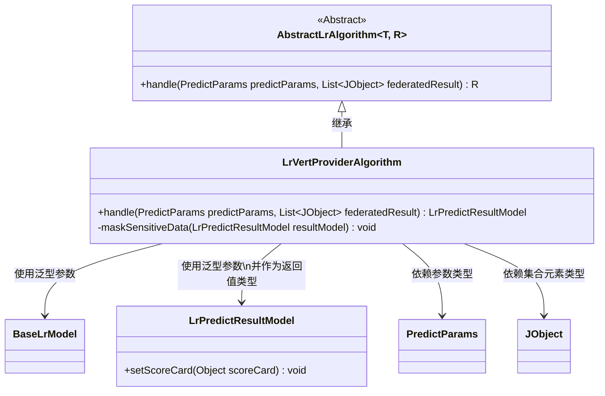
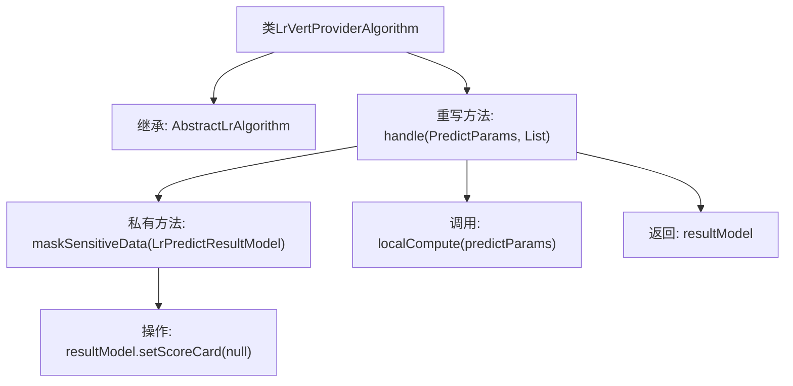

# 基础信息

|      |      |
|------|------|
| 名称 | LrVertProviderAlgorithm |
| 编码语言 | .java |
| 代码路径 | WeFe/serving/serving-sdk-java/src/main/java/com/welab/wefe/serving/sdk/algorithm/lr/single/LrVertProviderAlgorithm.java |
| 包名 | com.welab.wefe.serving.sdk.algorithm.lr.single |
| 依赖项 | ['com.welab.wefe.common.util.JObject', 'com.welab.wefe.serving.sdk.dto.PredictParams', 'com.welab.wefe.serving.sdk.model.lr.BaseLrModel', 'com.welab.wefe.serving.sdk.model.lr.LrPredictResultModel', 'java.util.List'] |
| 概述说明 | LrVertProviderAlgorithm继承AbstractLrAlgorithm，重写handle方法进行本地计算并屏蔽敏感数据（清空scoreCard）。 |

# 说明

该代码描述了一个名为LrVertProviderAlgorithm的类，继承自AbstractLrAlgorithm。它重写了handle方法，接收PredictParams和JObject列表作为参数，先调用localCompute进行本地计算生成LrPredictResultModel结果，随后通过maskSensitiveData方法清除敏感数据（将scoreCard设为null），最后返回处理后的结果模型。整个过程实现了预测逻辑与敏感数据保护的结合。

# 类列表 Class Summary

| 名称   | 类型  | 说明 |
|-------|------|-------------|
| LrVertProviderAlgorithm | class | LrVertProviderAlgorithm继承AbstractLrAlgorithm，重写handle方法执行本地计算并屏蔽敏感数据（清空scoreCard）。 |

## 类 LrVertProviderAlgorithm

|      |      |
|------|------|
| 访问范围 | public |
| 类型 | class |
| 名称 | LrVertProviderAlgorithm |
| 说明 | LrVertProviderAlgorithm继承AbstractLrAlgorithm，重写handle方法执行本地计算并屏蔽敏感数据（清空scoreCard）。 |

### UML类图

这段代码展示了一个纵向逻辑回归(LR)提供方算法的实现，继承自泛型抽象类AbstractLrAlgorithm。LrVertProviderAlgorithm实现了handle方法，先进行本地计算，然后通过maskSensitiveData方法清除敏感数据（将scoreCard设为null）。类图中清晰地展示了继承关系、泛型参数绑定、方法可见性以及各类之间的依赖关系，体现了纵向联邦学习中数据隐私保护的关键处理流程。

### 内部方法调用关系图

该流程图展示了LrVertProviderAlgorithm类的结构和方法调用关系。该类继承自AbstractLrAlgorithm泛型类，重写了handle方法用于处理预测参数和联邦计算结果。handle方法首先调用localCompute进行本地计算，然后通过maskSensitiveData方法对结果中的敏感数据进行脱敏处理（清空scoreCard字段），最后返回处理后的结果模型。整个流程体现了数据处理的安全性和完整性保障机制。

### 字段列表 Field List

| 名称  | 类型  | 说明 |
|-------|-------|------|

### 方法列表

| 名称  | 类型  | 说明 |
|-------|-------|------|
| handle | LrPredictResultModel | 该方法处理预测参数和联合结果，先本地计算生成预测结果模型，然后脱敏敏感数据，最后返回结果模型。 |
| maskSensitiveData | void | 方法maskSensitiveData清空resultModel的scoreCard字段以隐藏敏感数据。 |

