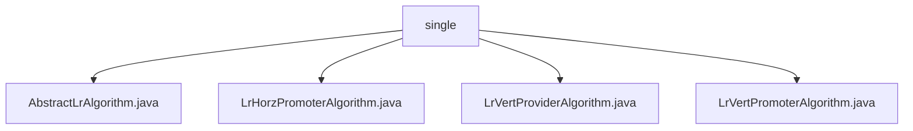

# 基础信息

|      |      |
|------|------|
| 名称 | single |
| 编码语言 | .java |
| 代码路径 | WeFe/serving/serving-sdk-java/src/main/java/com/welab/wefe/serving/sdk/algorithm/lr/single |
| 包名 | docs.serving.serving-sdk-java.src.main.java.com.welab.wefe.serving.sdk.algorithm.lr.single |
| 概述说明 | 抽象类AbstractLrAlgorithm扩展AbstractAlgorithm，实现逻辑回归核心逻辑，含预测计算、分数调整等方法。LrHorzPromoterAlgorithm处理本地计算与标准化。LrVertProviderAlgorithm执行本地计算并清除敏感数据。LrVertPromoterAlgorithm合并远程结果并归一化。 |

# 说明

## 概述  
该模块核心职责是实现逻辑回归算法的预测流程，包括本地计算、分数调整和结果合并。接口规范统一通过handle方法处理预测参数，支持本地计算（localCompute）和结果标准化（normalize）。关键数据结构包含LrPredictResultModel（存储预测结果）和PredictParams（预测参数）。外部依赖包括JObject（JSON处理库）和AbstractAlgorithm（算法基类）。例如，分数调整涉及Sigmoid转换和截距处理。

## 主要业务场景  
业务流程分为三类：Promoter端（LrHorzPromoterAlgorithm）执行本地计算与错误检查；Provider端（LrVertProviderAlgorithm）在计算后清除敏感数据；VertPromoter端（LrVertPromoterAlgorithm）合并远程结果并归一化。交互模式类似分布式计算，先本地处理再协同整合。典型应用包括评分卡模型预测（例如baseScore调整）和非评分卡模型（例如Sigmoid转换）。API类型均为预测接口，集成案例涵盖横向和纵向联邦场景。

### 包内部结构视图

该流程图展示了LR算法目录下的文件结构关系。根节点为"single"目录，包含4个Java实现文件：一个抽象基类AbstractLrAlgorithm和三个具体实现类（LrHorzPromoterAlgorithm、LrVertProviderAlgorithm和LrVertPromoterAlgorithm），清晰地反映了算法实现的继承与扩展关系。

# 文件列表

| 名称   | 类型  | 说明 |
|-------|------|-------------|
| [AbstractLrAlgorithm.java](AbstractLrAlgorithm.md) | file | 抽象类AbstractLrAlgorithm实现逻辑回归预测，包含本地计算、归一化处理（计分卡判断、截距调整、Sigmoid转换）及基础分数计算功能。 |
| [LrHorzPromoterAlgorithm.java](LrHorzPromoterAlgorithm.md) | file | LrHorzPromoterAlgorithm继承AbstractLrAlgorithm，重写handle方法，先本地计算预测结果，错误则返回，否则归一化后返回。 |
| [LrVertProviderAlgorithm.java](LrVertProviderAlgorithm.md) | file | LrVertProviderAlgorithm继承AbstractLrAlgorithm，重写handle方法进行本地计算并屏蔽敏感数据（清空scoreCard）。 |
| [LrVertPromoterAlgorithm.java](LrVertPromoterAlgorithm.md) | file | LrVertPromoterAlgorithm继承AbstractLrAlgorithm，处理预测参数和联邦结果，合并远程分数并归一化返回。错误时抛出异常或返回结果。 |

