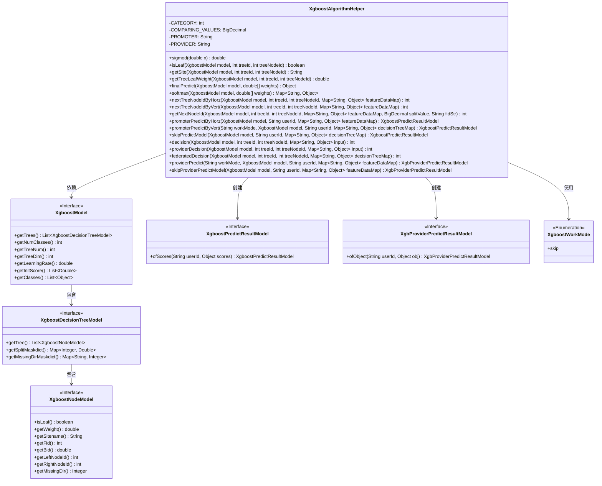
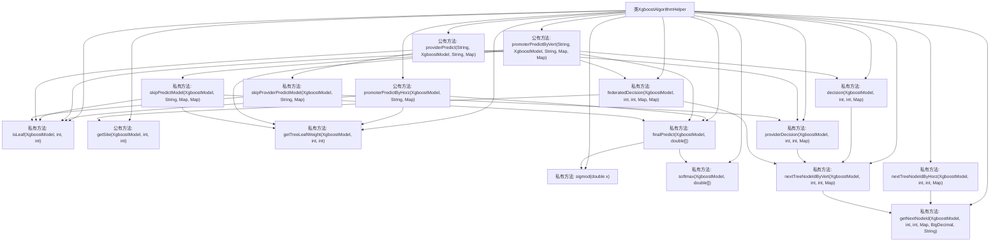

# 基础信息

|      |      |
|------|------|
| 名称 | XgboostAlgorithmHelper |
| 编码语言 | .java |
| 代码路径 | WeFe/serving/serving-sdk-java/src/main/java/com/welab/wefe/serving/sdk/algorithm/xgboost/XgboostAlgorithmHelper.java |
| 包名 | com.welab.wefe.serving.sdk.algorithm.xgboost |
| 依赖项 | ['java.lang.Math.exp', 'java.math.BigDecimal', 'java.util.ArrayList', 'java.util.HashMap', 'java.util.Map', 'org.apache.commons.collections4.MapUtils', 'org.apache.commons.lang3.ObjectUtils', 'com.alibaba.fastjson.util.TypeUtils', 'com.welab.wefe.serving.sdk.enums.XgboostWorkMode', 'com.welab.wefe.serving.sdk.model.xgboost.XgbProviderPredictResultModel', 'com.welab.wefe.serving.sdk.model.xgboost.XgboostDecisionTreeModel', 'com.welab.wefe.serving.sdk.model.xgboost.XgboostModel', 'com.welab.wefe.serving.sdk.model.xgboost.XgboostNodeModel', 'com.welab.wefe.serving.sdk.model.xgboost.XgboostPredictResultModel'] |
| 概述说明 | XgboostAlgorithmHelper类提供XGBoost模型预测功能，包含sigmoid激活、节点判断、权重获取、横向/纵向联邦预测及softmax多分类处理。支持发起方和协作方的本地与联合决策，适配不同工作模式。 |

# 说明

XgboostAlgorithmHelper类提供XGBoost模型预测相关功能，包含横向和纵向联邦学习场景下的决策逻辑。主要功能包括判断节点是否为叶子节点、获取节点权重、计算sigmoid和softmax结果、处理特征数据映射以及根据工作模式进行本地或联合决策。支持二分类、多分类和回归任务，通过遍历树结构获取叶子节点权重并合并最终预测结果。类中定义了横向和纵向联邦下的节点跳转逻辑，处理缺失值路径，并区分发起方和协作方的预测流程。同时包含skip工作模式的特殊处理逻辑，以适应不同场景需求。

# 类列表 Class Summary

| 名称   | 类型  | 说明 |
|-------|------|-------------|
| XgboostAlgorithmHelper | class | XgboostAlgorithmHelper类提供XGBoost模型预测功能，包含sigmoid和softmax计算、节点判断、权重获取、横向纵向联邦预测及合作方预测方法。支持二分类、多分类和回归任务。 |

## 类 XgboostAlgorithmHelper

|      |      |
|------|------|
| 访问范围 | public |
| 类型 | class |
| 名称 | XgboostAlgorithmHelper |
| 说明 | XgboostAlgorithmHelper类提供XGBoost模型预测功能，包含sigmoid和softmax计算、节点判断、权重获取、横向纵向联邦预测及合作方预测方法。支持二分类、多分类和回归任务。 |

### UML类图

这段代码是一个XGBoost算法辅助类，主要用于处理联邦学习场景下的XGBoost模型预测。它提供了多种预测方法（水平/纵向联邦、跳过模式），包含核心预测逻辑如节点遍历、权重计算、sigmoid/softmax转换等。类图中展示了与XGBoost模型相关接口的依赖关系，包括模型结构、决策树、节点等组件，以及预测结果和枚举类型的关联。该类封装了完整的预测流程，支持不同联邦学习模式下的协同预测需求。

### 内部方法调用关系图

该流程图展示了XgboostAlgorithmHelper类的主要方法调用关系。核心逻辑围绕XGBoost模型的预测流程展开，包括水平/纵向联邦学习的预测路径、叶子节点判断、权重计算和最终预测结果合并。关键路径涉及promoterPredictByHorz和promoterPredictByVert两个主要预测入口，通过决策树遍历和联邦决策机制实现分布式预测。流程图中清晰体现了方法间的层级调用关系，特别是finalPredict作为预测结果合并的核心方法，会调用sigmod和softmax进行概率计算。

### 字段列表 Field List

| 名称  | 类型  | 说明 |
|-------|-------|------|
| COMPARING_VALUES = BigDecimal.valueOf(1e-17) | BigDecimal | 定义了一个静态不可变的BigDecimal常量COMPARING_VALUES，值为1乘以10的负17次方，用于比较操作。 |
| PROMOTER = "promoter" | String | 定义私有静态常量PROMOTER，值为"promoter"。 |
| PROVIDER = "provider" | String | 定义了一个私有静态常量字符串变量PROVIDER，值为"provider"。 |
| CATEGORY = 2 | int | 定义私有静态常量CATEGORY，值为2。 |

### 方法列表

| 名称  | 类型  | 说明 |
|-------|-------|------|
| nextTreeNodeIdByHorz | int | 该方法根据特征数据映射，计算XGBoost模型中指定树节点的下一个水平节点ID。通过获取当前节点的特征ID和分裂值，调用内部方法确定下一节点。 |
| nextTreeNodeIdByVert | int | 该方法根据XGBoost模型、树ID、节点ID和特征数据，计算当前节点的下一节点ID。先获取特征ID和分割值，若存在分割掩码字典则从中取值，否则取节点默认值，最后调用getNextNodeId返回结果。 |
| softmax | Map<String, Object> | 该方法实现softmax函数，计算权重数组的概率分布，返回最大概率标签及所有分数。 |
| isLeaf | boolean | 检查Xgboost模型指定树节点是否为叶子节点。 |
| promoterPredictByHorz | XgboostPredictResultModel | 静态方法promoterPredictByHorz使用XGBoost模型预测结果。遍历模型树节点获取叶子节点，计算权重后返回预测分数。输入为模型、用户ID和特征数据，输出为预测结果对象。 |
| decision | int | 该方法根据XGBoost模型决策路径遍历树节点，直到遇到叶子节点或非PROMOTER节点，返回最终节点ID。 |
| skipPredictModel | XgboostPredictResultModel | 该方法跳过预测模型，遍历决策树获取节点ID和权重，最终返回用户ID和预测分数。 |
| getTreeLeafWeight | double | 该方法用于获取XGBoost模型中指定树节点的权重值，输入参数为模型对象、树ID和节点ID，返回对应节点的权重。 |
| finalPredict | Object | 方法finalPredict根据XgboostModel的类别数处理预测：二分类返回sigmoid结果，多分类返回softmax结果，回归则返回加权和。 |
| promoterPredictByVert | XgboostPredictResultModel | 该方法基于XGBoost模型进行预测，支持skip模式跳过处理。非skip模式下，通过本地和联邦决策遍历决策树，获取叶子节点权重并计算最终预测结果。 |
| federatedDecision | int | 该方法实现联邦决策逻辑，根据模型和节点类型决定路径选择，直至叶子节点返回ID。 |
| getNextNodeId | int | 方法根据特征值比较决定XGBoost模型的下一个节点ID：若特征存在且小于分割值返回左节点，否则返回右节点；若特征缺失则按缺失方向返回对应节点，默认返回右节点。 |
| providerDecision | int | 该方法根据XGBoost模型遍历决策树，从指定节点开始，通过输入数据判断路径，直到到达叶节点并返回其ID。 |
| providerPredict | XgbProviderPredictResultModel | 静态方法providerPredict根据工作模式处理预测：skip模式调用skipProviderPredictModel，否则遍历模型决策树生成预测结果。关键步骤包括特征比较和缺失值处理，最终返回用户ID和预测结果。 |
| getSite | String | 获取Xgboost模型中指定树节点的站点名称第一部分。 |
| sigmod | double | 该代码定义了一个静态方法sigmod，用于计算输入x的sigmoid函数值，公式为1/(1+e^(-x))。 |
| skipProviderPredictModel | XgbProviderPredictResultModel | 方法skipProviderPredictModel根据XGBoost模型跳过特定提供商的预测。遍历模型树，检查节点是否为叶子节点或非目标提供商，执行本地决策并记录结果。最终返回用户ID和决策结果的模型对象。 |

