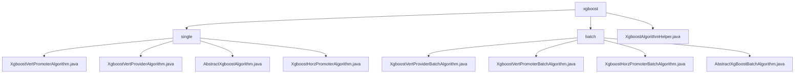

# 基础信息

|      |      |
|------|------|
| 名称 | xgboost |
| 编码语言 | .java |
| 代码路径 | WeFe/serving/serving-sdk-java/src/main/java/com/welab/wefe/serving/sdk/algorithm/xgboost |
| 包名 | docs.serving.serving-sdk-java.src.main.java.com.welab.wefe.serving.sdk.algorithm.xgboost |
| 概述说明 | 该模块实现XGBoost联邦预测，支持垂直/水平联邦模式，整合多方决策树结构并执行联合预测。核心功能包括特征映射、多线程并行计算和结果聚合，依赖XGBoost框架和联邦学习工具。 |

# 说明

## 概述  
该模块实现基于XGBoost的联邦预测功能，支持单条与批量预测场景，核心职责包括整合多方决策树结构（如垂直/水平联邦模式）和执行联合预测。接口规范要求实现handlePredict方法，通过XgboostAlgorithmHelper工具类完成预测，包含特征映射转换（setFidValueMapping）和联邦结果解析（getFederatedPredict）。关键数据结构涵盖fidValueMapping特征ID映射、XgboostPredictResultModel结果模型及线程安全集合。外部依赖包括XGBoost框架、多线程同步工具（如CountDownLatch）和联邦学习框架（如WeFe）。例如XgboostVertPromoterAlgorithm合并多方树结构，XgboostHorzPromoterBatchAlgorithm处理多线程水平联邦预测。

## 主要业务场景  
模块支持垂直与水平联邦的预测流程，类似分布式决策引擎与MapReduce混合模式。典型流程为：初始化特征映射→多线程并行计算→聚合协作方数据→返回结果。交互模式遵循"Promoter-Provider"架构，Promoter方通过CountDownLatch同步线程，Provider方提供特征数据或模型参数。例如垂直联邦中解析远程树结构，水平联邦同步模型参数。功能完整性体现在支持二分类/多分类/回归任务、缺失值处理及skip模式特殊逻辑。API类型覆盖单条预测、批量接口及联邦结果解析接口。

### 包内部结构视图

该流程图展示了XGBoost算法模块的层级结构，包含single和batch两个子目录及其对应的实现类文件。single目录下包含4个单机版算法实现类，batch目录下包含4个批量处理算法实现类和1个抽象基类，根目录下还有1个算法辅助工具类。

# 文件列表

| 名称   | 类型  | 说明 |
|-------|------|-------------|
| [XgboostAlgorithmHelper.java](XgboostAlgorithmHelper.md) | file | XgboostAlgorithmHelper类提供XGBoost模型预测功能，包含sigmoid激活、节点判断、权重获取、横向/纵向联邦预测及softmax多分类处理。支持发起方和协作方的本地与联合决策，适配不同工作模式。 |
| [batch](batch/_module.md) | package | XgboostVertProviderBatchAlgorithm类处理批量预测，多线程计算节点结果，使用CopyOnWriteArrayList存储结果。XgboostVertPromoterBatchAlgorithm类解析联邦决策树结果，多线程预测并同步线程。XgboostHorzPromoterBatchAlgorithm类多线程并行预测，记录日志并处理异常。AbstractXgBoostBatchAlgorithm是抽象基类，管理特征映射，定义批量预测框架。 |
| [single](single/_module.md) | package | XgboostVertPromoterAlgorithm类处理XGBoost联邦预测，提取决策树结构并合并。XgboostVertProviderAlgorithm类重写预测方法，检查特征映射后调用预测逻辑。AbstractXgboostAlgorithm是抽象基类，设置特征映射并定义预测流程。XgboostHorzPromoterAlgorithm类处理水平联邦预测，检查特征映射后调用预测方法。 |

