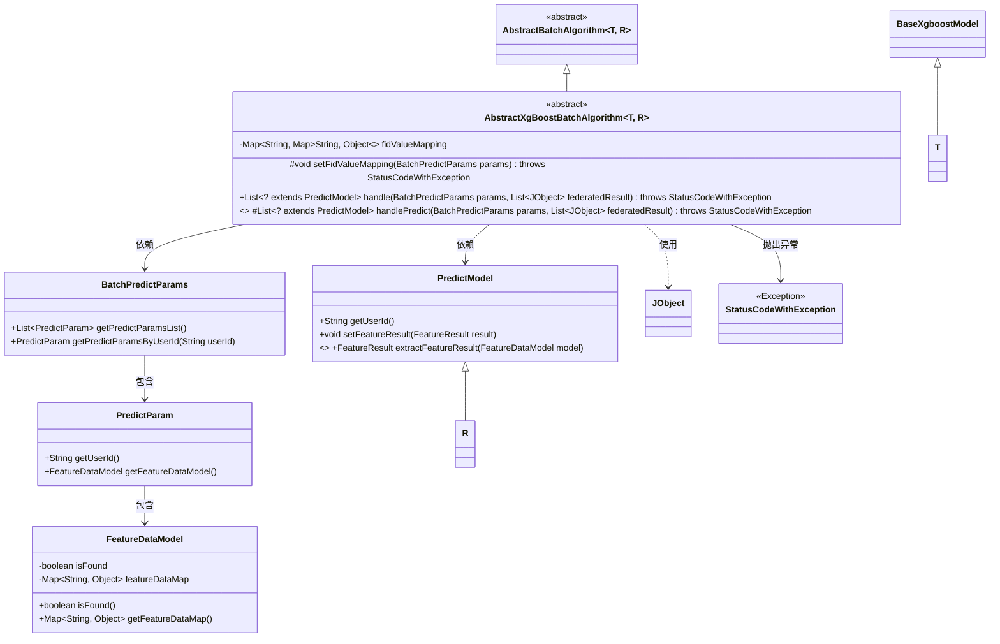
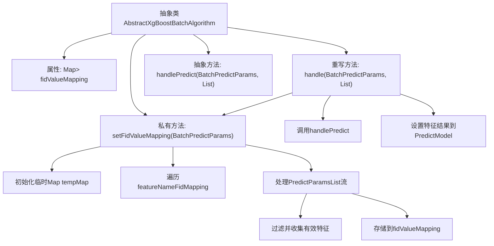

# 基础信息

|      |      |
|------|------|
| 名称 | AbstractXgBoostBatchAlgorithm |
| 编码语言 | .java |
| 代码路径 | WeFe/serving/serving-sdk-java/src/main/java/com/welab/wefe/serving/sdk/algorithm/xgboost/batch/AbstractXgBoostBatchAlgorithm.java |
| 包名 | com.welab.wefe.serving.sdk.algorithm.xgboost.batch |
| 依赖项 | ['com.welab.wefe.common.exception.StatusCodeWithException', 'com.welab.wefe.common.util.JObject', 'com.welab.wefe.serving.sdk.algorithm.AbstractBatchAlgorithm', 'com.welab.wefe.serving.sdk.dto.BatchPredictParams', 'com.welab.wefe.serving.sdk.model.PredictModel', 'com.welab.wefe.serving.sdk.model.xgboost.BaseXgboostModel', 'java.util.HashMap', 'java.util.List', 'java.util.Map', 'java.util.stream.Collectors'] |
| 概述说明 | 抽象类AbstractXgBoostBatchAlgorithm实现批量预测算法，包含特征映射转换和预测处理方法，支持自定义模型执行逻辑。 |

# 说明

这是一个名为AbstractXgBoostBatchAlgorithm的抽象类，继承自AbstractBatchAlgorithm，用于实现XGBoost批量预测算法。类中包含一个fidValueMapping映射，存储用户ID与特征数据的对应关系。setFidValueMapping方法负责将特征名称转换为特征ID格式，并填充fidValueMapping。handle方法处理批量预测参数，调用抽象方法handlePredict执行模型预测，并将特征结果设置到预测模型中。handlePredict是一个抽象方法，需要子类实现具体的预测逻辑。

# 类列表 Class Summary

| 名称   | 类型  | 说明 |
|-------|------|-------------|
| AbstractXgBoostBatchAlgorithm | class | AbstractXgBoostBatchAlgorithm是一个抽象批处理算法类，用于XGBoost模型预测。包含特征值映射转换和预测处理方法，支持批量预测并返回结果。 |

## 类 AbstractXgBoostBatchAlgorithm

|      |      |
|------|------|
| 访问范围 | public abstract |
| 类型 | class |
| 名称 | AbstractXgBoostBatchAlgorithm |
| 说明 | AbstractXgBoostBatchAlgorithm是一个抽象批处理算法类，用于XGBoost模型预测。包含特征值映射转换和预测处理方法，支持批量预测并返回结果。 |

### UML类图

该类图展示了一个抽象类`AbstractXgBoostBatchAlgorithm`，它继承自`AbstractBatchAlgorithm`并使用了泛型参数T和R。主要功能是处理批量预测任务，包含特征值映射设置和预测结果处理。图中清晰地展示了类之间的继承、依赖和关联关系，包括与参数类、模型类和异常类的关系。核心方法`handle`负责协调整个预测流程，而`handlePredict`作为抽象方法需要子类实现具体预测逻辑。

### 内部方法调用关系图

这段代码流程图展示了XGBoost批量预测算法的核心流程。抽象类包含特征值映射存储和三个关键方法：初始化特征映射的私有方法、处理预测的主流程方法以及需要子类实现的抽象预测方法。主流程会先转换特征键名格式，然后调用具体模型实现进行预测，最后将特征处理结果附加到预测模型对象上。整个流程体现了特征预处理与模型预测的分离设计，通过抽象方法支持不同子类的具体实现。

### 字段列表 Field List

| 名称  | 类型  | 说明 |
|-------|-------|------|
| fidValueMapping = new HashMap<>() | Map<String, Map<String, Object>> | 定义了一个嵌套哈希映射变量fidValueMapping，外层键为字符串，内层为字符串到对象的映射。 |

### 方法列表

| 名称  | 类型  | 说明 |
|-------|-------|------|
| setFidValueMapping | void | 该方法将模型参数中的特征名与FID映射关系反转存入临时Map，遍历预测参数列表，若特征数据存在则筛选出与临时Map匹配的特征键值对存入结果映射，否则存入空Map，最终以用户ID为键存储。 |
| handle | List<? extends PredictModel> | 方法重写处理批量预测，设置FID映射，调用预测处理，遍历结果并设置特征结果，最后返回预测模型列表。 |
| handlePredict | List<? extends PredictModel> | 抽象方法handlePredict处理批量预测，接收BatchPredictParams参数和联合结果列表，返回PredictModel子类列表，可能抛出StatusCodeWithException异常。 |

