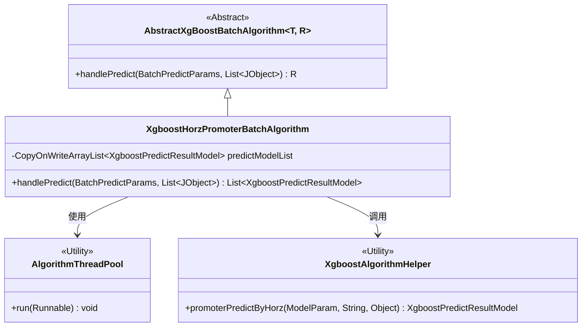
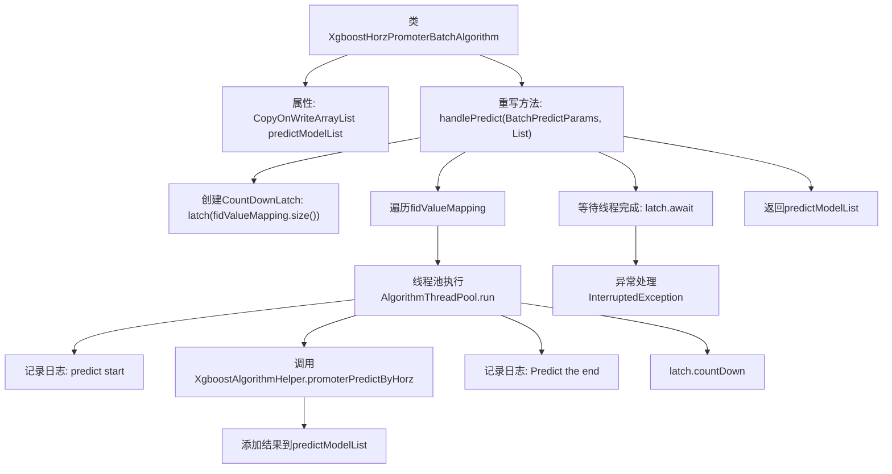

# 基础信息

|      |      |
|------|------|
| 名称 | XgboostHorzPromoterBatchAlgorithm |
| 编码语言 | .java |
| 代码路径 | WeFe/serving/serving-sdk-java/src/main/java/com/welab/wefe/serving/sdk/algorithm/xgboost/batch/XgboostHorzPromoterBatchAlgorithm.java |
| 包名 | com.welab.wefe.serving.sdk.algorithm.xgboost.batch |
| 依赖项 | ['com.welab.wefe.common.util.JObject', 'com.welab.wefe.serving.sdk.algorithm.xgboost.XgboostAlgorithmHelper', 'com.welab.wefe.serving.sdk.dto.BatchPredictParams', 'com.welab.wefe.serving.sdk.model.xgboost.BaseXgboostModel', 'com.welab.wefe.serving.sdk.model.xgboost.XgboostPredictResultModel', 'com.welab.wefe.serving.sdk.utils.AlgorithmThreadPool', 'java.util.List', 'java.util.concurrent.CopyOnWriteArrayList', 'java.util.concurrent.CountDownLatch'] |
| 概述说明 | XgboostHorzPromoterBatchAlgorithm类实现多线程水平联邦预测，使用CountDownLatch同步线程，返回预测结果列表。 |

# 说明

XgboostHorzPromoterBatchAlgorithm类继承自AbstractXgBoostBatchAlgorithm，用于处理批量预测任务。该类维护一个线程安全的XgboostPredictResultModel列表predictModelList。在handlePredict方法中，通过多线程方式并行计算每个节点的预测结果，使用CountDownLatch同步线程。每个线程调用XgboostAlgorithmHelper的promoterPredictByHorz方法进行预测，并将结果添加到predictModelList。方法最终返回包含所有预测结果的列表。过程中会记录预测开始和结束的日志，并捕获可能的异常。

# 类列表 Class Summary

| 名称   | 类型  | 说明 |
|-------|------|-------------|
| XgboostHorzPromoterBatchAlgorithm | class | XgboostHorzPromoterBatchAlgorithm类继承AbstractXgBoostBatchAlgorithm，通过多线程处理预测任务，使用CountDownLatch同步线程，返回预测结果列表。 |

## 类 XgboostHorzPromoterBatchAlgorithm

|      |      |
|------|------|
| 访问范围 | public |
| 类型 | class |
| 名称 | XgboostHorzPromoterBatchAlgorithm |
| 说明 | XgboostHorzPromoterBatchAlgorithm类继承AbstractXgBoostBatchAlgorithm，通过多线程处理预测任务，使用CountDownLatch同步线程，返回预测结果列表。 |

### UML类图

该类图展示了XgboostHorzPromoterBatchAlgorithm继承自泛型抽象类AbstractXgBoostBatchAlgorithm，并实现了多线程预测功能。主要包含：1）使用线程池AlgorithmThreadPool并行处理预测任务；2）通过XgboostAlgorithmHelper工具类执行具体预测逻辑；3）维护线程安全的预测结果列表predictModelList。整体实现了横向联邦学习中Promoter方的批量预测流程，通过CountDownLatch确保所有线程完成后返回聚合结果。

### 内部方法调用关系图

该流程图描述了XgboostHorzPromoterBatchAlgorithm类的核心预测流程。通过多线程并行处理fidValueMapping中的每个键值对，调用XgboostAlgorithmHelper进行预测，并将结果收集到线程安全的predictModelList中。主线程通过CountDownLatch等待所有子线程完成，最终返回预测结果集合。整个过程包含日志记录和异常处理机制，确保分布式预测任务的可靠执行。

### 字段列表 Field List

| 名称  | 类型  | 说明 |
|-------|-------|------|
| predictModelList = new CopyOnWriteArrayList<>() | CopyOnWriteArrayList<XgboostPredictResultModel> | 声明线程安全的CopyOnWriteArrayList，存储XgboostPredictResultModel类型预测模型。 |

### 方法列表

| 名称  | 类型  | 说明 |
|-------|-------|------|
| handlePredict | List<XgboostPredictResultModel> | 方法处理批量预测，使用多线程计算节点并行执行XGBoost预测，通过CountDownLatch同步线程，完成后返回预测结果列表。 |

