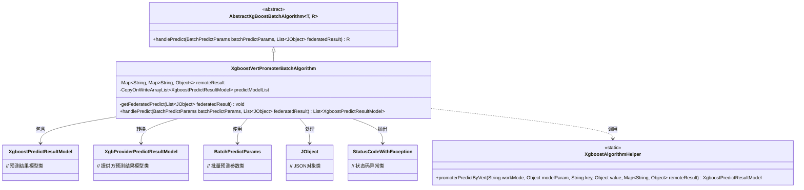
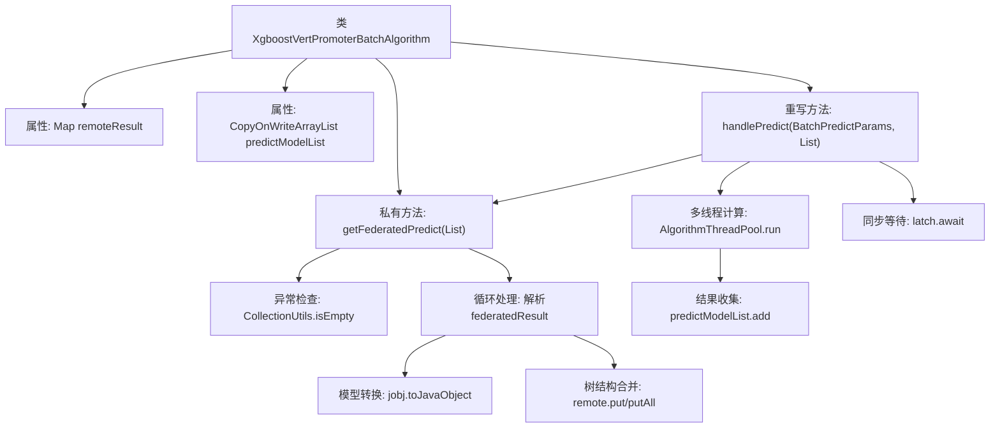

# 基础信息

|      |      |
|------|------|
| 名称 | XgboostVertPromoterBatchAlgorithm |
| 编码语言 | .java |
| 代码路径 | WeFe/serving/serving-sdk-java/src/main/java/com/welab/wefe/serving/sdk/algorithm/xgboost/batch/XgboostVertPromoterBatchAlgorithm.java |
| 包名 | com.welab.wefe.serving.sdk.algorithm.xgboost.batch |
| 依赖项 | ['com.welab.wefe.common.StatusCode', 'com.welab.wefe.common.exception.StatusCodeWithException', 'com.welab.wefe.common.util.JObject', 'com.welab.wefe.serving.sdk.algorithm.xgboost.XgboostAlgorithmHelper', 'com.welab.wefe.serving.sdk.dto.BatchPredictParams', 'com.welab.wefe.serving.sdk.enums.XgboostWorkMode', 'com.welab.wefe.serving.sdk.model.xgboost.BaseXgboostModel', 'com.welab.wefe.serving.sdk.model.xgboost.XgbProviderPredictResultModel', 'com.welab.wefe.serving.sdk.model.xgboost.XgboostPredictResultModel', 'com.welab.wefe.serving.sdk.utils.AlgorithmThreadPool', 'org.apache.commons.collections4.CollectionUtils', 'org.apache.commons.collections4.MapUtils', 'java.util.HashMap', 'java.util.List', 'java.util.Map', 'java.util.concurrent.CopyOnWriteArrayList', 'java.util.concurrent.CountDownLatch'] |
| 概述说明 | XgboostVertPromoterBatchAlgorithm类实现联邦XGBoost预测，通过getFederatedPredict方法处理协作方返回的决策树结果，多线程计算节点预测结果并汇总。 |

# 说明

该代码定义了一个名为XgboostVertPromoterBatchAlgorithm的类，继承自AbstractXgBoostBatchAlgorithm，用于处理XGBoost模型的批量预测任务。类中包含两个主要成员变量：remoteResult用于存储联邦预测返回的数据，predictModelList以线程安全方式存储预测结果模型。核心方法getFederatedPredict负责解析协作方返回的联邦决策树结果，将其转换为特定结构并存入remoteResult。handlePredict方法通过多线程方式调用XgboostAlgorithmHelper进行预测计算，使用CountDownLatch同步线程，最终返回预测结果列表。整个过程包含异常处理机制，确保远程服务错误和空结果等异常情况能被捕获并处理。

# 类列表 Class Summary

| 名称   | 类型  | 说明 |
|-------|------|-------------|
| XgboostVertPromoterBatchAlgorithm | class | XgboostVertPromoterBatchAlgorithm类实现联邦XGBoost预测，通过getFederatedPredict方法处理协作方返回的决策树数据，多线程计算节点预测结果并汇总返回。 |

## 类 XgboostVertPromoterBatchAlgorithm

|      |      |
|------|------|
| 访问范围 | public |
| 类型 | class |
| 名称 | XgboostVertPromoterBatchAlgorithm |
| 说明 | XgboostVertPromoterBatchAlgorithm类实现联邦XGBoost预测，通过getFederatedPredict方法处理协作方返回的决策树数据，多线程计算节点预测结果并汇总返回。 |

### UML类图

这段代码展示了一个XGBoost垂直联邦学习的批量预测算法实现。XgboostVertPromoterBatchAlgorithm继承自抽象类AbstractXgBoostBatchAlgorithm，主要负责处理联邦预测任务。它通过getFederatedPredict方法解析协作方返回的预测结果，并使用多线程方式调用XgboostAlgorithmHelper进行本地预测计算。类图中清晰地展示了核心类之间的关系，包括数据模型类、参数类和工具类的依赖关系，体现了联邦学习场景下预测任务的处理流程。

### 内部方法调用关系图

该流程图展示了Xgboost纵向联邦预测算法的核心流程。首先通过getFederatedPredict方法解析协作方返回的决策树数据，进行数据校验和结构合并；然后在handlePredict方法中启动多线程计算节点预测任务，使用CountDownLatch同步线程，最终将预测结果收集到线程安全的predictModelList中。整个过程包含数据验证、树结构处理、并行计算和线程同步等关键步骤。

### 字段列表 Field List

| 名称  | 类型  | 说明 |
|-------|-------|------|
| remoteResult = new HashMap<>() | Map<String, Map<String, Object>> | 定义远程结果映射：键为字符串，值为嵌套映射（字符串键，对象值）。 |
| predictModelList = new CopyOnWriteArrayList<>() | CopyOnWriteArrayList<XgboostPredictResultModel> | 私有线程安全列表，存储Xgboost预测结果模型，使用写时复制机制。 |

### 方法列表

| 名称  | 类型  | 说明 |
|-------|-------|------|
| getFederatedPredict | void | 方法检查联邦学习结果，若为空抛出异常。遍历结果集合并处理预测模型数据，合并树结构到远程结果映射。若最终结果为空则报错。 |
| handlePredict | List<XgboostPredictResultModel> | 该方法处理批量预测，通过多线程计算节点并行执行XGBoost预测任务，使用CountDownLatch同步线程，最终返回预测结果列表。 |

