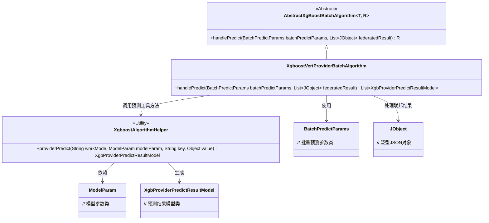
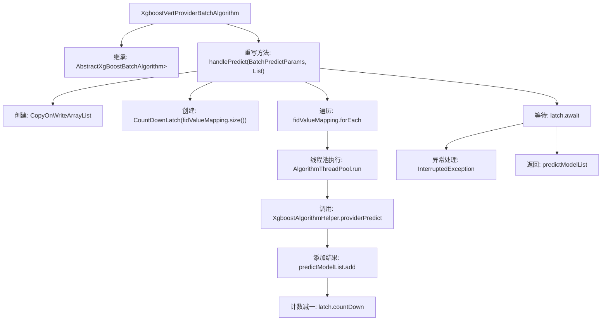

# 基础信息

|      |      |
|------|------|
| 名称 | XgboostVertProviderBatchAlgorithm |
| 编码语言 | .java |
| 代码路径 | WeFe/serving/serving-sdk-java/src/main/java/com/welab/wefe/serving/sdk/algorithm/xgboost/batch/XgboostVertProviderBatchAlgorithm.java |
| 包名 | com.welab.wefe.serving.sdk.algorithm.xgboost.batch |
| 依赖项 | ['com.welab.wefe.common.util.JObject', 'com.welab.wefe.serving.sdk.algorithm.xgboost.XgboostAlgorithmHelper', 'com.welab.wefe.serving.sdk.dto.BatchPredictParams', 'com.welab.wefe.serving.sdk.model.xgboost.BaseXgboostModel', 'com.welab.wefe.serving.sdk.model.xgboost.XgbProviderPredictResultModel', 'com.welab.wefe.serving.sdk.utils.AlgorithmThreadPool', 'java.util.List', 'java.util.concurrent.CopyOnWriteArrayList', 'java.util.concurrent.CountDownLatch'] |
| 概述说明 | XgboostVertProviderBatchAlgorithm类继承AbstractXgBoostBatchAlgorithm，通过多线程处理批量预测任务，使用CountDownLatch同步线程，最终返回预测结果列表。 |

# 说明

该内容描述了一个名为XgboostVertProviderBatchAlgorithm的类，继承自AbstractXgBoostBatchAlgorithm。该类重写了handlePredict方法，用于处理批量预测任务。方法接收BatchPredictParams参数和federatedResult列表，通过多线程方式计算节点预测结果。使用CopyOnWriteArrayList存储预测结果模型，并通过CountDownLatch确保所有线程完成。每个线程调用XgboostAlgorithmHelper.providerPredict方法生成预测结果，最终返回预测模型列表。若线程被中断，会记录错误日志。

# 类列表 Class Summary

| 名称   | 类型  | 说明 |
|-------|------|-------------|
| XgboostVertProviderBatchAlgorithm | class | XgboostVertProviderBatchAlgorithm类通过多线程处理批量预测任务，使用CountDownLatch同步线程，最终返回预测结果列表。 |

## 类 XgboostVertProviderBatchAlgorithm

|      |      |
|------|------|
| 访问范围 | public |
| 类型 | class |
| 名称 | XgboostVertProviderBatchAlgorithm |
| 说明 | XgboostVertProviderBatchAlgorithm类通过多线程处理批量预测任务，使用CountDownLatch同步线程，最终返回预测结果列表。 |

### UML类图

这段代码展示了一个基于XGBoost的批量预测算法实现，继承自抽象基类`AbstractXgBoostBatchAlgorithm`。核心方法`handlePredict`使用多线程并行处理预测任务，通过`CountDownLatch`同步线程，最终返回预测结果列表。类图清晰地呈现了算法与参数类、工具类之间的依赖关系，以及继承层次结构，体现了分布式预测任务的处理流程和关键组件交互。

### 内部方法调用关系图

这段代码流程图描述了XgboostVertProviderBatchAlgorithm类中handlePredict方法的执行流程。该方法通过多线程方式并行处理预测任务，使用CountDownLatch同步线程，最终返回预测结果集合。主要步骤包括：初始化线程安全集合和计数器，遍历映射表提交线程任务，每个线程调用预测辅助类并收集结果，主线程等待所有任务完成，最后返回结果列表或处理中断异常。该设计适用于高并发预测场景，确保线程安全和任务同步。

### 字段列表 Field List

| 名称  | 类型  | 说明 |
|-------|-------|------|

### 方法列表

| 名称  | 类型  | 说明 |
|-------|-------|------|
| handlePredict | List<XgbProviderPredictResultModel> | 该方法使用多线程处理批量预测任务，通过线程池并行计算每个节点的预测结果，利用CountDownLatch同步线程，最后返回预测结果集合。异常时记录错误日志。 |

