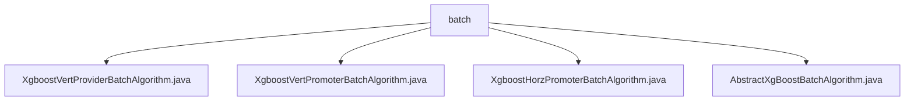

# 基础信息

|      |      |
|------|------|
| 名称 | batch |
| 编码语言 | .java |
| 代码路径 | WeFe/serving/serving-sdk-java/src/main/java/com/welab/wefe/serving/sdk/algorithm/xgboost/batch |
| 包名 | docs.serving.serving-sdk-java.src.main.java.com.welab.wefe.serving.sdk.algorithm.xgboost.batch |
| 概述说明 | XgboostVertProviderBatchAlgorithm类处理批量预测，多线程计算节点结果，使用CopyOnWriteArrayList存储结果。XgboostVertPromoterBatchAlgorithm类解析联邦决策树结果，多线程预测并同步线程。XgboostHorzPromoterBatchAlgorithm类多线程并行预测，记录日志并处理异常。AbstractXgBoostBatchAlgorithm是抽象基类，管理特征映射，定义批量预测框架。 |

# 说明

## 概述  
该模块核心职责是实现XGBoost模型的联邦批量预测，支持横向和纵向联邦学习场景。通过多线程并行计算和线程安全数据结构（如CopyOnWriteArrayList）处理预测任务，类似分布式任务调度模式。  

接口规范包括：handlePredict方法处理批量预测参数和联邦结果，getFederatedPredict解析协作方数据，setFidValueMapping转换特征ID格式。关键数据结构含XgboostPredictResultModel、fidValueMapping映射和remoteResult联邦结果集。  

外部依赖项包括XGBoost算法库、多线程同步工具（CountDownLatch）和联邦学习框架（如WeFe）。例如通过XgboostAlgorithmHelper调用预测方法，使用CountDownLatch确保线程同步。  

## 主要业务场景  
模块支持横向和纵向联邦的批量预测流程。典型场景为：发起方通过多线程并行计算节点预测结果，聚合协作方返回的联邦决策树数据，类似MapReduce模式。例如XgboostVertPromoterBatchAlgorithm解析远程结果，XgboostHorzPromoterBatchAlgorithm处理横向预测。  

交互模式包含：线程间通过CountDownLatch同步，结果存入线程安全集合；异常处理机制捕获远程服务错误。功能完整性体现在支持ID特征映射、多线程预测和结果聚合。API类型涵盖批量预测接口和联邦结果解析接口。

### 包内部结构视图

该流程图展示了XGBoost批处理算法模块的类文件结构，其中batch文件夹包含四个Java类文件：XgboostVertProviderBatchAlgorithm、XgboostVertPromoterBatchAlgorithm、XgboostHorzPromoterBatchAlgorithm以及抽象基类AbstractXgBoostBatchAlgorithm。这些类共同构成了XGBoost算法在横向和纵向联邦学习场景下的批处理实现基础。

# 文件列表

| 名称   | 类型  | 说明 |
|-------|------|-------------|
| [XgboostVertProviderBatchAlgorithm.java](XgboostVertProviderBatchAlgorithm.md) | file | XgboostVertProviderBatchAlgorithm类继承AbstractXgBoostBatchAlgorithm，通过多线程处理批量预测任务，使用CountDownLatch同步线程，最终返回预测结果列表。 |
| [XgboostVertPromoterBatchAlgorithm.java](XgboostVertPromoterBatchAlgorithm.md) | file | XgboostVertPromoterBatchAlgorithm类实现联邦XGBoost预测，通过getFederatedPredict方法处理协作方返回的决策树结果，多线程计算节点预测结果并汇总。 |
| [XgboostHorzPromoterBatchAlgorithm.java](XgboostHorzPromoterBatchAlgorithm.md) | file | XgboostHorzPromoterBatchAlgorithm类实现多线程水平联邦预测，使用CountDownLatch同步线程，返回预测结果列表。 |
| [AbstractXgBoostBatchAlgorithm.java](AbstractXgBoostBatchAlgorithm.md) | file | 抽象类AbstractXgBoostBatchAlgorithm实现批量预测算法，包含特征映射转换和预测处理方法，支持自定义模型执行逻辑。 |

