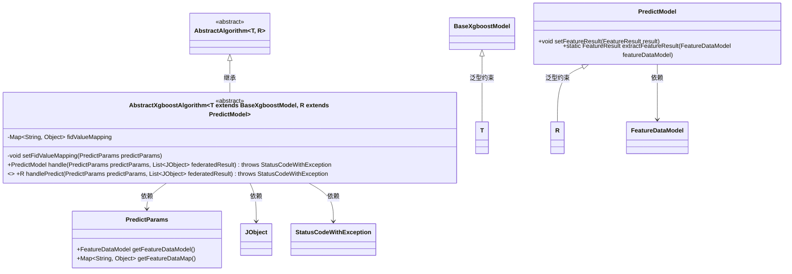

# 基础信息

|      |      |
|------|------|
| 名称 | AbstractXgboostAlgorithm |
| 编码语言 | .java |
| 代码路径 | WeFe/serving/serving-sdk-java/src/main/java/com/welab/wefe/serving/sdk/algorithm/xgboost/single/AbstractXgboostAlgorithm.java |
| 包名 | com.welab.wefe.serving.sdk.algorithm.xgboost.single |
| 依赖项 | ['com.welab.wefe.common.exception.StatusCodeWithException', 'com.welab.wefe.common.util.JObject', 'com.welab.wefe.serving.sdk.algorithm.AbstractAlgorithm', 'com.welab.wefe.serving.sdk.dto.PredictParams', 'com.welab.wefe.serving.sdk.model.PredictModel', 'com.welab.wefe.serving.sdk.model.xgboost.BaseXgboostModel', 'java.util.HashMap', 'java.util.List', 'java.util.Map'] |
| 概述说明 | 抽象XGBoost算法类，含特征映射转换方法，处理预测参数并返回结果。核心方法包括特征值映射设置和抽象预测处理。 |

# 说明

这是一个抽象类AbstractXgboostAlgorithm，继承自AbstractAlgorithm，用于实现XGBoost算法。类中包含特征映射关系fidValueMapping，通过setFidValueMapping方法将特征名称转换为ID格式。主要处理逻辑在handle方法中，先设置特征映射，然后调用抽象方法handlePredict进行预测，最后设置预测结果。handlePredict方法需要子类实现具体预测逻辑。

# 类列表 Class Summary

| 名称   | 类型  | 说明 |
|-------|------|-------------|
| AbstractXgboostAlgorithm | class | 抽象类AbstractXgboostAlgorithm实现特征映射转换和预测处理，包含特征值映射方法setFidValueMapping和抽象预测方法handlePredict。 |

## 类 AbstractXgboostAlgorithm

|      |      |
|------|------|
| 访问范围 | public abstract |
| 类型 | class |
| 名称 | AbstractXgboostAlgorithm |
| 说明 | 抽象类AbstractXgboostAlgorithm实现特征映射转换和预测处理，包含特征值映射方法setFidValueMapping和抽象预测方法handlePredict。 |

### UML类图

这段代码展示了一个XGBoost算法抽象类结构，其中AbstractXgboostAlgorithm继承自AbstractAlgorithm并实现了特征映射转换和预测处理的核心逻辑。该类通过泛型参数T和R分别约束模型类型和预测结果类型，包含特征值映射处理(setFidValueMapping)、预测主流程(handle)和抽象预测方法(handlePredict)。类图中清晰呈现了泛型约束关系、继承层次和关键依赖，特别是与PredictParams、PredictModel等核心组件的交互关系。该设计实现了算法框架与具体实现的分离，支持XGBoost模型的标准预测流程。

### 内部方法调用关系图

该流程图展示了抽象类AbstractXgboostAlgorithm的核心结构和处理流程。类包含特征映射属性和关键方法：私有方法setFidValueMapping用于转换特征键名，handle方法作为主流程控制器，先执行特征映射转换，再调用抽象预测方法handlePredict，最后设置预测结果的特征数据。抽象方法handlePredict需要子类实现具体预测逻辑，体现了模板方法设计模式。整个流程实现了从原始特征到标准化特征映射的转换，再到模型预测的完整处理链条。

### 字段列表 Field List

| 名称  | 类型  | 说明 |
|-------|-------|------|
| fidValueMapping = new HashMap<>() | Map<String, Object> | 定义一个受保护的Map变量fidValueMapping，用于存储键为String、值为Object的映射关系，初始化为HashMap实例。 |

### 方法列表

| 名称  | 类型  | 说明 |
|-------|-------|------|
| setFidValueMapping | void | 该方法将模型参数中的特征名与FID映射反转，并根据预测参数的特征数据更新fidValueMapping。 |
| handle | PredictModel | 该方法重写父类逻辑，处理预测参数和联合结果。先设置特征ID映射，再执行预测处理，最后提取特征结果并返回预测模型。 |
| handlePredict | R | 抽象方法，处理预测结果，接收预测参数和联合结果列表，可能抛出状态码异常。 |

