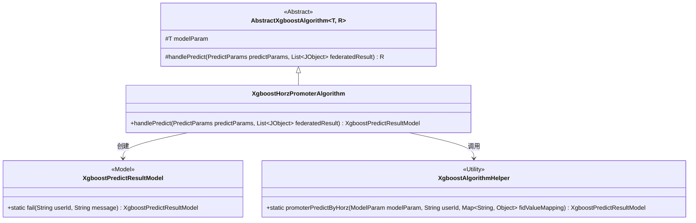
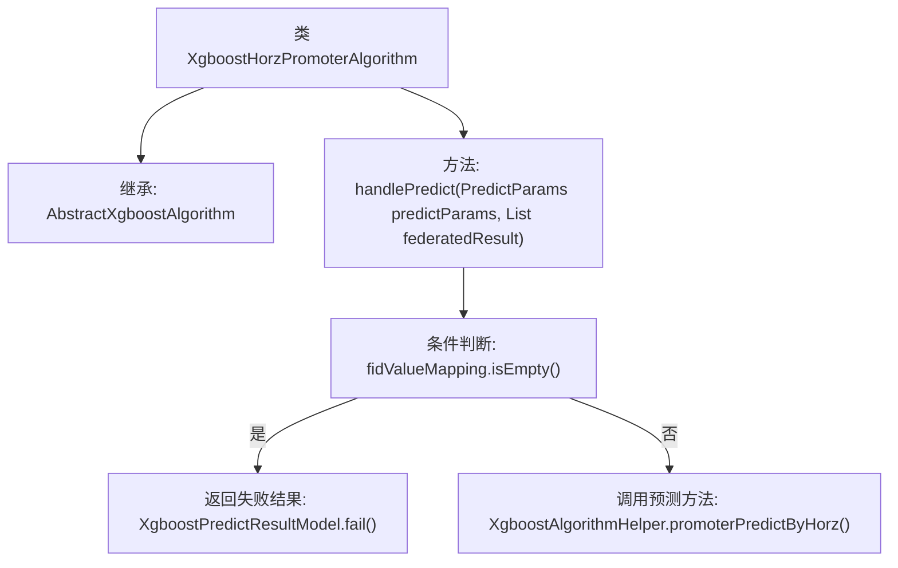

# 基础信息

|      |      |
|------|------|
| 名称 | XgboostHorzPromoterAlgorithm |
| 编码语言 | .java |
| 代码路径 | WeFe/serving/serving-sdk-java/src/main/java/com/welab/wefe/serving/sdk/algorithm/xgboost/single/XgboostHorzPromoterAlgorithm.java |
| 包名 | com.welab.wefe.serving.sdk.algorithm.xgboost.single |
| 依赖项 | ['com.welab.wefe.common.util.JObject', 'com.welab.wefe.serving.sdk.algorithm.xgboost.XgboostAlgorithmHelper', 'com.welab.wefe.serving.sdk.dto.PredictParams', 'com.welab.wefe.serving.sdk.enums.StateCode', 'com.welab.wefe.serving.sdk.model.xgboost.BaseXgboostModel', 'com.welab.wefe.serving.sdk.model.xgboost.XgboostPredictResultModel', 'java.util.List'] |
| 概述说明 | XgboostHorzPromoterAlgorithm类继承AbstractXgboostAlgorithm，重写handlePredict方法：若fidValueMapping为空返回错误，否则调用XgboostAlgorithmHelper进行预测。 |

# 说明

该代码定义了一个名为XgboostHorzPromoterAlgorithm的类，继承自AbstractXgboostAlgorithm。它重写了handlePredict方法，用于处理预测逻辑。方法首先检查fidValueMapping是否为空，若为空则返回包含错误信息的失败结果；否则调用XgboostAlgorithmHelper的promoterPredictByHorz方法进行水平联邦学习的预测，并返回预测结果模型。整个过程涉及用户ID、模型参数和特征值映射等关键数据。

# 类列表 Class Summary

| 名称   | 类型  | 说明 |
|-------|------|-------------|
| XgboostHorzPromoterAlgorithm | class | XgboostHorzPromoterAlgorithm类处理预测请求，检查特征映射非空后调用XgboostAlgorithmHelper进行水平联邦预测，失败返回错误信息。 |

## 类 XgboostHorzPromoterAlgorithm

|      |      |
|------|------|
| 访问范围 | public |
| 类型 | class |
| 名称 | XgboostHorzPromoterAlgorithm |
| 说明 | XgboostHorzPromoterAlgorithm类处理预测请求，检查特征映射非空后调用XgboostAlgorithmHelper进行水平联邦预测，失败返回错误信息。 |

### UML类图

该类图展示了XgboostHorzPromoterAlgorithm继承自泛型抽象类AbstractXgboostAlgorithm，并实现了handlePredict方法。该方法依赖XgboostPredictResultModel返回预测结果，并通过XgboostAlgorithmHelper工具类完成横向联邦学习的预测逻辑。图中清晰体现了类之间的继承关系、依赖关系以及工具类的静态方法调用，整体结构符合横向联邦学习场景下的XGBoost算法实现模式。

### 内部方法调用关系图

这段代码展示了一个XGBoost水平联邦学习算法的预测处理流程。类XgboostHorzPromoterAlgorithm继承自抽象基类，重写了handlePredict方法。该方法首先检查特征值映射是否为空，若为空则返回带有错误信息的失败结果；否则调用辅助类的promoterPredictByHorz方法进行水平联邦预测。流程图清晰呈现了条件分支和不同执行路径，体现了对特征完整性的防御性检查机制。

### 字段列表 Field List

| 名称  | 类型  | 说明 |
|-------|-------|------|

### 方法列表

| 名称  | 类型  | 说明 |
|-------|-------|------|
| handlePredict | XgboostPredictResultModel | 重写Xgboost预测处理方法：检查特征映射非空后调用水平联邦预测，失败返回错误信息。 |

