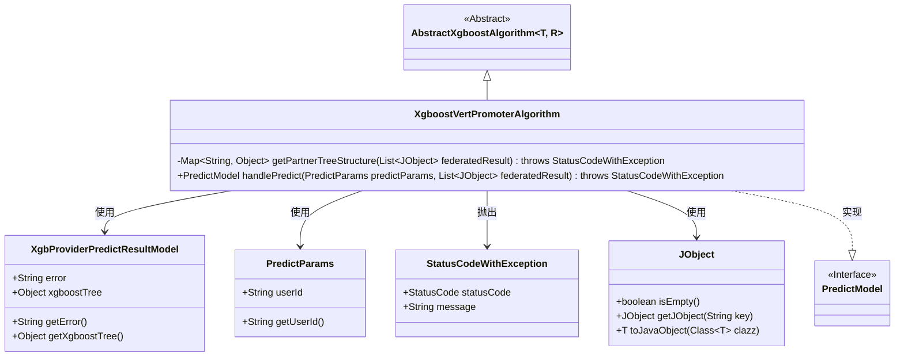
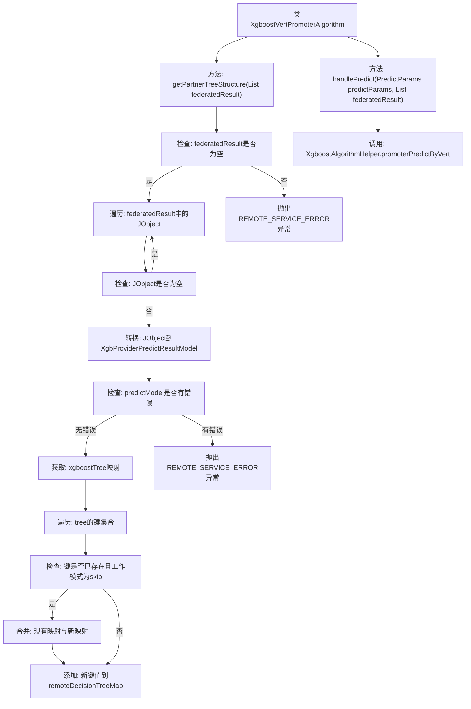

# 基础信息

|      |      |
|------|------|
| 名称 | XgboostVertPromoterAlgorithm |
| 编码语言 | .java |
| 代码路径 | WeFe/serving/serving-sdk-java/src/main/java/com/welab/wefe/serving/sdk/algorithm/xgboost/single/XgboostVertPromoterAlgorithm.java |
| 包名 | com.welab.wefe.serving.sdk.algorithm.xgboost.single |
| 依赖项 | ['com.welab.wefe.common.StatusCode', 'com.welab.wefe.common.exception.StatusCodeWithException', 'com.welab.wefe.common.util.JObject', 'com.welab.wefe.common.util.StringUtil', 'com.welab.wefe.serving.sdk.algorithm.xgboost.XgboostAlgorithmHelper', 'com.welab.wefe.serving.sdk.dto.PredictParams', 'com.welab.wefe.serving.sdk.enums.XgboostWorkMode', 'com.welab.wefe.serving.sdk.model.PredictModel', 'com.welab.wefe.serving.sdk.model.xgboost.BaseXgboostModel', 'com.welab.wefe.serving.sdk.model.xgboost.XgbProviderPredictResultModel', 'org.apache.commons.collections4.CollectionUtils', 'java.util.HashMap', 'java.util.List', 'java.util.Map'] |
| 概述说明 | XgboostVertPromoterAlgorithm类继承AbstractXgboostAlgorithm，包含getPartnerTreeStructure方法处理联邦决策树结构，并通过handlePredict方法调用XgboostAlgorithmHelper进行预测。 |

# 说明

XgboostVertPromoterAlgorithm类继承自AbstractXgboostAlgorithm，主要用于处理XGBoost模型的联邦预测。核心方法getPartnerTreeStructure从联邦结果中提取决策树结构，返回一个包含树节点关系的映射。若结果为空或包含错误则抛出异常。该方法会合并不同提供方的树结构，支持跳过模式处理重复键。handlePredict方法调用XgboostAlgorithmHelper进行预测，整合工作模式、模型参数、用户ID、特征映射和获取的决策树结构。

# 类列表 Class Summary

| 名称   | 类型  | 说明 |
|-------|------|-------------|
| XgboostVertPromoterAlgorithm | class | XgboostVertPromoterAlgorithm类通过getPartnerTreeStructure方法获取联邦决策树结构，处理远程预测结果并合并树结构，最终调用promoterPredictByVert进行预测。 |

## 类 XgboostVertPromoterAlgorithm

|      |      |
|------|------|
| 访问范围 | public |
| 类型 | class |
| 名称 | XgboostVertPromoterAlgorithm |
| 说明 | XgboostVertPromoterAlgorithm类通过getPartnerTreeStructure方法获取联邦决策树结构，处理远程预测结果并合并树结构，最终调用promoterPredictByVert进行预测。 |

### UML类图

这段代码展示了一个XGBoost垂直提升算法实现类XgboostVertPromoterAlgorithm，它继承自抽象类AbstractXgboostAlgorithm。主要功能包括通过getPartnerTreeStructure方法处理联邦学习结果，构建决策树结构映射，并通过handlePredict方法调用辅助类进行预测。该类与多个辅助类交互，包括处理JSON数据的JObject、存储预测结果的XgbProviderPredictResultModel、包含用户ID的PredictParams等，同时可能抛出StatusCodeWithException异常。整个设计体现了联邦学习场景下XGBoost算法的协作预测流程。

### 内部方法调用关系图

这段代码流程图展示了XgboostVertPromoterAlgorithm类的核心逻辑，主要包含两个关键方法：getPartnerTreeStructure用于处理联邦学习结果的树结构合并，handlePredict负责预测流程的协调。流程图清晰呈现了空值检查、异常处理、树结构遍历合并等关键步骤，特别突出了工作模式为skip时的特殊合并逻辑，最终通过XgboostAlgorithmHelper完成预测任务。整个过程体现了对边缘情况的严密处理和数据转换的完整性。

### 字段列表 Field List

| 名称  | 类型  | 说明 |
|-------|-------|------|

### 方法列表

| 名称  | 类型  | 说明 |
|-------|-------|------|
| handlePredict | PredictModel | 该方法重写父类逻辑，调用Xgboost工具进行纵向联邦预测，传入工作模式、模型参数、用户ID、特征映射及合作方树结构，返回预测结果。 |
| getPartnerTreeStructure | Map<String, Object> | 该方法从联邦结果中提取XGBoost树结构，合并重复键值，处理空结果和错误，返回决策树映射。 |

