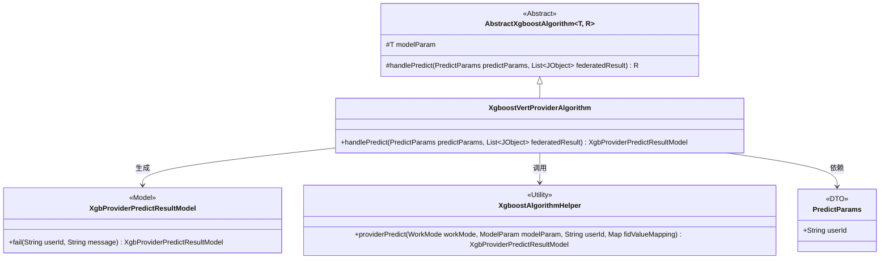
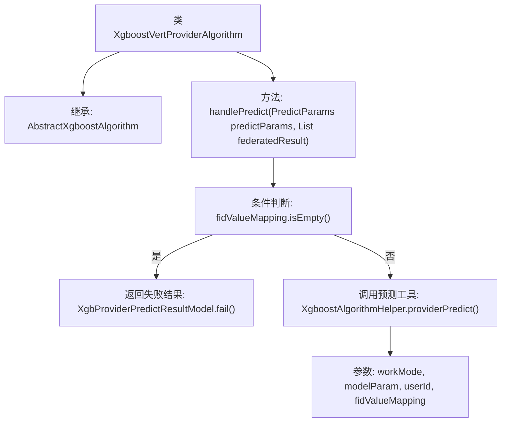

# 基础信息

|      |      |
|------|------|
| 名称 | XgboostVertProviderAlgorithm |
| 编码语言 | .java |
| 代码路径 | WeFe/serving/serving-sdk-java/src/main/java/com/welab/wefe/serving/sdk/algorithm/xgboost/single/XgboostVertProviderAlgorithm.java |
| 包名 | com.welab.wefe.serving.sdk.algorithm.xgboost.single |
| 依赖项 | ['com.welab.wefe.common.util.JObject', 'com.welab.wefe.serving.sdk.algorithm.xgboost.XgboostAlgorithmHelper', 'com.welab.wefe.serving.sdk.dto.PredictParams', 'com.welab.wefe.serving.sdk.enums.StateCode', 'com.welab.wefe.serving.sdk.model.xgboost.BaseXgboostModel', 'com.welab.wefe.serving.sdk.model.xgboost.XgbProviderPredictResultModel', 'java.util.List'] |
| 概述说明 | XgboostVertProviderAlgorithm继承AbstractXgboostAlgorithm，重写handlePredict方法。若fidValueMapping为空返回错误结果，否则调用XgboostAlgorithmHelper进行预测。 |

# 说明

该代码定义了一个名为XgboostVertProviderAlgorithm的类，继承自AbstractXgboostAlgorithm。它重写了handlePredict方法，用于处理预测请求。方法首先检查fidValueMapping是否为空，若为空则返回包含错误信息的失败结果；否则调用XgboostAlgorithmHelper的providerPredict方法进行预测，传入工作模式、模型参数、用户ID和特征值映射等参数。整个过程实现了基于XGBoost模型的预测功能。

# 类列表 Class Summary

| 名称   | 类型  | 说明 |
|-------|------|-------------|
| XgboostVertProviderAlgorithm | class | XgboostVertProviderAlgorithm类继承AbstractXgboostAlgorithm，重写handlePredict方法。若fidValueMapping为空返回错误结果，否则调用XgboostAlgorithmHelper进行预测。 |

## 类 XgboostVertProviderAlgorithm

|      |      |
|------|------|
| 访问范围 | public |
| 类型 | class |
| 名称 | XgboostVertProviderAlgorithm |
| 说明 | XgboostVertProviderAlgorithm类继承AbstractXgboostAlgorithm，重写handlePredict方法。若fidValueMapping为空返回错误结果，否则调用XgboostAlgorithmHelper进行预测。 |

### UML类图

该类图展示了Xgboost垂直提供方算法的继承与协作关系。XgboostVertProviderAlgorithm继承自泛型抽象类AbstractXgboostAlgorithm，实现了具体的handlePredict方法。该方法依赖PredictParams参数对象，通过XgboostAlgorithmHelper工具类进行预测计算，最终生成XgbProviderPredictResultModel结果模型。图中包含5个核心类/组件，清晰体现了模板方法模式的应用和工具类调用的协作方式。

### 内部方法调用关系图

该流程图展示了XgboostVertProviderAlgorithm类的核心逻辑结构。该类继承自AbstractXgboostAlgorithm，主要实现handlePredict方法。方法首先检查fidValueMapping是否为空，若为空则返回包含错误信息的失败结果；否则调用XgboostAlgorithmHelper的providerPredict方法进行预测，传入工作模式、模型参数、用户ID和特征值映射等关键参数。整个流程清晰展现了预测请求的处理路径和异常情况处理机制。

### 字段列表 Field List

| 名称  | 类型  | 说明 |
|-------|-------|------|

### 方法列表

| 名称  | 类型  | 说明 |
|-------|-------|------|
| handlePredict | XgbProviderPredictResultModel | 重写XGBoost预测处理方法：检查特征映射非空后调用预测工具，失败返回错误信息。 |

