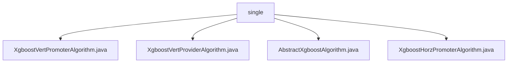

# 基础信息

|      |      |
|------|------|
| 名称 | single |
| 编码语言 | .java |
| 代码路径 | WeFe/serving/serving-sdk-java/src/main/java/com/welab/wefe/serving/sdk/algorithm/xgboost/single |
| 包名 | docs.serving.serving-sdk-java.src.main.java.com.welab.wefe.serving.sdk.algorithm.xgboost.single |
| 概述说明 | XgboostVertPromoterAlgorithm类处理XGBoost联邦预测，提取决策树结构并合并。XgboostVertProviderAlgorithm类重写预测方法，检查特征映射后调用预测逻辑。AbstractXgboostAlgorithm是抽象基类，设置特征映射并定义预测流程。XgboostHorzPromoterAlgorithm类处理水平联邦预测，检查特征映射后调用预测方法。 |

# 说明

## 概述  
该模块实现基于XGBoost的联邦预测功能，核心职责包括整合多方决策树结构（如垂直/水平联邦模式）和执行联合预测。接口规范要求子类实现handlePredict方法，并通过XgboostAlgorithmHelper工具类完成实际预测。关键数据结构包含fidValueMapping（特征ID映射）、树节点关系映射和模型参数。外部依赖仅为XGBoost框架。例如，XgboostVertPromoterAlgorithm通过getPartnerTreeStructure合并多方树结构，XgboostHorzPromoterAlgorithm调用promoterPredictByHorz处理水平联邦预测。

## 主要业务场景  
模块支持垂直与水平联邦两种预测模式，类似分布式决策引擎。典型流程为：初始化特征映射→验证输入→调用Helper类执行预测→返回结果。交互模式遵循"Promoter-Provider"架构，Promoter方整合树结构，Provider方提供特征数据。例如，垂直联邦中Promoter合并多方树结构，水平联邦则通过horzPredict同步模型参数。所有场景均依赖特征ID标准化映射和XGBoost模型参数传递。

### 包内部结构视图

该流程图展示了Xgboost算法在单机模式下的四个实现类，均位于single目录下。包含纵向联邦的Promoter和Provider算法实现，以及横向联邦的Promoter算法实现，同时抽象基类AbstractXgboostAlgorithm作为其他具体算法的基础结构。整个结构清晰地体现了Xgboost单机模式下不同联邦学习场景的算法实现关系。

# 文件列表

| 名称   | 类型  | 说明 |
|-------|------|-------------|
| [XgboostVertPromoterAlgorithm.java](XgboostVertPromoterAlgorithm.md) | file | XgboostVertPromoterAlgorithm类继承AbstractXgboostAlgorithm，包含getPartnerTreeStructure方法处理联邦决策树结构，并通过handlePredict方法调用XgboostAlgorithmHelper进行预测。 |
| [XgboostVertProviderAlgorithm.java](XgboostVertProviderAlgorithm.md) | file | XgboostVertProviderAlgorithm继承AbstractXgboostAlgorithm，重写handlePredict方法。若fidValueMapping为空返回错误结果，否则调用XgboostAlgorithmHelper进行预测。 |
| [AbstractXgboostAlgorithm.java](AbstractXgboostAlgorithm.md) | file | 抽象XGBoost算法类，含特征映射转换方法，处理预测参数并返回结果。核心方法包括特征值映射设置和抽象预测处理。 |
| [XgboostHorzPromoterAlgorithm.java](XgboostHorzPromoterAlgorithm.md) | file | XgboostHorzPromoterAlgorithm类继承AbstractXgboostAlgorithm，重写handlePredict方法：若fidValueMapping为空返回错误，否则调用XgboostAlgorithmHelper进行预测。 |

