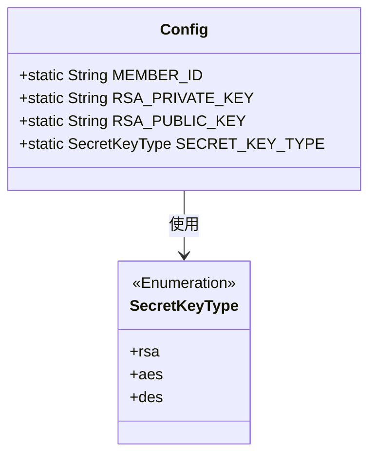
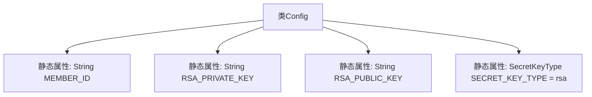

# 基础信息

|      |      |
|------|------|
| 名称 | Config |
| 编码语言 | .java |
| 代码路径 | WeFe/serving/serving-sdk-java/src/main/java/com/welab/wefe/serving/sdk/config/Config.java |
| 包名 | com.welab.wefe.serving.sdk.config |
| 依赖项 | ['com.welab.wefe.common.constant.SecretKeyType'] |
| 概述说明 | Config类包含静态成员变量：MEMBER_ID、RSA私钥、RSA公钥，默认密钥类型为rsa。 |

# 说明

这是一个名为Config的Java公共类，用于存储配置信息。它包含四个静态成员变量：MEMBER_ID用于存储成员标识，RSA_PRIVATE_KEY和RSA_PUBLIC_KEY分别存储RSA私钥和公钥，SECRET_KEY_TYPE定义密钥类型并默认设置为rsa。所有变量均为公开可访问。

# 类列表 Class Summary

| 名称   | 类型  | 说明 |
|-------|------|-------------|
| Config | class | Config类包含静态成员变量：MEMBER_ID、RSA_PRIVATE_KEY、RSA_PUBLIC_KEY和默认值为rsa的SECRET_KEY_TYPE。 |

## 类 Config

|      |      |
|------|------|
| 访问范围 | public |
| 类型 | class |
| 名称 | Config |
| 说明 | Config类包含静态成员变量：MEMBER_ID、RSA_PRIVATE_KEY、RSA_PUBLIC_KEY和默认值为rsa的SECRET_KEY_TYPE。 |

### UML类图

这段代码展示了一个配置类`Config`，它包含四个静态成员变量：`MEMBER_ID`、`RSA_PRIVATE_KEY`、`RSA_PUBLIC_KEY`用于存储字符串类型的配置信息，以及`SECRET_KEY_TYPE`枚举类型变量（默认值为`rsa`）用于指定密钥类型。类图清晰地表示了`Config`与枚举类`SecretKeyType`之间的依赖关系，后者定义了可能的密钥类型选项。这是一个典型的全局配置类设计模式，用于集中管理应用程序的密钥相关配置参数。

### 内部方法调用关系图

该流程图展示了Config类的静态属性结构，包含4个静态字段：MEMBER_ID、RSA_PRIVATE_KEY、RSA_PUBLIC_KEY三个字符串类型属性，以及一个默认值为rsa的SECRET_KEY_TYPE枚举类型属性。所有属性均为静态(static)修饰，表明它们属于类级别而非实例级别，可在不创建类实例的情况下直接访问。

### 字段列表 Field List

| 名称  | 类型  | 说明 |
|-------|-------|------|
| MEMBER_ID | String | 静态字符串变量MEMBER_ID，用于存储成员ID。 |
| RSA_PRIVATE_KEY | String | 静态字符串变量RSA_PRIVATE_KEY用于存储RSA私钥。 |
| RSA_PUBLIC_KEY | String | 静态字符串变量，存储RSA公钥。 |
| SECRET_KEY_TYPE = SecretKeyType.rsa | SecretKeyType | 静态密钥类型设为RSA。 |

### 方法列表

| 名称  | 类型  | 说明 |
|-------|-------|------|

