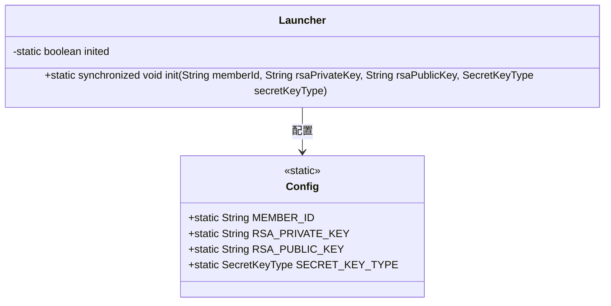
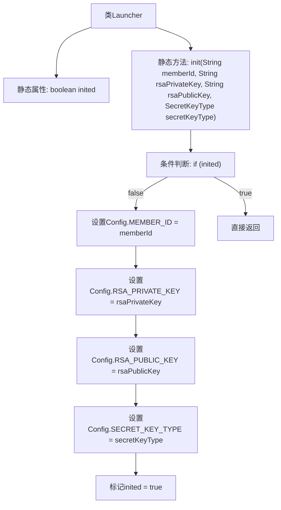

# 基础信息

|      |      |
|------|------|
| 名称 | Launcher |
| 编码语言 | .java |
| 代码路径 | WeFe/serving/serving-sdk-java/src/main/java/com/welab/wefe/serving/sdk/config/Launcher.java |
| 包名 | com.welab.wefe.serving.sdk.config |
| 依赖项 | ['com.welab.wefe.common.constant.SecretKeyType', 'java.io.Serializable'] |
| 概述说明 | Java类Launcher实现Serializable，提供静态同步方法init，用于初始化配置项（会员ID、RSA公私钥、密钥类型），确保仅执行一次。 |

# 说明

Launcher类实现了Serializable接口，包含一个静态布尔变量inited标记初始化状态。它提供了静态同步方法init，用于初始化配置参数。方法首先检查inited状态，若已初始化则直接返回。否则将传入的memberId、rsaPrivateKey、rsaPublicKey和secretKeyType赋值给Config类的对应静态变量，并将inited设为true。该方法确保配置仅初始化一次。

# 类列表 Class Summary

| 名称   | 类型  | 说明 |
|-------|------|-------------|
| Launcher | class | Launcher类实现序列化，提供静态同步方法init，用于初始化配置项（会员ID、RSA公私钥、密钥类型），确保仅初始化一次。 |

## 类 Launcher

|      |      |
|------|------|
| 访问范围 | public |
| 类型 | class |
| 名称 | Launcher |
| 说明 | Launcher类实现序列化，提供静态同步方法init，用于初始化配置项（会员ID、RSA公私钥、密钥类型），确保仅初始化一次。 |

### UML类图

这段代码展示了一个可序列化的Launcher类，它通过静态同步方法init()来初始化Config类的静态配置项。Launcher使用inited标志确保初始化只执行一次，防止重复配置。Config类存储了成员ID、RSA密钥对和密钥类型等静态配置信息。类图清晰地反映了Launcher对Config的依赖关系以及初始化控制的线程安全设计。

### 内部方法调用关系图

流程图描述：该流程图描述了Launcher类的初始化过程。首先检查静态标志位inited，若未初始化则依次设置Config类的四个静态字段（会员ID、RSA公私钥和密钥类型），最后标记inited为true；若已初始化则直接返回。整个过程通过同步方法保证线程安全，避免重复初始化配置参数。

### 字段列表 Field List

| 名称  | 类型  | 说明 |
|-------|-------|------|
| inited = false | boolean | 静态布尔变量inited初始为false，用于标记初始化状态。 |

### 方法列表

| 名称  | 类型  | 说明 |
|-------|-------|------|
| init | void | 静态同步方法init用于初始化配置，参数包括会员ID、RSA公私钥和密钥类型，仅首次调用生效。 |

