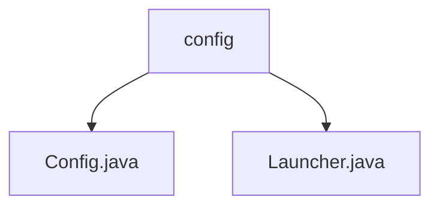

# 基础信息

|      |      |
|------|------|
| 名称 | config |
| 编码语言 | .java |
| 代码路径 | WeFe/serving/serving-sdk-java/src/main/java/com/welab/wefe/serving/sdk/config |
| 包名 | docs.serving.serving-sdk-java.src.main.java.com.welab.wefe.serving.sdk.config |
| 概述说明 | Config类存储配置信息，含成员ID、RSA公私钥和密钥类型变量。Launcher类通过init方法初始化Config变量，确保仅执行一次。 |

# 说明

## 概述  
该模块核心职责是管理加密配置信息，采用单例模式确保配置仅初始化一次。接口规范包括通过Launcher.init方法统一设置Config类的静态参数，包含MemberId、RSA密钥对和密钥类型。关键数据结构为Config类的静态字段，例如MEMBER_ID和RSA_PRIVATE_KEY。外部依赖仅为Java原生Serializable接口。例如Config.SECRET_KEY_TYPE默认值为"rsa"。

## 主要业务场景  
典型场景是在服务启动时通过Launcher.init加载加密配置，类似配置中心的基础模块。业务流程包含参数校验和线程安全初始化，例如检查inited状态避免重复操作。完整功能涵盖密钥存储与类型管理，支持通过静态变量全局访问。交互模式为同步调用，如Launcher.init方法使用synchronized保证原子性。API类型为静态方法调用，集成案例包括设置RSA密钥对等参数。

### 包内部结构视图

该流程图展示了WeFe项目中serving-sdk-java模块下config目录的层级结构。根节点为config文件夹，包含两个Java文件：Config.java和Launcher.java。这两个文件直接隶属于config目录，没有更深层级的子目录结构。整个结构简洁明了，体现了配置相关类的组织方式。

# 文件列表

| 名称   | 类型  | 说明 |
|-------|------|-------------|
| [Config.java](Config.md) | file | Config类包含静态成员变量：MEMBER_ID、RSA私钥、RSA公钥，默认密钥类型为rsa。 |
| [Launcher.java](Launcher.md) | file | Java类Launcher实现Serializable，提供静态同步方法init，用于初始化配置项（会员ID、RSA公私钥、密钥类型），确保仅执行一次。 |

