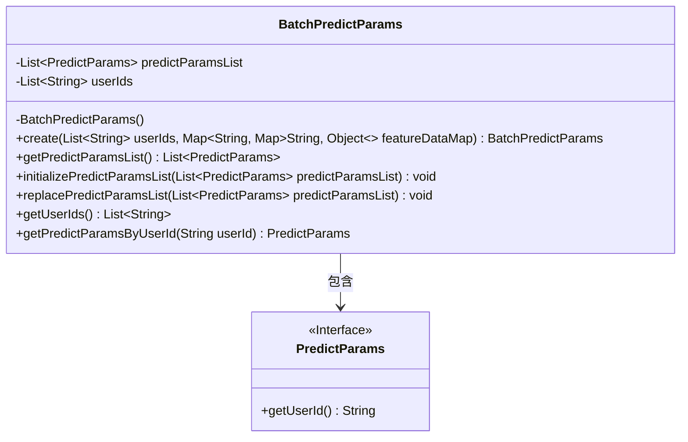
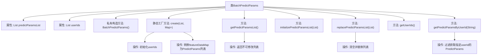

# 基础信息

|      |      |
|------|------|
| 名称 | BatchPredictParams |
| 编码语言 | .java |
| 代码路径 | WeFe/serving/serving-sdk-java/src/main/java/com/welab/wefe/serving/sdk/dto/BatchPredictParams.java |
| 包名 | com.welab.wefe.serving.sdk.dto |
| 依赖项 | ['org.apache.commons.collections4.MapUtils', 'org.apache.commons.compress.utils.Lists', 'java.util.Collections', 'java.util.List', 'java.util.Map', 'java.util.stream.Collectors'] |
| 概述说明 | BatchPredictParams类用于批量预测，包含用户ID列表和预测参数列表，提供创建、获取、初始化和替换预测参数的方法。 |

# 说明

BatchPredictParams类用于批量预测参数管理，包含用户ID列表和预测参数列表。私有构造方法确保通过静态工厂方法create创建实例，该方法接收用户ID列表和特征数据映射，将后者转换为PredictParams对象列表。提供获取不可修改的用户ID列表和预测参数列表的方法。支持初始化或替换预测参数列表。可通过用户ID查询对应的预测参数，列表为空时返回null。

# 类列表 Class Summary

| 名称   | 类型  | 说明 |
|-------|------|-------------|
| BatchPredictParams | class | BatchPredictParams类用于批量预测，包含用户ID列表和预测参数列表，提供创建、初始化、替换和查询方法。 |

## 类 BatchPredictParams

|      |      |
|------|------|
| 访问范围 | public |
| 类型 | class |
| 名称 | BatchPredictParams |
| 说明 | BatchPredictParams类用于批量预测，包含用户ID列表和预测参数列表，提供创建、初始化、替换和查询方法。 |

### UML类图

该代码展示了一个批量预测参数类BatchPredictParams，它通过私有构造函数和静态工厂方法创建实例，管理用户ID列表和预测参数列表。类中包含对PredictParams接口的依赖，提供参数列表的初始化、替换和查询功能，所有返回列表都封装为不可修改集合以确保数据安全。核心方法能根据用户ID查找对应预测参数，体现了数据封装和线程安全的设计思想。

### 内部方法调用关系图

该流程图展示了BatchPredictParams类的完整结构，包含两个核心属性列表、私有构造方法和五个主要方法。静态工厂方法create()负责初始化对象并转换输入数据，get方法返回不可修改的列表保证封装性，replace方法实现先清空后替换的逻辑，查询方法通过流式处理精准过滤数据。类设计体现了防御性编程思想，通过不可变集合和空值检查确保数据安全。

### 字段列表 Field List

| 名称  | 类型  | 说明 |
|-------|-------|------|
| predictParamsList = Lists.newArrayList() | List<PredictParams> | 定义一个私有列表变量predictParamsList，使用Lists.newArrayList()初始化。 |
| userIds = Lists.newArrayList() | List<String> | 声明一个私有字符串列表变量userIds，初始化为空ArrayList。 |

### 方法列表

| 名称  | 类型  | 说明 |
|-------|-------|------|
| replacePredictParamsList | void | 方法替换预测参数列表：先清空原列表，再添加新参数列表。 |
| getUserIds | List<String> | 该方法返回一个不可修改的用户ID列表，确保列表数据不被外部修改。 |
| getPredictParamsByUserId | PredictParams | 该方法通过用户ID从列表中查找匹配的预测参数，若列表为空返回null，否则返回第一个匹配项。 |
| create | BatchPredictParams | 静态方法创建批量预测参数对象，接收用户ID列表和特征数据映射，初始化参数并转换映射数据为预测参数列表后返回。 |
| getPredictParamsList | List<PredictParams> | 该方法返回一个不可修改的预测参数列表。 |
| initializePredictParamsList | void | 该方法将输入的预测参数列表全部添加到当前对象的预测参数列表中。 |

