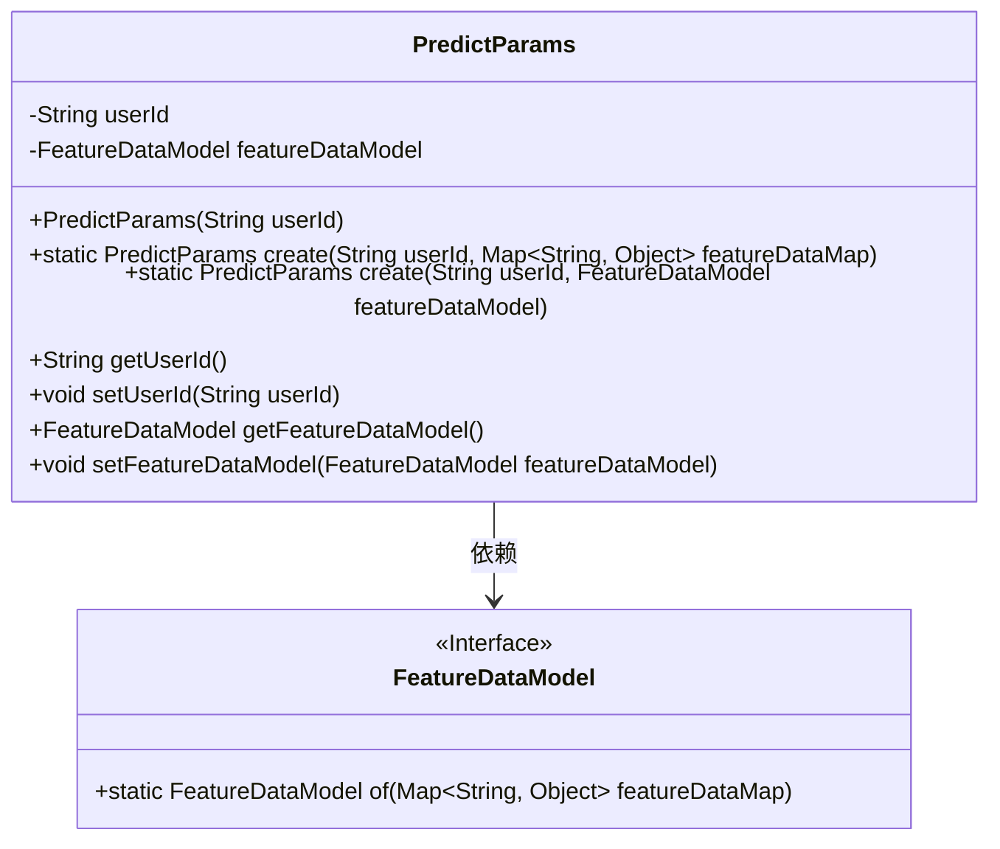
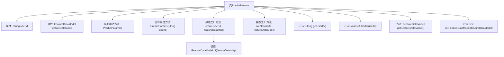

# 基础信息

|      |      |
|------|------|
| 名称 | PredictParams |
| 编码语言 | .java |
| 代码路径 | WeFe/serving/serving-sdk-java/src/main/java/com/welab/wefe/serving/sdk/dto/PredictParams.java |
| 包名 | com.welab.wefe.serving.sdk.dto |
| 依赖项 | ['com.welab.wefe.serving.sdk.model.FeatureDataModel', 'java.util.Map'] |
| 概述说明 | PredictParams类用于预测参数管理，包含userId和featureDataModel属性，提供构造方法和静态创建方法，支持通过Map或FeatureDataModel设置特征数据。 |

# 说明

PredictParams类是一个用于封装预测参数的Java类，包含userId和featureDataModel两个私有属性。该类提供了两种静态创建方法：一种接受userId和featureDataMap参数，另一种接受userId和featureDataModel参数。此外，还提供了公共构造方法仅接受userId参数，以及私有无参构造方法。类中还包含标准的getter和setter方法用于访问和修改属性值。整体设计支持通过不同方式初始化预测参数对象。

# 类列表 Class Summary

| 名称   | 类型  | 说明 |
|-------|------|-------------|
| PredictParams | class | PredictParams类用于存储用户ID和特征数据模型，提供构造方法和静态工厂方法创建实例，支持getter和setter操作。 |

## 类 PredictParams

|      |      |
|------|------|
| 访问范围 | public |
| 类型 | class |
| 名称 | PredictParams |
| 说明 | PredictParams类用于存储用户ID和特征数据模型，提供构造方法和静态工厂方法创建实例，支持getter和setter操作。 |

### UML类图

类图描述：PredictParams类封装了用户ID和特征数据模型，提供两种静态工厂方法创建实例。FeatureDataModel作为接口提供数据转换功能，PredictParams通过组合方式持有该接口实例。类设计体现了封装性和灵活性，支持通过Map或直接传入特征模型两种初始化方式。

### 内部方法调用关系图

这段代码定义了一个PredictParams类，主要用于封装用户ID和特征数据模型。类提供了两种构造方式：直接构造和静态工厂方法创建。其中静态工厂方法支持通过Map或FeatureDataModel对象初始化特征数据，并通过私有构造方法实现对象创建。类还包含标准的getter/setter方法用于属性访问，整体设计体现了封装性和灵活性。

### 字段列表 Field List

| 名称  | 类型  | 说明 |
|-------|-------|------|
| featureDataModel | FeatureDataModel | 私有成员变量featureDataModel，类型为FeatureDataModel。 |
| userId | String | 声明一个私有字符串变量userId。 |

### 方法列表

| 名称  | 类型  | 说明 |
|-------|-------|------|
| create | PredictParams | 静态方法create接收用户ID和特征数据映射，构建并返回包含这些参数的PredictParams对象。 |
| getUserId | String | 获取用户ID的方法，返回字符串类型的userId。 |
| create | PredictParams | 静态方法create接收用户ID和特征数据模型，创建并返回PredictParams实例，设置其属性后返回。 |
| setUserId | void | 设置用户ID的方法，将参数userId赋值给当前对象的userId属性。 |
| getFeatureDataModel | FeatureDataModel | 获取featureDataModel对象的方法。 |
| setFeatureDataModel | void | 设置特征数据模型方法，将输入参数赋值给当前对象的featureDataModel属性。 |

