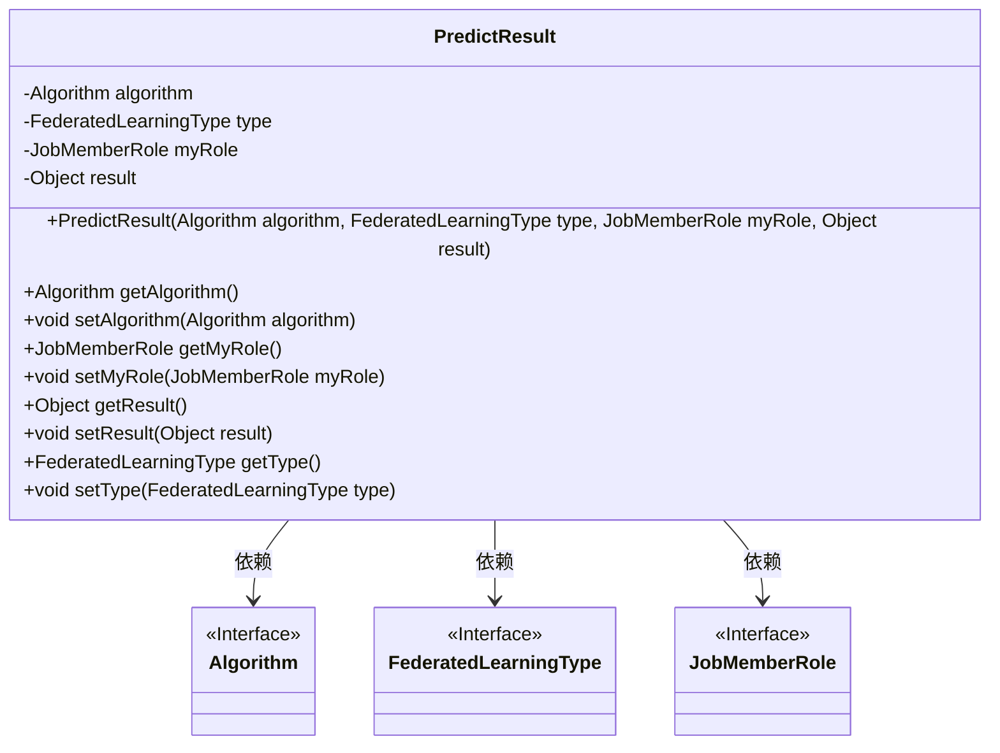

# 基础信息

|      |      |
|------|------|
| 名称 | PredictResult |
| 编码语言 | .java |
| 代码路径 | WeFe/serving/serving-sdk-java/src/main/java/com/welab/wefe/serving/sdk/dto/PredictResult.java |
| 包名 | com.welab.wefe.serving.sdk.dto |
| 依赖项 | ['com.welab.wefe.common.wefe.enums.Algorithm', 'com.welab.wefe.common.wefe.enums.FederatedLearningType', 'com.welab.wefe.common.wefe.enums.JobMemberRole'] |
| 概述说明 | PredictResult类封装预测结果，包含算法、联邦学习类型、角色和结果字段，提供构造方法和getter/setter。 |

# 说明

PredictResult类用于封装预测结果，包含四个属性：algorithm表示算法类型，type表示联邦学习类型，myRole表示任务成员角色，result存储实际结果。提供构造方法初始化这些属性，并为每个属性提供getter和setter方法以便访问和修改。

# 类列表 Class Summary

| 名称   | 类型  | 说明 |
|-------|------|-------------|
| PredictResult | class | PredictResult类包含算法、联邦学习类型、角色和结果属性，提供构造方法和getter/setter。 |

## 类 PredictResult

|      |      |
|------|------|
| 访问范围 | public |
| 类型 | class |
| 名称 | PredictResult |
| 说明 | PredictResult类包含算法、联邦学习类型、角色和结果属性，提供构造方法和getter/setter。 |

### UML类图

这段代码定义了一个`PredictResult`类，用于封装联邦学习中的预测结果，包含算法类型、联邦学习类型、成员角色和结果对象四个核心属性。该类通过构造函数初始化这些属性，并为每个属性提供了getter和setter方法。类图中显示了`PredictResult`与三个接口`Algorithm`、`FederatedLearningType`和`JobMemberRole`的依赖关系，表明这些属性是接口类型，具体实现由外部提供。整体设计体现了对联邦学习预测结果的封装和灵活配置能力。

### 内部方法调用关系图

```mermaid
graph TD
    A["类PredictResult"]
    B["属性: Algorithm algorithm"]
    C["属性: FederatedLearningType type"]
    D["属性: JobMemberRole myRole"]
    E["属性: Object result"]
    F["构造方法: PredictResult(Algorithm, FederatedLearningType, JobMemberRole, Object)"]
    G["方法: Algorithm getAlgorithm()"]
    H["方法: void setAlgorithm(Algorithm)"]
    I["方法: JobMemberRole getMyRole()"]
    J["方法: void setMyRole(JobMemberRole)"]
    K["方法: Object getResult()"]
    L["方法: void setResult(Object)"]
    M["方法: FederatedLearningType getType()"]
    N["方法: void setType(FederatedLearningType)"]

    A --> B
    A --> C
    A --> D
    A --> E
    A --> F
    A --> G
    A --> H
    A --> I
    A --> J
    A --> K
    A --> L
    A --> M
    A --> N
```

这段代码定义了一个名为PredictResult的类，用于封装预测结果的相关信息。该类包含四个私有属性：algorithm表示使用的算法，type表示联邦学习的类型，myRole表示任务成员角色，result表示预测结果对象。提供了构造方法和对应的getter/setter方法，用于初始化和访问这些属性。这是一个典型的数据封装类，用于在联邦学习场景中传递和管理预测结果数据。

### 字段列表 Field List

| 名称  | 类型  | 说明 |
|-------|-------|------|
| result | Object | 私有结果对象 |
| algorithm | Algorithm | 私有算法实例变量。 |
| type | FederatedLearningType | 私有联邦学习类型变量。 |
| myRole | JobMemberRole | 私有变量myRole，类型为JobMemberRole。 |

### 方法列表

| 名称  | 类型  | 说明 |
|-------|-------|------|
| getMyRole | JobMemberRole | 获取当前用户的角色信息。 |
| setResult | void | 设置方法，将参数result赋值给类的成员变量result。 |
| setMyRole | void | 这是一个Java方法，用于设置当前对象的myRole属性，参数为JobMemberRole类型。 |
| getAlgorithm | Algorithm | 获取当前算法实例的方法。 |
| getResult | Object | 方法返回结果对象。 |
| setAlgorithm | void | 设置算法方法，将传入的算法对象赋值给当前对象的algorithm属性。 |
| getType | FederatedLearningType | 获取联邦学习类型的方法，返回类型变量。 |
| setType | void | 设置联邦学习类型的方法，将输入参数赋值给类成员变量。 |

