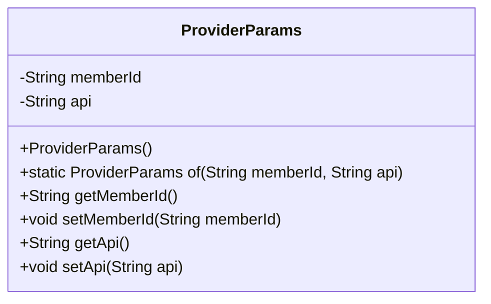
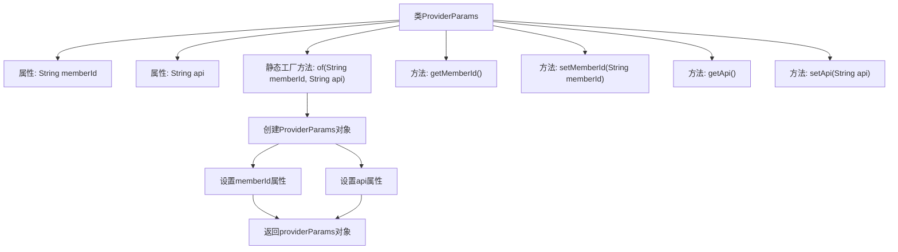

# 基础信息

|      |      |
|------|------|
| 名称 | ProviderParams |
| 编码语言 | .java |
| 代码路径 | WeFe/serving/serving-sdk-java/src/main/java/com/welab/wefe/serving/sdk/dto/ProviderParams.java |
| 包名 | com.welab.wefe.serving.sdk.dto |
| 依赖项 | [] |
| 概述说明 | ProviderParams类包含memberId和api字段，提供构造方法of及getter/setter方法。 |

# 说明

ProviderParams是一个Java类，用于封装提供者参数。它包含两个私有字符串字段：memberId和api。类提供了静态工厂方法of，用于通过memberId和api参数创建ProviderParams实例。此外，类为每个字段提供了标准的getter和setter方法，允许外部访问和修改这两个字段的值。这个类的主要功能是作为数据传输对象，用于存储和传递提供者相关的参数信息。

# 类列表 Class Summary

| 名称   | 类型  | 说明 |
|-------|------|-------------|
| ProviderParams | class | ProviderParams类包含memberId和api属性，提供构造方法of及getter/setter方法。 |

## 类 ProviderParams

|      |      |
|------|------|
| 访问范围 | public |
| 类型 | class |
| 名称 | ProviderParams |
| 说明 | ProviderParams类包含memberId和api属性，提供构造方法of及getter/setter方法。 |

### UML类图

这段代码定义了一个名为`ProviderParams`的类，用于封装提供者参数信息。该类包含两个私有字段`memberId`和`api`，分别表示成员ID和API地址。通过静态工厂方法`of()`可以创建并初始化对象实例，同时提供了标准的getter和setter方法用于字段访问和修改。这是一个典型的数据传输对象(DTO)设计，用于在不同层之间传递参数数据。

### 内部方法调用关系图

该流程图展示了ProviderParams类的结构，包含两个私有属性和五个方法。核心是静态工厂方法of，通过创建对象并设置属性值后返回实例。其他方法包括标准的getter/setter，用于访问和修改成员变量。流程图清晰呈现了对象创建和属性赋值的顺序关系。

### 字段列表 Field List

| 名称  | 类型  | 说明 |
|-------|-------|------|
| api | String | 私有字符串变量api |
| memberId | String | 成员ID字符串变量 |

### 方法列表

| 名称  | 类型  | 说明 |
|-------|-------|------|
| getMemberId | String | 获取成员ID的方法，返回成员ID字符串。 |
| setMemberId | void | 设置成员ID的方法，将输入字符串赋值给成员变量memberId。 |
| of | ProviderParams | 静态方法`of`创建并返回包含`memberId`和`api`的`ProviderParams`对象。 |
| getApi | String | 获取API字符串的方法。 |
| setApi | void | 这是一个Java方法，用于设置类的api属性值。方法接收一个字符串参数api，并将其赋值给当前对象的api成员变量。 |

