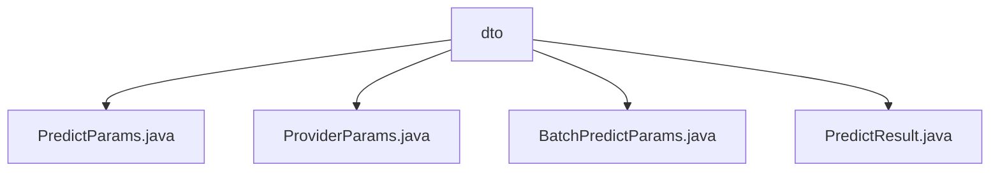

# 基础信息

|      |      |
|------|------|
| 名称 | dto |
| 编码语言 | .java |
| 代码路径 | WeFe/serving/serving-sdk-java/src/main/java/com/welab/wefe/serving/sdk/dto |
| 包名 | docs.serving.serving-sdk-java.src.main.java.com.welab.wefe.serving.sdk.dto |
| 概述说明 | PredictParams类封装预测参数，含userId和featureDataModel属性，提供多种创建方式。ProviderParams类存储提供者参数，含memberId和api字段，支持工厂方法创建。BatchPredictParams管理批量预测参数，含用户ID列表和预测参数列表，支持查询。PredictResult类封装预测结果，含算法类型、联邦学习类型、角色和结果属性。 |

# 说明

## 概述  
该模块核心职责是封装联邦学习预测流程中的参数与结果，提供标准化的数据传输对象。接口规范包含四类DTO：PredictParams封装单次预测参数，ProviderParams存储提供者信息，BatchPredictParams管理批量预测参数，PredictResult统一结果格式。关键数据结构包括用户ID、特征数据模型、算法类型和预测结果等。外部依赖仅涉及Java基础库。例如PredictParams支持通过用户ID和特征数据初始化，BatchPredictParams提供批量参数转换功能。

## 主要业务场景  
模块支持单次和批量预测两种模式，类似工作流引擎的参数组装过程。单次场景通过PredictParams传递用户特征，批量场景使用BatchPredictParams管理用户列表与参数映射。例如ProviderParams可标识数据提供方，PredictResult统一返回算法类型和联邦角色信息。整体形成"参数封装-预测执行-结果返回"的闭环流程，适用于需要标准化接口的联邦学习预测服务集成。

### 包内部结构视图

该流程图展示了Java项目中DTO层的文件结构，根节点为dto目录，包含四个参数类文件：PredictParams、ProviderParams、BatchPredictParams和PredictResult，这些文件用于定义服务调用时的数据传输对象结构。

# 文件列表

| 名称   | 类型  | 说明 |
|-------|------|-------------|
| [PredictParams.java](PredictParams.md) | file | PredictParams类用于预测参数管理，包含userId和featureDataModel属性，提供构造方法和静态创建方法，支持通过Map或FeatureDataModel设置特征数据。 |
| [ProviderParams.java](ProviderParams.md) | file | ProviderParams类包含memberId和api字段，提供构造方法of及getter/setter方法。 |
| [BatchPredictParams.java](BatchPredictParams.md) | file | BatchPredictParams类用于批量预测，包含用户ID列表和预测参数列表，提供创建、获取、初始化和替换预测参数的方法。 |
| [PredictResult.java](PredictResult.md) | file | PredictResult类封装预测结果，包含算法、联邦学习类型、角色和结果字段，提供构造方法和getter/setter。 |

