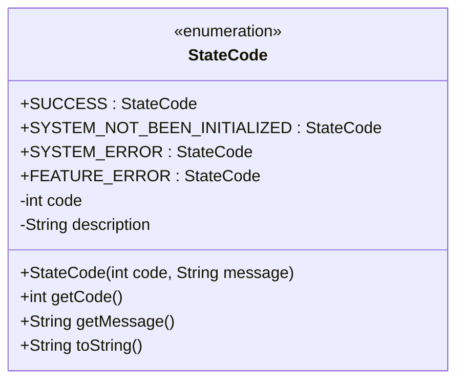
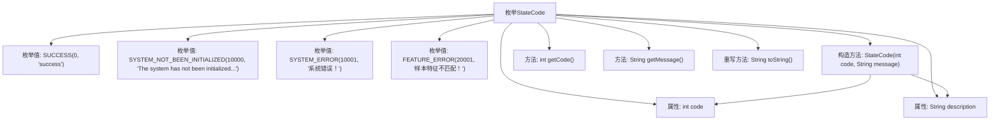

# 基础信息

|      |      |
|------|------|
| 名称 | StateCode |
| 编码语言 | .java |
| 代码路径 | WeFe/serving/serving-sdk-java/src/main/java/com/welab/wefe/serving/sdk/enums/StateCode.java |
| 包名 | com.welab.wefe.serving.sdk.enums |
| 依赖项 | [] |
| 概述说明 | 枚举StateCode定义了状态码：SUCCESS(0)表示成功；SYSTEM_NOT_BEEN_INITIALIZED(10000)和SYSTEM_ERROR(10001)为系统错误；FEATURE_ERROR(20001)为数据错误。每个状态码包含代码和描述信息。 |

# 说明

这是一个枚举类StateCode，定义了系统状态码及其描述信息。包含三种状态类型：成功状态SUCCESS（0），系统级错误（10000-10001）和数据错误（20001）。每个枚举项包含整型code和字符串description，通过构造方法初始化。提供getCode和getMessage方法获取属性值，toString方法返回code字符串形式。状态码用于标识操作结果或错误类型，如系统未初始化、系统错误和样本特征不匹配等场景。

# 类列表 Class Summary

| 名称   | 类型  | 说明 |
|-------|------|-------------|
| StateCode | enum | 枚举StateCode定义了状态码：0成功，10000系统未初始化，10001系统错误，20001特征不匹配。包含code和description属性及对应方法。 |

## 类 StateCode

|      |      |
|------|------|
| 访问范围 | public |
| 类型 | enum |
| 名称 | StateCode |
| 说明 | 枚举StateCode定义了状态码：0成功，10000系统未初始化，10001系统错误，20001特征不匹配。包含code和description属性及对应方法。 |

### UML类图

这段代码定义了一个枚举类StateCode，用于表示系统状态码及其描述信息。枚举包含四种状态：SUCCESS(成功)、SYSTEM_NOT_BEEN_INITIALIZED(系统未初始化)、SYSTEM_ERROR(系统错误)和FEATURE_ERROR(样本特征不匹配)。每个枚举值都关联一个整型code和字符串description，通过构造函数初始化，并提供getCode()和getMessage()方法获取这些值。toString()方法返回code的字符串表示。该设计适用于需要标准化错误码和消息的系统，便于统一管理和维护错误信息。

### 内部方法调用关系图

该流程图展示了StateCode枚举的结构，包含4个预定义枚举值（SUCCESS、SYSTEM_NOT_BEEN_INITIALIZED等），两个私有属性（code和description），以及构造方法、三个成员方法（getCode、getMessage和重写的toString）。构造方法初始化属性，各方法分别提供状态码获取、描述信息获取和字符串转换功能。枚举设计用于统一管理系统状态码及其描述信息。

### 字段列表 Field List

| 名称  | 类型  | 说明 |
|-------|-------|------|

### 方法列表

| 名称  | 类型  | 说明 |
|-------|-------|------|

