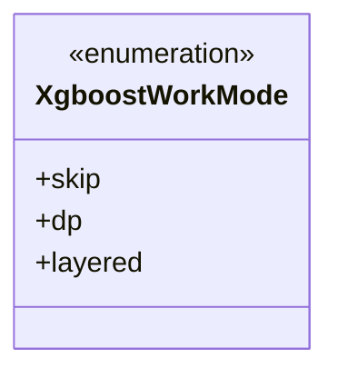
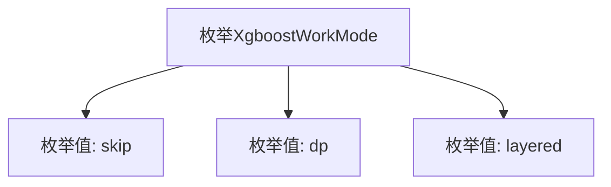

# 基础信息

|      |      |
|------|------|
| 名称 | XgboostWorkMode |
| 编码语言 | .java |
| 代码路径 | WeFe/serving/serving-sdk-java/src/main/java/com/welab/wefe/serving/sdk/enums/XgboostWorkMode.java |
| 包名 | com.welab.wefe.serving.sdk.enums |
| 依赖项 | [] |
| 概述说明 | XgboostWorkMode枚举定义了三种工作模式：跳过（skip）、数据并行（dp）和分层（layered）。 |

# 说明

该内容定义了一个名为XgboostWorkMode的公共枚举类型，包含三个枚举值：skip、dp和layered。这些枚举值可能代表XGBoost模型的不同工作模式或配置选项，用于控制模型训练或预测时的行为方式。

# 类列表 Class Summary

| 名称   | 类型  | 说明 |
|-------|------|-------------|
| XgboostWorkMode | enum | XgboostWorkMode枚举定义三种工作模式：跳过（skip）、数据并行（dp）、分层（layered）。 |

## 类 XgboostWorkMode

|      |      |
|------|------|
| 访问范围 | public |
| 类型 | enum |
| 名称 | XgboostWorkMode |
| 说明 | XgboostWorkMode枚举定义三种工作模式：跳过（skip）、数据并行（dp）、分层（layered）。 |

### UML类图

这段代码定义了一个名为XgboostWorkMode的枚举类型，包含三个枚举常量：skip、dp和layered。枚举类型用于表示一组固定的常量值，这里可能用于指定XGBoost算法的工作模式。skip可能表示跳过某些处理步骤，dp可能表示数据并行模式，layered可能表示分层处理模式。枚举类型在类图中用<<enumeration>>标记，清晰地展示了其结构和可能的用途场景。

### 内部方法调用关系图

该流程图展示了XgboostWorkMode枚举的结构，包含三个枚举值：skip、dp和layered。枚举作为一种特殊的数据类型，用于定义一组固定的常量值，这里表示XGBoost算法可能的工作模式。每个枚举值都是该枚举类型的实例，可以直接通过XgboostWorkMode.skip等方式引用。这种设计模式常用于替代魔法数字，提高代码可读性和类型安全性。

### 字段列表 Field List

| 名称  | 类型  | 说明 |
|-------|-------|------|

### 方法列表

| 名称  | 类型  | 说明 |
|-------|-------|------|

