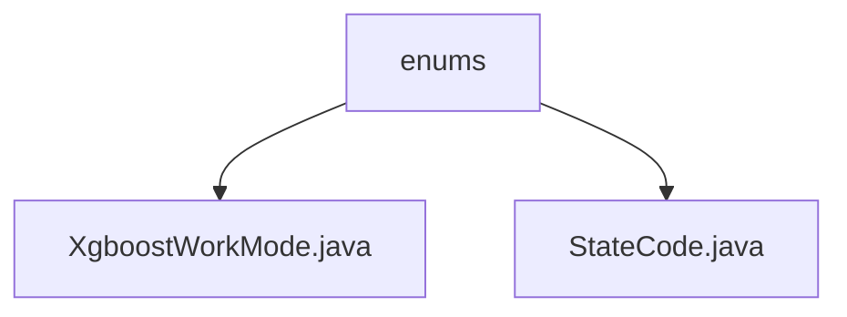

# 基础信息

|      |      |
|------|------|
| 名称 | enums |
| 编码语言 | .java |
| 代码路径 | WeFe/serving/serving-sdk-java/src/main/java/com/welab/wefe/serving/sdk/enums |
| 包名 | docs.serving.serving-sdk-java.src.main.java.com.welab.wefe.serving.sdk.enums |
| 概述说明 | XgboostWorkMode枚举定义skip、dp、layered三种工作模式。StateCode枚举包含SUCCESS(0)、系统错误(10000-10001)和数据错误(20001)状态码，提供code和description属性及获取方法。 |

# 说明

## 概述  
该模块核心职责是提供枚举类型定义，支持XGBoost工作模式选择和系统状态码管理。接口规范包括XgboostWorkMode的skip/dp/layered三种模式，以及StateCode的状态码获取方法（getCode/getMessage）。关键数据结构为枚举类，包含整型code和字符串description。外部依赖仅涉及XGBoost框架。例如StateCode定义了样本特征不匹配(20001)等具体错误码。

## 主要业务场景  
模块用于控制XGBoost训练流程（如分层模式layered）和统一异常处理（类似HTTP状态码机制）。业务流程涵盖模型配置、错误拦截等场景，例如系统未初始化(10000)触发状态码校验。交互模式通过枚举值传递参数，如SUCCESS(0)标识操作成功。典型应用包括分布式训练模式(dp)选择和API调用结果状态反馈。

### 包内部结构视图

该流程图展示了WeFe项目中serving-sdk-java模块下enums目录的层级结构。enums作为父节点包含两个枚举类文件：XgboostWorkMode.java和StateCode.java，这两个文件分别代表XGBoost工作模式和状态码的枚举定义。整个结构清晰地呈现了枚举类型在项目中的组织方式。

# 文件列表

| 名称   | 类型  | 说明 |
|-------|------|-------------|
| [XgboostWorkMode.java](XgboostWorkMode.md) | file | XgboostWorkMode枚举定义了三种工作模式：跳过（skip）、数据并行（dp）和分层（layered）。 |
| [StateCode.java](StateCode.md) | file | 枚举StateCode定义了状态码：SUCCESS(0)表示成功；SYSTEM_NOT_BEEN_INITIALIZED(10000)和SYSTEM_ERROR(10001)为系统错误；FEATURE_ERROR(20001)为数据错误。每个状态码包含代码和描述信息。 |

