# 基础信息

|      |      |
|------|------|
| 名称 | AlgorithmManager |
| 编码语言 | .java |
| 代码路径 | WeFe/serving/serving-sdk-java/src/main/java/com/welab/wefe/serving/sdk/manager/AlgorithmManager.java |
| 包名 | com.welab.wefe.serving.sdk.manager |
| 依赖项 | ['com.welab.wefe.serving.sdk.algorithm.AbstractAlgorithm', 'com.welab.wefe.serving.sdk.algorithm.AbstractBatchAlgorithm', 'com.welab.wefe.serving.sdk.algorithm.lr.batch.LrHorzPromoterBatchAlgorithm', 'com.welab.wefe.serving.sdk.algorithm.lr.batch.LrVertPromoterBatchAlgorithm', 'com.welab.wefe.serving.sdk.algorithm.lr.batch.LrVertProviderBatchAlgorithm', 'com.welab.wefe.serving.sdk.algorithm.lr.single.LrHorzPromoterAlgorithm', 'com.welab.wefe.serving.sdk.algorithm.lr.single.LrVertPromoterAlgorithm', 'com.welab.wefe.serving.sdk.algorithm.lr.single.LrVertProviderAlgorithm', 'com.welab.wefe.serving.sdk.algorithm.xgboost.batch.XgboostHorzPromoterBatchAlgorithm', 'com.welab.wefe.serving.sdk.algorithm.xgboost.batch.XgboostVertPromoterBatchAlgorithm', 'com.welab.wefe.serving.sdk.algorithm.xgboost.batch.XgboostVertProviderBatchAlgorithm', 'com.welab.wefe.serving.sdk.algorithm.xgboost.single.XgboostHorzPromoterAlgorithm', 'com.welab.wefe.serving.sdk.algorithm.xgboost.single.XgboostVertPromoterAlgorithm', 'com.welab.wefe.serving.sdk.algorithm.xgboost.single.XgboostVertProviderAlgorithm', 'com.welab.wefe.serving.sdk.model.BaseModel', 'java.util.HashMap', 'java.util.Map'] |
| 概述说明 | AlgorithmManager类管理算法映射，包含普通和批量算法两种映射表，通过模型参数动态获取对应算法实例。支持逻辑回归和XGBoost的不同分布式类型和角色。 |

# 说明

AlgorithmManager类通过两个静态映射表MAP和BATCH_MAP管理算法实现类。MAP存储常规算法类，BATCH_MAP存储批处理算法类。映射表以算法名称、联邦学习类型和角色组合作为键，对应不同场景下的算法实现类。提供get和getBatch方法，根据传入的BaseModel参数动态生成对应算法实例。支持逻辑回归和XGBoost两种算法，涵盖水平、垂直和混合三种联邦学习模式，区分发起方和提供方两种角色。

# 类列表 Class Summary

| 名称   | 类型  | 说明 |
|-------|------|-------------|
| AlgorithmManager | class | AlgorithmManager类通过静态映射表管理算法实例，支持逻辑回归和XGBoost的不同分布式类型和角色，提供单次和批量处理两种获取方式。 |

## 类 AlgorithmManager

|      |      |
|------|------|
| 访问范围 | public |
| 类型 | class |
| 名称 | AlgorithmManager |
| 说明 | AlgorithmManager类通过静态映射表管理算法实例，支持逻辑回归和XGBoost的不同分布式类型和角色，提供单次和批量处理两种获取方式。 |

### UML类图

```mermaid
classDiagram
    class AlgorithmManager {
        -Map~String, Class~? extends AbstractAlgorithm~~ MAP
        -Map~String, Class~? extends AbstractBatchAlgorithm~~ BATCH_MAP
        +get(BaseModel model) AbstractAlgorithm
        +getBatch(BaseModel model) AbstractBatchAlgorithm
    }

    class AbstractAlgorithm {
        <<Abstract>>
    }

    class AbstractBatchAlgorithm {
        <<Abstract>>
    }

    class LrHorzPromoterAlgorithm {
        <<Concrete>>
    }

    class LrVertPromoterAlgorithm {
        <<Concrete>>
    }

    class LrVertProviderAlgorithm {
        <<Concrete>>
    }

    class XgboostVertPromoterAlgorithm {
        <<Concrete>>
    }

    class XgboostVertProviderAlgorithm {
        <<Concrete>>
    }

    class XgboostHorzPromoterAlgorithm {
        <<Concrete>>
    }

    class LrHorzPromoterBatchAlgorithm {
        <<Concrete>>
    }

    class LrVertPromoterBatchAlgorithm {
        <<Concrete>>
    }

    class LrVertProviderBatchAlgorithm {
        <<Concrete>>
    }

    class XgboostVertPromoterBatchAlgorithm {
        <<Concrete>>
    }

    class XgboostVertProviderBatchAlgorithm {
        <<Concrete>>
    }

    class XgboostHorzPromoterBatchAlgorithm {
        <<Concrete>>
    }

    class BaseModel {
        +algorithm: Enum
        +flType: Enum
        +myRole: Enum
    }

    AlgorithmManager --> AbstractAlgorithm : 依赖
    AlgorithmManager --> AbstractBatchAlgorithm : 依赖
    LrHorzPromoterAlgorithm --|> AbstractAlgorithm
    LrVertPromoterAlgorithm --|> AbstractAlgorithm
    LrVertProviderAlgorithm --|> AbstractAlgorithm
    XgboostVertPromoterAlgorithm --|> AbstractAlgorithm
    XgboostVertProviderAlgorithm --|> AbstractAlgorithm
    XgboostHorzPromoterAlgorithm --|> AbstractAlgorithm
    LrHorzPromoterBatchAlgorithm --|> AbstractBatchAlgorithm
    LrVertPromoterBatchAlgorithm --|> AbstractBatchAlgorithm
    LrVertProviderBatchAlgorithm --|> AbstractBatchAlgorithm
    XgboostVertPromoterBatchAlgorithm --|> AbstractBatchAlgorithm
    XgboostVertProviderBatchAlgorithm --|> AbstractBatchAlgorithm
    XgboostHorzPromoterBatchAlgorithm --|> AbstractBatchAlgorithm
    AlgorithmManager --> BaseModel : 依赖
```

这段代码描述了一个算法管理器(AlgorithmManager)，它通过静态映射表(MAP和BATCH_MAP)来管理不同类型的算法实现类。该类提供了两个核心方法：get()和getBatch()，根据传入的BaseModel参数动态创建对应的算法实例。系统包含两种抽象算法类型(AbstractAlgorithm和AbstractBatchAlgorithm)，以及它们的多个具体实现类(如逻辑回归和XGBoost的各种变体)。BaseModel作为输入参数，包含算法类型、联邦学习类型和角色信息，用于确定要实例化的具体算法类。整个设计采用了工厂模式的思想，通过字符串键值映射来解耦算法创建逻辑。

### 内部方法调用关系图

这段代码展示了一个算法管理器类，通过静态映射表实现算法类的动态加载。核心功能是通过模型参数生成key，从预定义的MAP或BATCH_MAP中获取对应算法类，并通过反射实例化。流程图清晰呈现了类结构、静态初始化过程以及两个核心方法的执行流程，包括key生成、映射查询、实例创建和异常处理等关键步骤。

### 字段列表 Field List

| 名称  | 类型  | 说明 |
|-------|-------|------|
| BATCH_MAP = new HashMap<>() | Map<String, Class<? extends AbstractBatchAlgorithm>> | 定义了一个私有静态不可变的映射BATCH_MAP，键为字符串，值为AbstractBatchAlgorithm的子类类型。 |
| MAP = new HashMap<>() | Map<String, Class<? extends AbstractAlgorithm>> | 定义静态常量MAP，类型为HashMap，键为String，值为AbstractAlgorithm的子类Class对象。 |

### 方法列表

| 名称  | 类型  | 说明 |
|-------|-------|------|
| get | AbstractAlgorithm | 静态方法根据模型参数生成算法实例，通过拼接键名从映射获取类并实例化，异常返回空。 |
| getBatch | AbstractBatchAlgorithm | 该方法根据模型参数生成唯一键，从映射表获取对应算法类并实例化，异常时返回空。 |

