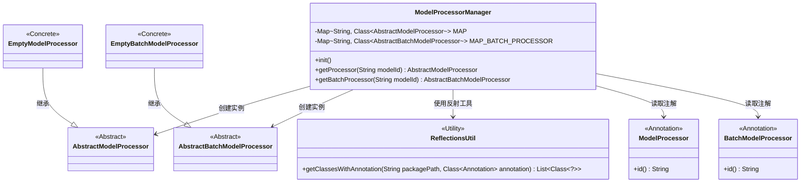
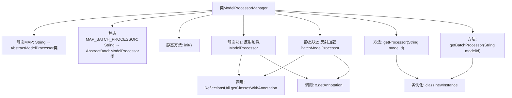

# 基础信息

|      |      |
|------|------|
| 名称 | ModelProcessorManager |
| 编码语言 | .java |
| 代码路径 | WeFe/serving/serving-sdk-java/src/main/java/com/welab/wefe/serving/sdk/manager/ModelProcessorManager.java |
| 包名 | com.welab.wefe.serving.sdk.manager |
| 依赖项 | ['com.welab.wefe.common.util.ReflectionsUtil', 'com.welab.wefe.common.web.Launcher', 'com.welab.wefe.serving.sdk.processor', 'org.slf4j.Logger', 'org.slf4j.LoggerFactory', 'java.util.HashMap', 'java.util.List', 'java.util.Map'] |
| 概述说明 | ModelProcessorManager管理模型处理器，通过反射加载注解类到静态Map，提供获取单例和批量处理器的方法，未找到时返回空处理器。 |

# 说明

ModelProcessorManager类管理模型处理器，包含两个静态映射MAP和MAP_BATCH_PROCESSOR，分别存储模型ID与对应处理器类的关联。通过静态初始化块使用反射扫描指定包路径下带有ModelProcessor和BatchModelProcessor注解的类，并填充映射表。提供getProcessor和getBatchProcessor方法，根据模型ID获取对应的处理器实例，若未找到则返回空处理器。初始化时记录日志。

# 类列表 Class Summary

| 名称   | 类型  | 说明 |
|-------|------|-------------|
| ModelProcessorManager | class | ModelProcessorManager管理模型处理器类，通过反射初始化单例和批量处理器映射表，提供获取处理器实例的方法。 |

## 类 ModelProcessorManager

|      |      |
|------|------|
| 访问范围 | public |
| 类型 | class |
| 名称 | ModelProcessorManager |
| 说明 | ModelProcessorManager管理模型处理器类，通过反射初始化单例和批量处理器映射表，提供获取处理器实例的方法。 |

### UML类图

这段代码展示了一个模型处理器管理器`ModelProcessorManager`，它通过静态映射表管理两类模型处理器：单模型处理器(`AbstractModelProcessor`)和批量模型处理器(`AbstractBatchModelProcessor`)。管理器在静态初始化块中使用反射工具`ReflectionsUtil`扫描带有特定注解(`ModelProcessor`和`BatchModelProcessor`)的类，并将它们注册到对应的映射表中。当请求处理器时，管理器会根据模型ID查找并实例化相应的处理器类，若未找到则返回空处理器(`EmptyModelProcessor`或`EmptyBatchModelProcessor`)。整个设计实现了基于注解的处理器动态注册和按需创建机制。

### 内部方法调用关系图

该流程图展示了ModelProcessorManager类的核心结构，包含两个静态Map用于存储处理器类映射，通过静态初始化块使用反射机制加载带特定注解的处理器类。主要方法getProcessor和getBatchProcessor根据modelId获取对应处理器实例，若未找到则返回空处理器。静态初始化过程涉及反射工具类和注解解析，实例化时可能抛出异常。

### 字段列表 Field List

| 名称  | 类型  | 说明 |
|-------|-------|------|
| MAP_BATCH_PROCESSOR = new HashMap<>() | Map<String, Class<? extends AbstractBatchModelProcessor>> | 定义静态常量MAP_BATCH_PROCESSOR，存储字符串到AbstractBatchModelProcessor子类类型的映射。 |
| MAP = new HashMap<>() | Map<String, Class<? extends AbstractModelProcessor>> | 定义静态常量MAP，存储字符串到AbstractModelProcessor子类的映射。 |

### 方法列表

| 名称  | 类型  | 说明 |
|-------|-------|------|
| getProcessor | AbstractModelProcessor | 根据模型ID获取处理器实例，未找到则返回空处理器，异常时返回null。 |
| init | void | 初始化模型处理器，记录日志信息。 |
| getBatchProcessor | AbstractBatchModelProcessor | 获取指定模型ID对应的批处理处理器，若无则返回空处理器，异常时返回null。 |

