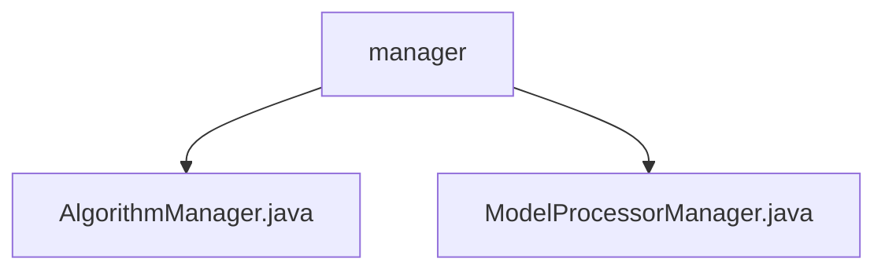

# 基础信息

|      |      |
|------|------|
| 名称 | manager |
| 编码语言 | .java |
| 代码路径 | WeFe/serving/serving-sdk-java/src/main/java/com/welab/wefe/serving/sdk/manager |
| 包名 | docs.serving.serving-sdk-java.src.main.java.com.welab.wefe.serving.sdk.manager |
| 概述说明 | AlgorithmManager类通过MAP和BATCH_MAP管理算法类，支持逻辑回归和XGBoost，覆盖三种联邦学习模式和两种角色。ModelProcessorManager类管理模型处理器，通过反射扫描注解类填充映射表，提供获取处理器实例的方法。 |

# 说明

## 概述  
该模块核心职责是通过映射表管理算法实现类和模型处理器，支持动态实例化与联邦学习场景适配。接口规范包括：AlgorithmManager提供get/getBatch方法基于BaseModel参数获取算法实例；ModelProcessorManager提供getProcessor/getBatchProcessor方法根据模型ID获取处理器。关键数据结构为双映射表（MAP/BATCH_MAP），键分别为算法三元组（名称/联邦类型/角色）和模型ID。外部依赖仅涉及Java反射机制。例如支持逻辑回归/XGBoost算法和空处理器兜底逻辑。

## 主要业务场景  
模块采用类似工厂模式的双轨制管理，同时支持常规与批处理场景。完整业务流程为：根据联邦学习类型（水平/垂直/混合）和角色（发起方/提供方）动态加载算法类，或通过模型ID匹配预扫描的处理器类。典型应用包括模型推理时的处理器链式调用，例如批处理场景下通过BATCH_MAP获取XGBoost处理器。所有API均为查询类接口，集成案例体现在BaseModel参数到具体实现的运行时绑定。

### 包内部结构视图

该流程图展示了WeFe服务SDK中manager目录下的文件结构。manager作为父节点，包含两个子节点：AlgorithmManager.java和ModelProcessorManager.java，这两个Java文件分别代表不同的管理功能模块。结构简洁明了，体现了manager模块的核心组成部分。

# 文件列表

| 名称   | 类型  | 说明 |
|-------|------|-------------|
| [AlgorithmManager.java](AlgorithmManager.md) | file | AlgorithmManager类管理算法映射，包含普通和批量算法两种映射表，通过模型参数动态获取对应算法实例。支持逻辑回归和XGBoost的不同分布式类型和角色。 |
| [ModelProcessorManager.java](ModelProcessorManager.md) | file | ModelProcessorManager管理模型处理器，通过反射加载注解类到静态Map，提供获取单例和批量处理器的方法，未找到时返回空处理器。 |

