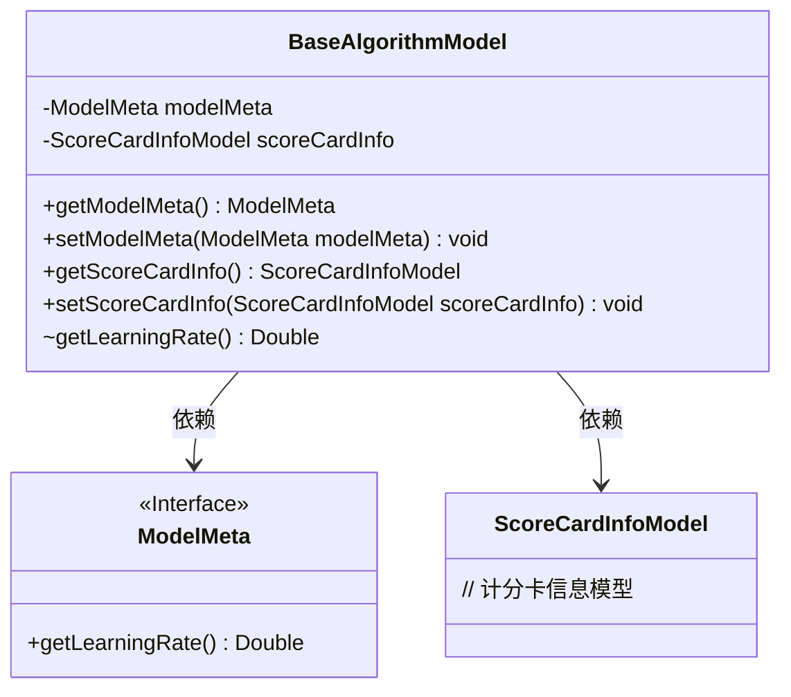
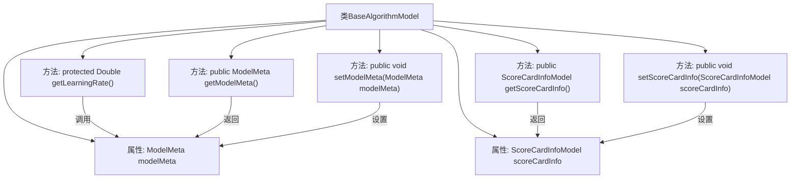

# 基础信息

|      |      |
|------|------|
| 名称 | BaseAlgorithmModel |
| 编码语言 | .java |
| 代码路径 | WeFe/serving/serving-sdk-java/src/main/java/com/welab/wefe/serving/sdk/model/BaseAlgorithmModel.java |
| 包名 | com.welab.wefe.serving.sdk.model |
| 依赖项 | [] |
| 概述说明 | BaseAlgorithmModel类包含ModelMeta和ScoreCardInfoModel属性，提供获取学习率的方法及属性的getter/setter。 |

# 说明

BaseAlgorithmModel是一个基础算法模型类，包含两个主要属性：modelMeta和scoreCardInfo。modelMeta存储模型元数据，提供获取学习率的方法getLearningRate。类中定义了获取和设置这两个属性的公共方法，其中getLearningRate是受保护方法。该类主要用于管理算法模型的元数据和评分卡信息。

# 类列表 Class Summary

| 名称   | 类型  | 说明 |
|-------|------|-------------|
| BaseAlgorithmModel | class | BaseAlgorithmModel类包含ModelMeta和ScoreCardInfoModel属性，提供获取学习率及属性的getter/setter方法。 |

## 类 BaseAlgorithmModel

|      |      |
|------|------|
| 访问范围 | public |
| 类型 | class |
| 名称 | BaseAlgorithmModel |
| 说明 | BaseAlgorithmModel类包含ModelMeta和ScoreCardInfoModel属性，提供获取学习率及属性的getter/setter方法。 |

### UML类图

这段代码展示了一个基础算法模型类(BaseAlgorithmModel)，它包含对模型元数据(ModelMeta)和计分卡信息(ScoreCardInfoModel)的依赖关系。BaseAlgorithmModel提供了获取和设置这两个属性的公有方法，以及一个受保护的获取学习率的方法。ModelMeta被定义为接口，包含获取学习率的抽象方法。类图清晰地展示了这些类之间的依赖关系和主要成员方法。

### 内部方法调用关系图

该流程图展示了BaseAlgorithmModel类的结构和内部关系。类包含两个私有属性modelMeta和scoreCardInfo，以及五个方法：一个受保护的getLearningRate方法（通过modelMeta获取学习率），两对getter/setter分别用于操作两个私有属性。箭头清晰地标明了方法间的调用关系，如getLearningRate依赖于modelMeta属性，而setter方法会修改对应属性的值。整体结构体现了典型的Java Bean设计模式，具有清晰的封装性和数据访问控制。

### 字段列表 Field List

| 名称  | 类型  | 说明 |
|-------|-------|------|
| modelMeta | ModelMeta | 私有模型元数据对象 |
| scoreCardInfo | ScoreCardInfoModel | 私有变量scoreCardInfo，类型为ScoreCardInfoModel。 |

### 方法列表

| 名称  | 类型  | 说明 |
|-------|-------|------|
| getLearningRate | Double | 获取模型学习率的方法，返回类型为Double，调用modelMeta的getLearningRate方法实现。 |
| getModelMeta | ModelMeta | 获取模型元数据的方法，返回modelMeta对象。 |
| setModelMeta | void | 这是一个Java方法，用于设置类的modelMeta属性，接收一个ModelMeta类型的参数。 |
| getScoreCardInfo | ScoreCardInfoModel | 获取计分卡信息的方法，返回ScoreCardInfoModel对象。 |
| setScoreCardInfo | void | 这是一个Java方法，用于设置ScoreCardInfoModel类型的scoreCardInfo对象。方法名为setScoreCardInfo，接受一个参数并赋值给成员变量。 |

