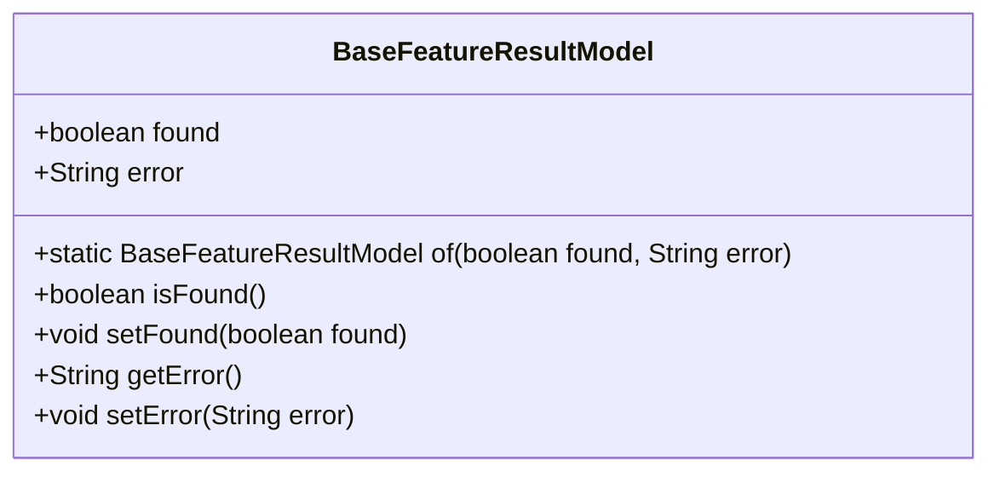
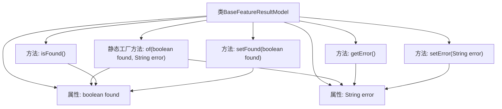

# 基础信息

|      |      |
|------|------|
| 名称 | BaseFeatureResultModel |
| 编码语言 | .java |
| 代码路径 | WeFe/serving/serving-sdk-java/src/main/java/com/welab/wefe/serving/sdk/model/BaseFeatureResultModel.java |
| 包名 | com.welab.wefe.serving.sdk.model |
| 依赖项 | [] |
| 概述说明 | BaseFeatureResultModel类包含found和error属性，提供构造方法of及getter/setter方法，用于返回特征查找结果和错误信息。 |

# 说明

BaseFeatureResultModel是一个基础特征结果模型类，包含found布尔变量表示是否找到特征，error字符串变量存储错误信息。提供静态方法of快速创建实例，并包含found和error的getter和setter方法。

# 类列表 Class Summary

| 名称   | 类型  | 说明 |
|-------|------|-------------|
| BaseFeatureResultModel | class | BaseFeatureResultModel类包含found和error属性，提供构造方法of及getter/setter方法，用于存储和操作特征结果状态及错误信息。 |

## 类 BaseFeatureResultModel

|      |      |
|------|------|
| 访问范围 | public |
| 类型 | class |
| 名称 | BaseFeatureResultModel |
| 说明 | BaseFeatureResultModel类包含found和error属性，提供构造方法of及getter/setter方法，用于存储和操作特征结果状态及错误信息。 |

### UML类图

这段代码定义了一个名为`BaseFeatureResultModel`的类，用于表示基础特性的结果模型。该类包含两个公有字段：`found`表示是否找到结果，`error`存储错误信息。提供了静态工厂方法`of()`快速创建实例，以及标准的getter/setter方法。类设计简单直接，适合作为基础结果封装类，便于扩展和复用。

### 内部方法调用关系图

这段代码定义了一个名为BaseFeatureResultModel的类，用于封装特征查找结果的状态信息。类中包含两个核心属性：found表示是否找到特征，error存储错误信息。通过静态工厂方法of()可以快速创建对象实例，同时提供了标准的getter/setter方法访问属性。流程图清晰展示了类结构、属性与方法间的调用关系，特别是工厂方法如何初始化属性值，以及各访问器方法如何与属性交互。

### 字段列表 Field List

| 名称  | 类型  | 说明 |
|-------|-------|------|
| error = "" | String | 定义了一个公共字符串变量error，初始值为空字符串。 |
| found = false | boolean | 定义了一个公共布尔变量found，初始值为false。 |

### 方法列表

| 名称  | 类型  | 说明 |
|-------|-------|------|
| isFound | boolean | 这是一个Java方法，返回布尔值变量found的当前状态。 |
| setFound | void | 设置found布尔值的公共方法。 |
| of | BaseFeatureResultModel | 静态方法`of`创建并返回`BaseFeatureResultModel`实例，设置`found`和`error`属性值。 |
| getError | String | 获取错误信息的字符串方法。 |
| setError | void | 这是一个Java方法，用于设置错误信息，将传入的字符串赋值给类的error成员变量。 |

