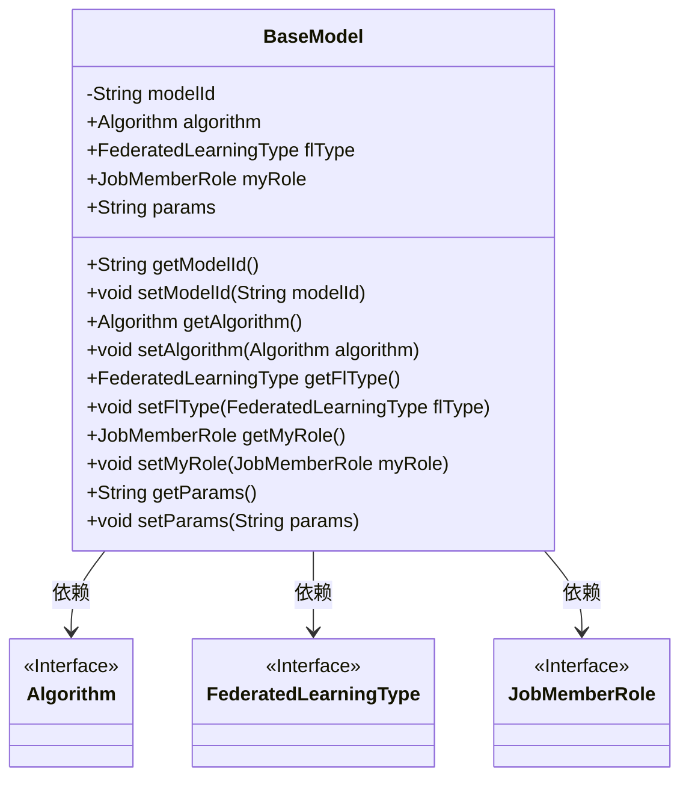

# 基础信息

|      |      |
|------|------|
| 名称 | BaseModel |
| 编码语言 | .java |
| 代码路径 | WeFe/serving/serving-sdk-java/src/main/java/com/welab/wefe/serving/sdk/model/BaseModel.java |
| 包名 | com.welab.wefe.serving.sdk.model |
| 依赖项 | ['com.welab.wefe.common.wefe.enums.Algorithm', 'com.welab.wefe.common.wefe.enums.FederatedLearningType', 'com.welab.wefe.common.wefe.enums.JobMemberRole'] |
| 概述说明 | BaseModel类包含模型ID、算法、联邦学习类型、成员角色和参数字段，提供各属性的getter和setter方法。 |

# 说明

BaseModel类是一个基础模型类，包含五个主要属性：modelId用于标识模型，algorithm表示使用的算法类型，flType指定联邦学习类型，myRole定义任务成员角色，params存储模型参数。每个属性都有对应的getter和setter方法用于访问和修改。该类提供了模型的基本框架，支持联邦学习场景下的参数管理和角色配置。

# 类列表 Class Summary

| 名称   | 类型  | 说明 |
|-------|------|-------------|
| BaseModel | class | BaseModel类包含模型ID、算法、联邦学习类型、成员角色和参数等属性，提供对应的getter和setter方法。 |

## 类 BaseModel

|      |      |
|------|------|
| 访问范围 | public |
| 类型 | class |
| 名称 | BaseModel |
| 说明 | BaseModel类包含模型ID、算法、联邦学习类型、成员角色和参数等属性，提供对应的getter和setter方法。 |

### UML类图

BaseModel 是一个基础模型类，包含模型ID、算法、联邦学习类型、成员角色和参数等属性。该类提供了对这些属性的getter和setter方法。BaseModel 依赖于三个接口：Algorithm、FederatedLearningType 和 JobMemberRole，这些接口可能定义了相关的行为或类型。BaseModel 的设计允许灵活地配置和管理模型的不同方面，适用于联邦学习等场景。

### 内部方法调用关系图

```mermaid
graph TD
    A["类BaseModel"]
    B["私有属性: String modelId"]
    C["公有属性: Algorithm algorithm"]
    D["公有属性: FederatedLearningType flType"]
    E["公有属性: JobMemberRole myRole"]
    F["公有属性: String params"]
    G["方法: String getModelId()"]
    H["方法: void setModelId(String modelId)"]
    I["方法: Algorithm getAlgorithm()"]
    J["方法: void setAlgorithm(Algorithm algorithm)"]
    K["方法: FederatedLearningType getFlType()"]
    L["方法: void setFlType(FederatedLearningType flType)"]
    M["方法: JobMemberRole getMyRole()"]
    N["方法: void setMyRole(JobMemberRole myRole)"]
    O["方法: String getParams()"]
    P["方法: void setParams(String params)"]

    A --> B
    A --> C
    A --> D
    A --> E
    A --> F
    A --> G
    A --> H
    A --> I
    A --> J
    A --> K
    A --> L
    A --> M
    A --> N
    A --> O
    A --> P
```

该流程图展示了BaseModel类的完整结构，包含5个成员变量（1个私有属性和4个公有属性）及其对应的getter/setter方法。所有方法均与类直接关联，形成标准的Java Bean模式，用于封装联邦学习基础模型的核心属性，包括模型ID、算法类型、联邦学习类型、成员角色和参数字符串等关键信息。

### 字段列表 Field List

| 名称  | 类型  | 说明 |
|-------|-------|------|
| modelId | String | 声明一个私有字符串变量modelId。 |
| flType | FederatedLearningType | 公共联邦学习类型变量flType。 |
| algorithm | Algorithm | 声明一个名为algorithm的Algorithm类公共变量。 |
| myRole | JobMemberRole | 定义了一个公共变量myRole，类型为JobMemberRole。 |
| params | String | 字符串类型参数变量。 |

### 方法列表

| 名称  | 类型  | 说明 |
|-------|-------|------|
| getFlType | FederatedLearningType | 获取联邦学习类型的方法，返回flType字段值。 |
| setModelId | void | 这是一个Java方法，用于设置对象的modelId属性值。方法接收一个字符串参数modelId，并将其赋值给当前对象的同名属性。 |
| setAlgorithm | void | 设置当前对象的算法属性为指定算法。 |
| setMyRole | void | 这是一个Java方法，用于设置当前对象的myRole属性值为传入的JobMemberRole参数。 |
| getModelId | String | 这是一个Java方法，返回字符串类型的modelId字段值。 |
| getAlgorithm | Algorithm | 获取当前算法实例的方法。 |
| setFlType | void | 设置联邦学习类型的方法，将参数flType赋值给类的成员变量flType。 |
| getMyRole | JobMemberRole | 获取当前用户的角色信息。 |
| getParams | String | 获取params参数的字符串值。 |
| setParams | void | 设置参数方法，将输入参数赋值给类成员变量params。 |

