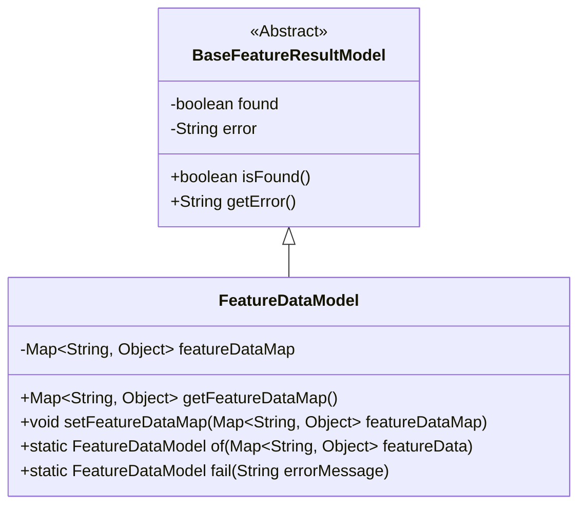
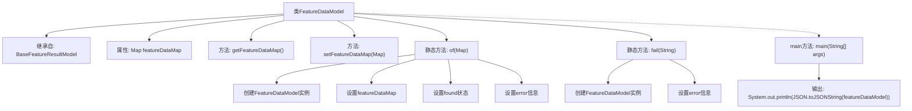

# 基础信息

|      |      |
|------|------|
| 名称 | FeatureDataModel |
| 编码语言 | .java |
| 代码路径 | WeFe/serving/serving-sdk-java/src/main/java/com/welab/wefe/serving/sdk/model/FeatureDataModel.java |
| 包名 | com.welab.wefe.serving.sdk.model |
| 依赖项 | ['com.alibaba.fastjson.JSON', 'org.apache.commons.collections4.MapUtils', 'java.util.Map'] |
| 概述说明 | FeatureDataModel类继承BaseFeatureResultModel，包含featureDataMap属性和相关操作方法，支持通过of方法创建实例并检查数据有效性，以及fail方法处理错误情况。 |

# 说明

该代码定义了一个名为FeatureDataModel的类，继承自BaseFeatureResultModel。类中包含一个Map类型的成员变量featureDataMap，并提供了对应的getter和setter方法。类提供了两个静态方法：of方法用于创建实例并初始化featureDataMap，同时根据Map是否为空设置found和error属性；fail方法用于创建带有错误信息的实例。main方法演示了使用of方法创建实例并输出JSON字符串。

# 类列表 Class Summary

| 名称   | 类型  | 说明 |
|-------|------|-------------|
| FeatureDataModel | class | FeatureDataModel类继承BaseFeatureResultModel，包含featureDataMap属性和相关操作方法，支持通过of方法创建实例并检查数据有效性，以及fail方法处理错误情况。 |

## 类 FeatureDataModel

|      |      |
|------|------|
| 访问范围 | public |
| 类型 | class |
| 名称 | FeatureDataModel |
| 说明 | FeatureDataModel类继承BaseFeatureResultModel，包含featureDataMap属性和相关操作方法，支持通过of方法创建实例并检查数据有效性，以及fail方法处理错误情况。 |

### UML类图

类图描述：FeatureDataModel继承自抽象基类BaseFeatureResultModel，扩展了特征数据存储功能。基类包含found状态标志和error错误信息，子类通过featureDataMap存储键值对形式的数据，提供静态工厂方法of()和fail()来创建实例。类图清晰展示了继承关系和核心方法，体现了对特征数据的封装和错误处理机制。

### 内部方法调用关系图

该流程图展示了FeatureDataModel类的结构和主要方法调用关系。该类继承自BaseFeatureResultModel，包含一个Map类型的属性featureDataMap及其getter/setter方法。核心静态方法of()用于创建实例并初始化数据状态，fail()用于创建错误实例。main方法演示了of()的调用和JSON输出流程。图中清晰呈现了属性定义、方法调用链和继承关系，特别突出了静态工厂方法内部的初始化逻辑。

### 字段列表 Field List

| 名称  | 类型  | 说明 |
|-------|-------|------|
| featureDataMap | Map<String, Object> | 私有映射变量featureDataMap，键为字符串类型，值为对象类型。 |

### 方法列表

| 名称  | 类型  | 说明 |
|-------|-------|------|
| setFeatureDataMap | void | 这是一个Java方法，用于设置类的featureDataMap属性，参数为Map类型，键为String，值为Object。 |
| getFeatureDataMap | Map<String, Object> | 获取特征数据映射的方法，返回Map类型数据，键为String，值为Object。 |
| fail | FeatureDataModel | 静态方法fail接收错误信息，创建FeatureDataModel实例并设置error属性后返回。 |
| of | FeatureDataModel | 静态方法of接收Map参数，初始化FeatureDataModel对象，设置featureDataMap属性，根据Map是否为空设置found和error属性，最后返回对象。 |
| main | void | Java主方法创建空FeatureDataModel对象并输出其JSON字符串。 |

