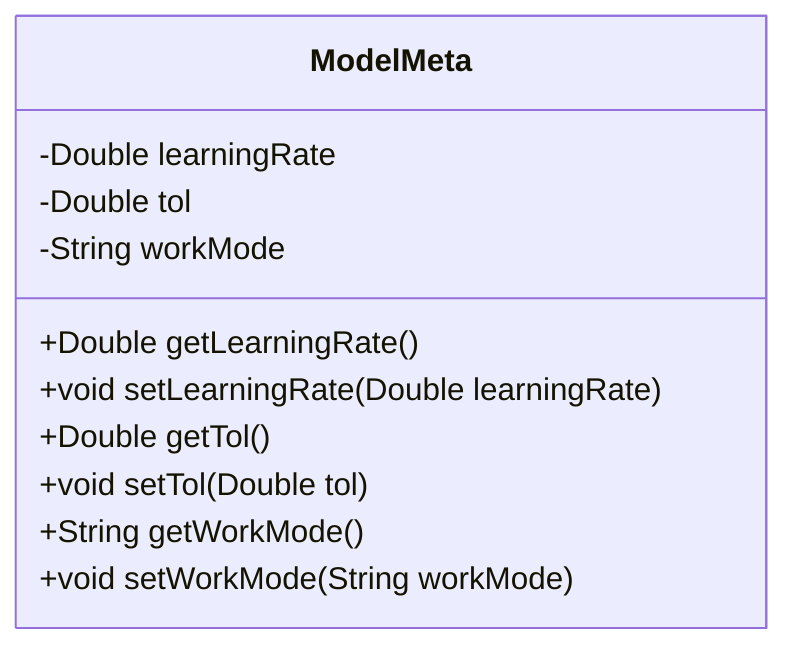
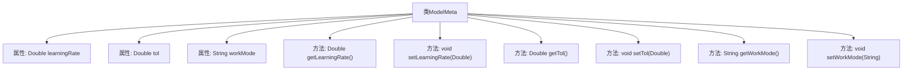

# 基础信息

|      |      |
|------|------|
| 名称 | ModelMeta |
| 编码语言 | .java |
| 代码路径 | WeFe/serving/serving-sdk-java/src/main/java/com/welab/wefe/serving/sdk/model/ModelMeta.java |
| 包名 | com.welab.wefe.serving.sdk.model |
| 依赖项 | [] |
| 概述说明 | ModelMeta类包含学习率、容差和工作模式三个属性，提供对应的getter和setter方法。 |

# 说明

ModelMeta类定义了模型元数据，包含三个私有属性：learningRate表示学习率，tol表示容差，workMode表示工作模式。每个属性都有对应的getter和setter方法用于获取和设置值。该类用于管理模型训练或运行时的关键参数配置。

# 类列表 Class Summary

| 名称   | 类型  | 说明 |
|-------|------|-------------|
| ModelMeta | class | ModelMeta类包含学习率、容差和工作模式三个属性，提供对应的getter和setter方法。 |

## 类 ModelMeta

|      |      |
|------|------|
| 访问范围 | public |
| 类型 | class |
| 名称 | ModelMeta |
| 说明 | ModelMeta类包含学习率、容差和工作模式三个属性，提供对应的getter和setter方法。 |

### UML类图

这段代码定义了一个名为ModelMeta的类，用于存储和管理机器学习模型的元数据。该类包含三个私有属性：learningRate（学习率）、tol（容忍度）和workMode（工作模式），并为每个属性提供了对应的getter和setter方法。这些方法允许外部代码安全地访问和修改这些属性值，实现了数据的封装性。

### 内部方法调用关系图

该流程图展示了ModelMeta类的结构，包含三个私有属性和对应的getter/setter方法。learningRate和tol是Double类型参数，workMode是String类型参数。每个属性都有对应的获取和设置方法，形成标准的JavaBean模式。类通过方法暴露属性访问接口，实现数据封装。

### 字段列表 Field List

| 名称  | 类型  | 说明 |
|-------|-------|------|
| workMode | String | 定义私有字符串变量workMode。 |
| tol | Double | 私有双精度浮点型变量tol |
| learningRate | Double | 私有双精度浮点型变量learningRate，用于存储学习率值。 |

### 方法列表

| 名称  | 类型  | 说明 |
|-------|-------|------|
| setLearningRate | void | 设置学习率的方法，参数为learningRate。 |
| setTol | void | 设置容差值方法，参数为Double类型。 |
| getTol | Double | 获取容差值的方法，返回Double类型的tol值。 |
| getWorkMode | String | 这是一个Java方法，返回字符串类型的workMode变量值。 |
| setWorkMode | void | 这是一个Java方法，用于设置对象的workMode属性值。方法接收一个字符串参数workMode，并将其赋值给当前对象的同名成员变量。 |
| getLearningRate | Double | 获取学习率的方法，返回Double类型值。 |

