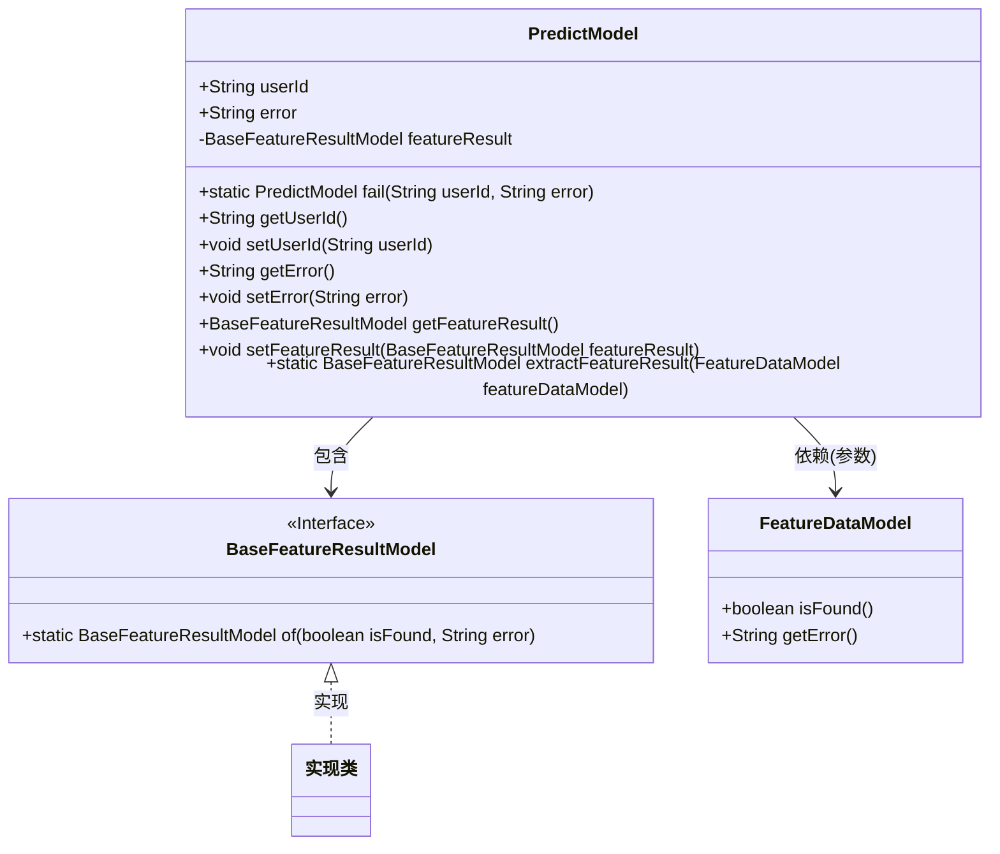
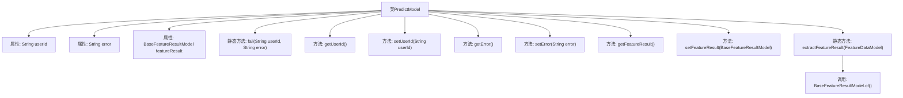

# 基础信息

|      |      |
|------|------|
| 名称 | PredictModel |
| 编码语言 | .java |
| 代码路径 | WeFe/serving/serving-sdk-java/src/main/java/com/welab/wefe/serving/sdk/model/PredictModel.java |
| 包名 | com.welab.wefe.serving.sdk.model |
| 依赖项 | [] |
| 概述说明 | PredictModel类包含用户ID、错误信息和特征结果，提供失败静态方法及getter/setter，支持特征结果提取。 |

# 说明

PredictModel类是一个用于预测的模型类，包含用户ID、错误信息和特征结果属性。提供了userId和error的getter和setter方法，以及featureResult的getter和setter方法。包含一个静态方法fail，用于创建带有错误信息的PredictModel实例。还提供了extractFeatureResult静态方法，用于从FeatureDataModel提取特征结果并生成BaseFeatureResultModel实例。

# 类列表 Class Summary

| 名称   | 类型  | 说明 |
|-------|------|-------------|
| PredictModel | class | PredictModel类包含用户ID、错误信息和特征结果，提供失败快速构造方法和相关getter/setter。 |

## 类 PredictModel

|      |      |
|------|------|
| 访问范围 | public |
| 类型 | class |
| 名称 | PredictModel |
| 说明 | PredictModel类包含用户ID、错误信息和特征结果，提供失败快速构造方法和相关getter/setter。 |

### UML类图

这段代码展示了一个预测模型类(PredictModel)，它包含用户ID、错误信息和特征结果。该类提供了静态工厂方法fail()用于创建失败实例，以及特征结果提取方法extractFeatureResult()。BaseFeatureResultModel是一个接口，定义了静态工厂方法of()。FeatureDataModel作为参数类型，提供特征数据查询方法。类图中清晰地展示了类之间的包含和依赖关系，以及接口的实现关系。

### 内部方法调用关系图

该流程图展示了PredictModel类的完整结构，包含3个属性字段、2个静态方法和6个实例方法。核心功能包括通过fail()方法快速创建错误模型，通过extractFeatureResult()静态方法转换特征数据，以及标准的getter/setter方法。特别值得注意的是extractFeatureResult()方法内部会调用BaseFeatureResultModel.of()来创建新的特征结果对象。

### 字段列表 Field List

| 名称  | 类型  | 说明 |
|-------|-------|------|
| userId | String | 声明一个公共字符串变量userId。 |
| error = "" | String | 定义了一个公共字符串变量error，初始值为空。 |
| featureResult | BaseFeatureResultModel | 私有成员变量featureResult，类型为BaseFeatureResultModel。 |

### 方法列表

| 名称  | 类型  | 说明 |
|-------|-------|------|
| setError | void | 设置错误信息的方法，将输入字符串赋值给类的error变量。 |
| fail | PredictModel | 静态方法fail接收用户ID和错误信息，创建并返回包含这些数据的PredictModel实例。 |
| getFeatureResult | BaseFeatureResultModel | 获取featureResult的方法，返回BaseFeatureResultModel类型结果。 |
| setUserId | void | 设置用户ID的方法，将参数userId赋值给当前对象的userId属性。 |
| getError | String | 获取错误信息的公共方法，返回字符串类型变量error。 |
| getUserId | String | 方法getUserId返回字符串类型的userId。 |
| setFeatureResult | void | 设置特征结果对象的方法，将输入参数赋值给类成员变量featureResult。 |
| extractFeatureResult | BaseFeatureResultModel | 静态方法extractFeatureResult接收FeatureDataModel参数，返回BaseFeatureResultModel实例，包含是否找到和错误信息。 |

